# O que é um motor?

# Definições

## Definições

Motor

> Uma máquina que transforma energia térmica em energia mecânica

::: {.fragment}

> Os motores de combustão interna, transformam a energia térmica gerada pela combustão da mistura ar/combustível em energia mecânica

:::

# Classificação dos motores

## Quanto a fonte geradora

 

::: {.columns}

::: {.column}

::: {.fragment}

Motor a combustão

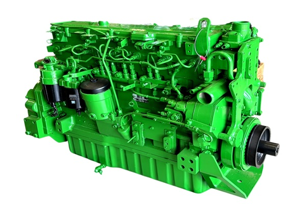{width=100%}

:::

:::

::: {.column}

::: {.fragment}
Motor elétrico

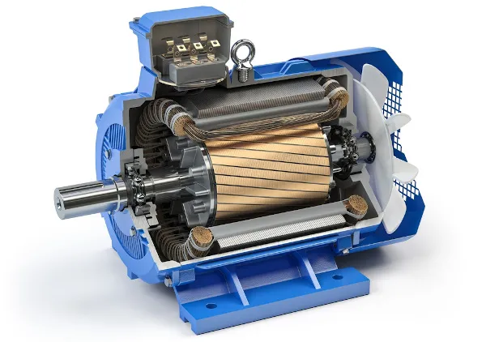{width=100%}

:::

:::

:::

::: {.fragment}

[__Motor híbrido__: Que é um sistema que se utiliza de ambos os tipos de motores para gerar movimento]{.fg style="--col: #e64173"}

:::

## Quanto a combustão

 

::: {.incremental}

- Combustão externa (máquina a vapor)

- Combustão interna
  - De pistão (ciclo otto e diesel)
  - Êmbolo rotativo (wankel)

:::

## Como ocorre a combustão

A combustão é uma reação química exotérmica (libera calor) entre uma substãncia (combustível) e um gás (comburente) para liberar calor. 

::: {.fragment}

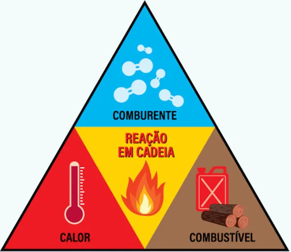{fig-align="center"}

:::

## Como ocorre a combustão

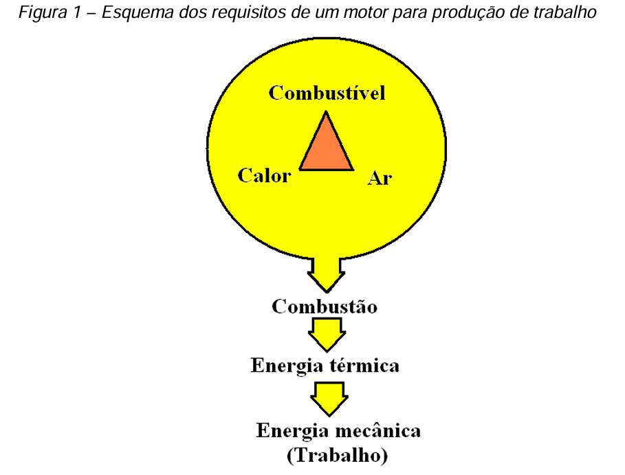{fig-align="center"}

## Como ocorre a combustão

Fórmula química da combustão

$$CH_{4} + 20_2 = CO_2 + 2H_{2}O + Calor$$

::: {.fragment}

Gasolina = C8H18 (octano)

Diesel (estrutura complexa) = CH3(CH2)14CH3(C16H34) (cetano)

:::

## Combustão externa 

Ex: máquinas a vapor

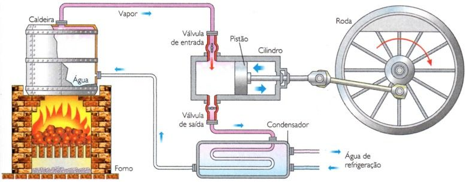{width=100%}

::: {.notes}

quando a água é aquecida ela se torna vapor e ocupa maior espaço o que gera pressão

:::

## Quanto a combustão

Exemplo de máquina a vapor

::: {layout-ncol=2}

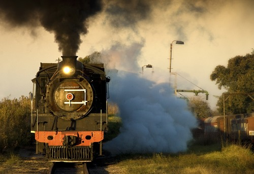{width=100%}

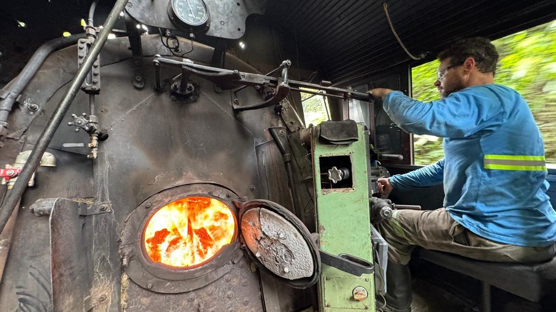{width=100%}

:::

# Combustão interna

## Combustão interna

::: {.fragment}

[__Ciclo Otto__]{.fg style="--col: #e64173"}

Utilizam combustível de baixa volatilidade, como gasolina e álcool. Para ignição necessitam de centelha produzida pelo sistema elétrico.

:::

::: {.fragment}

[__Ciclo Diesel__]{.fg style="--col: #e64173"}

Utilizam como combustível o óleo diesel. A inflamação do combustível injetado sobe pressão na câmara de combustão ocorre pela ocmpressão de ar e consequente elevação da temperatura.

:::

## Quanto ao número de ciclos

::: {.incremental}
 
- Motor de 4 tempos

- Motor de 2 tempos

:::

## Objetivo do motor

Gerar trabalho!

::: {.fragment}

$Trabalho~(J) = Força(N) * deslocamento(m)$

:::

::: {.fragment}

$Força(N) = mass(kg) * aceleração(\Delta_v/\Delta_t)$

:::

::: {.fragment}

Potência: Capacidade de transmitir energia por tempo.

- Realização de trabalho ou transmissão de calor.

Ex de potência: 1 cavalo puxa 75 kg em 1 s.
:::

# Histórico sobre motores

## Histórico

<!--   -->

::: {.timeline .horizontal .fragment-slide .tl-spacious}
::: {.event data-label="1862" }
**Alphonse Beau de Rochas (França)**

Publica e registra os termos teóricos de um "princípio" de um motor a 4 tempos com compressão prévia da mistura antes da ignição.

:::
::: {.event .fragment data-label="1867"}
**Exposição de Paris**

__Nikolaus August Otto__ apresenta um motor a combustão interna (4 tempos).
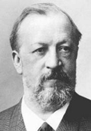

:::
::: {.event .fragment data-label="1876"}
**Motor a quatro tempos funcional de Otto**

Otto e Deutz produzem o primeiro motor prático e confiável no ciclo de 4 tempo (admissão, compressão, combustão e escape).

O ciclo ficou conhecido como **ciclo Otto**

:::
::: {.event .fragment data-label="1886" }
**Queda da patente de Otto na Alemanha**

O documento de Beau de Rocha é redescoberto, assim a patente de Otto é invalidade.

Várias fabricantes podem recriar o motor.

:::
::: {.event .fragment data-label="1879 – 1881" }
**Dois tempos**

Dugald Clerk patenteia um motor de 2 tempo com compressão estabelecendo uma alternativa ao ciclo Otto de 4 tempos.

:::

::: {.event .fragment data-label="1889" }
**Ciclo Otto em veículos**

Ocorre a primeira aplicação do motor de ciclo Otto em veículos utilizando combustível a gasolina.

:::
::: {.event .fragment data-label="1893" }
**Ciclo Diesel**

Engenheiro __Rudolf Diesel__ descreve um novo motor, no qual a ignição da mistura ar mais combustível era feita por compressão (**motor Diesel**).
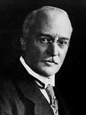

:::
:::

# Funcionamento do motor a combustão interna

## Funcionamento do motor a combustão interna

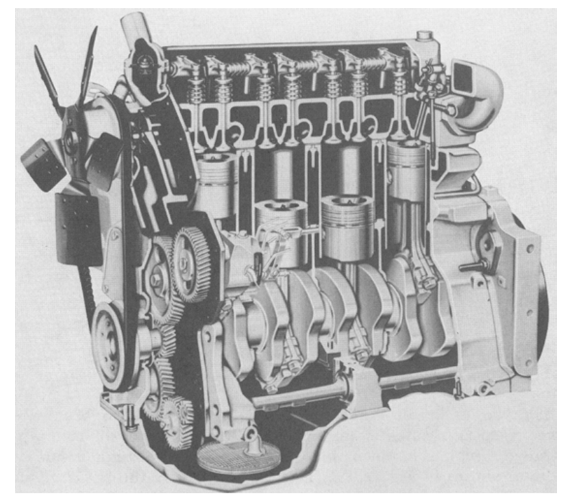{fig-align="center"}

## Funcionamento do motor a combustão interna

[__4 tempos ciclo diesel__]{.fg style="--col: #e64173"}

::: {.fragment}

- Admissão: O pistão desce, a válvula de admissão se abre e a de escape fecha. Ao descer, o pistão cria pressão no cilindor. O ar é forçado pela pressão atmosféria a entrar no cilindro pelo filtro de ar e pela tubulação de admissão. A quantidade que entra é sempre a mesma, independente da aceleração.

:::

::: {.fragment}

- Compressão: O pistão sobe, as válvulas de admissão e de escape ficam fechadas. O ar admitido é comprimido até ocupar o volume da câmara de combustão. O ar se aquece, e ao fim da compressão, o bico injeto pulveriza óleo diesel no interior da câmara de combustão.

:::

## Funcionamento do motor a combustão interna

[__4 tempos ciclo diesel__]{.fg style="--col: #e64173"}

::: {.fragment}

- Combustão: O pistão desce, acionado pela força de expansão dos gases queimados. As válvulas de admissão e de escape estão fechadas. A força de expansão é transmitida pelo piestão à biela e desta ao virabrequim, provocando assim movimento de rotação do motor.

:::

::: {.fragment}

- Escape: O pistão sobe, estando a válvula de escape aberta e a de admissão fechada. Os gases queimados são expulsos através da passagem dada pela válvula de escape.

:::

## Funcionamento do motor a combustão interna

Admissão

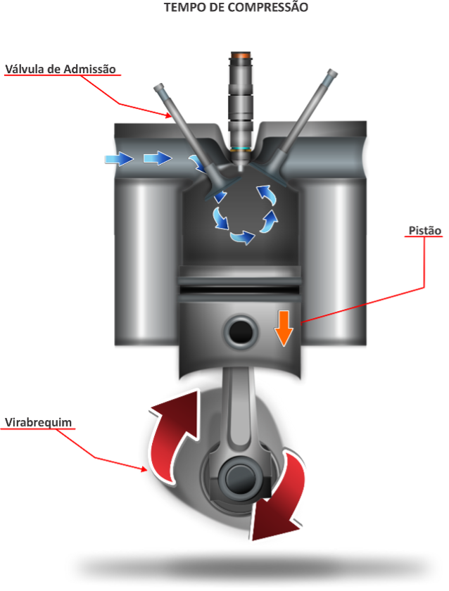{fig-align="center"}

## Funcionamento do motor a combustão interna

Compressão

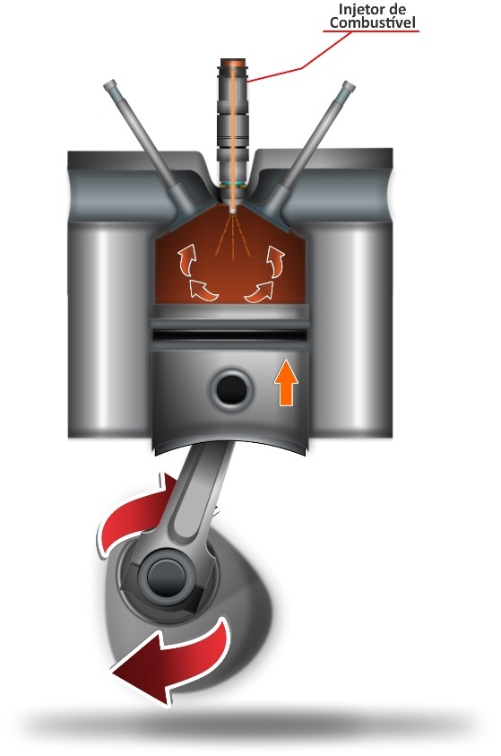{fig-align="center"}

## Funcionamento do motor a combustão interna

Explosão

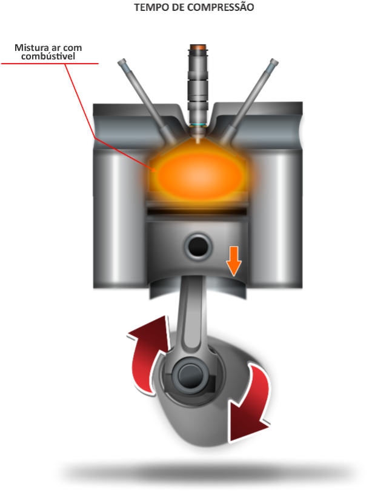{fig-align="center"}

## Funcionamento do motor a combustão interna

Descarga

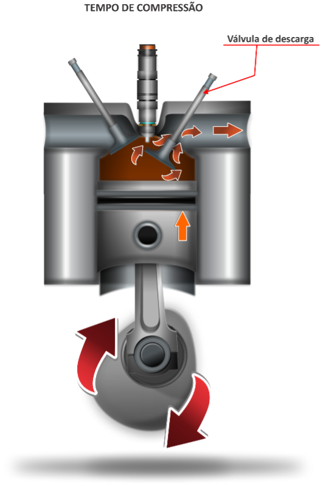{fig-align="center"}

## Funcionamento do motor a combustão interna

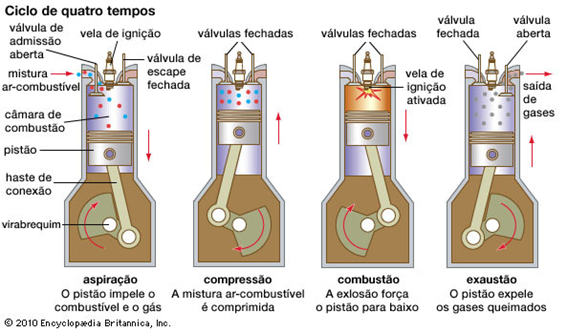{fig-align="center"}

## Funcionamento do motor a combustão interna

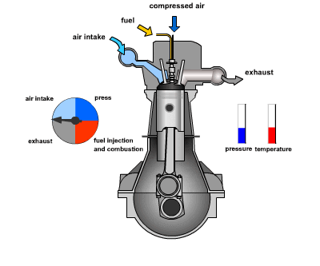{fig-align="center"}

## Funcionamento do motor a combustão interna

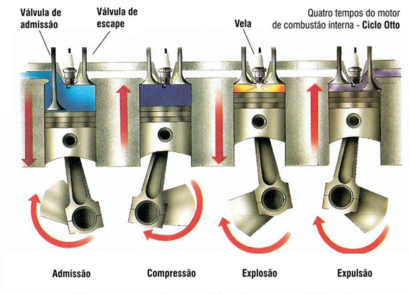{fig-align="center"}

## Funcionamento do motor a combustão interna

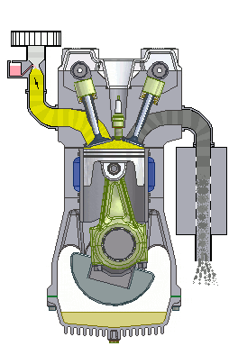

## Funcionamento do motor a combustão interna

<iframe width="2537" height="745" src="https://www.youtube.com/embed/Rw5Ewen7fGI" title="Como funciona um motor a diesel? Animação 3D" frameborder="0" allow="accelerometer; autoplay; clipboard-write; encrypted-media; gyroscope; picture-in-picture; web-share" referrerpolicy="strict-origin-when-cross-origin" allowfullscreen></iframe>

## Funcionamento do motor a combustão interna

# Componente do motor 

## Componente do motor 

::: {layout-ncol=2}

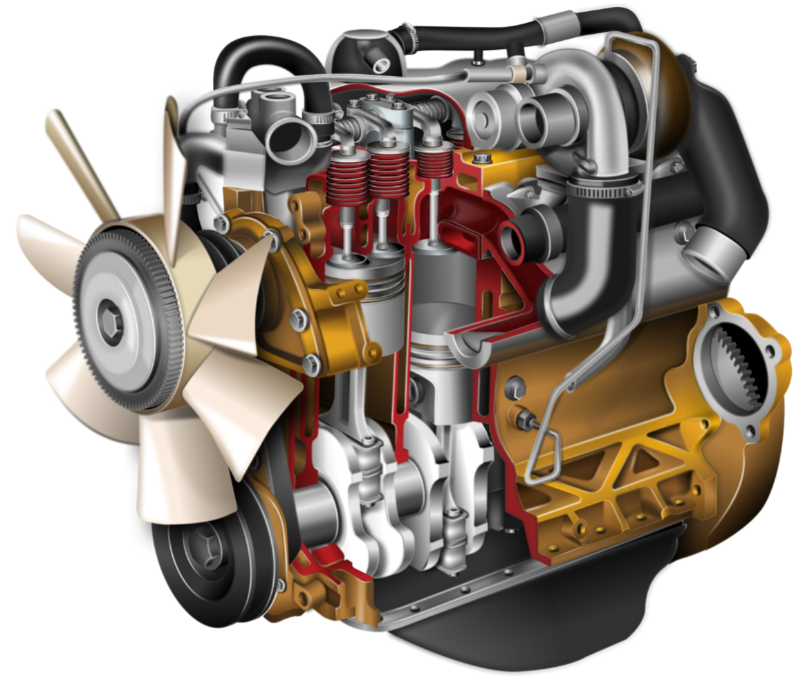{fig-align="center"}

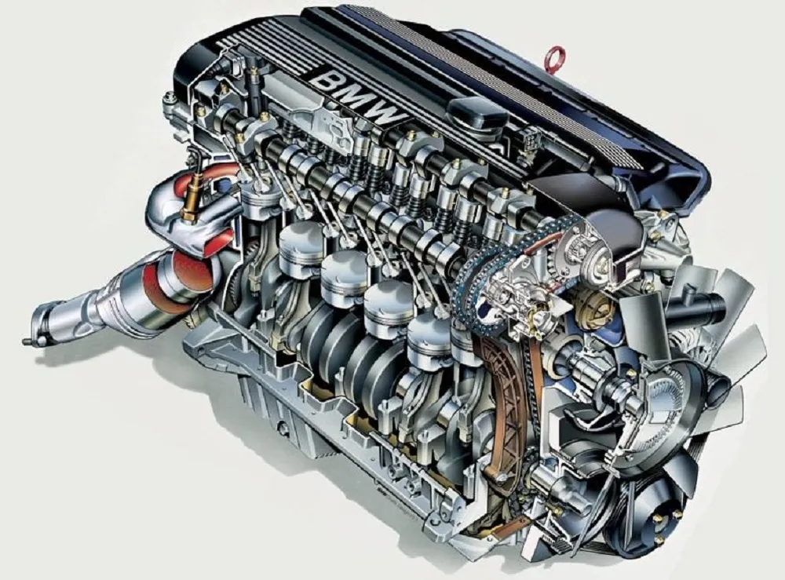{fig-align="center"}

:::

## Componente do motor diesel

[__Bloco dos cilindros__]{.fg style="--col: #e64173"}

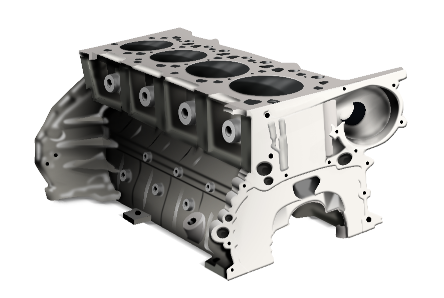{fig-align="center"}

## Componente do motor diesel

[__Bloco dos cilindros__]{.fg style="--col: #e64173"}

Função: 

- Base onde se encontram todos os demais elementos do funcionamento do motor.
  - Cabeçote, válvulas, árvore de comando, cilindros, pistão, aníes de segmento, biela, casquilhos, árvore dde manivelas, volante e cárter.
- Em máquinas agrícolas apresenta função estrutural e de sustentação.

Características:

- Peça de fundição.
- Em seu interior apresenta grandes orifícios cilíndricos (cilindros) onde se realiza a combustão.
- Apresenta cavidades para a passagem de água de arrefecimento.

## Componente do motor diesel

[__Árvore de manivelas (virabrequim )__]{.fg style="--col: #e64173"}

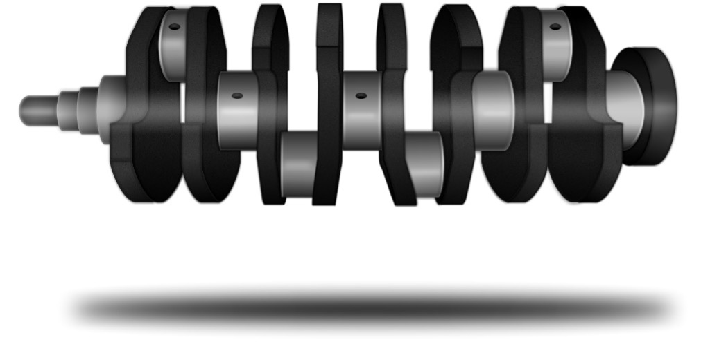{fig-align="center"}

## Componente do motor diesel

[__Árvore de manivelas (virabrequim )__]{.fg style="--col: #e64173"}

Função: 

- Atua em conjunto com a biela como órgão transformador do movimento alternativo do pistão em movimento de rotação, transformando o trabalho realizado pelo pistão em torque.

Características:

- Peça de aço forjado com canais para conduzir o óleo lubrificante até os mancais e cabeças das bielas.
- Seu formato deriva do número e da distribuição dos cilindros (manivelas iguais ao número de cilindros).

## Componente do motor diesel

[__Biela e pistão__]{.fg style="--col: #e64173"}

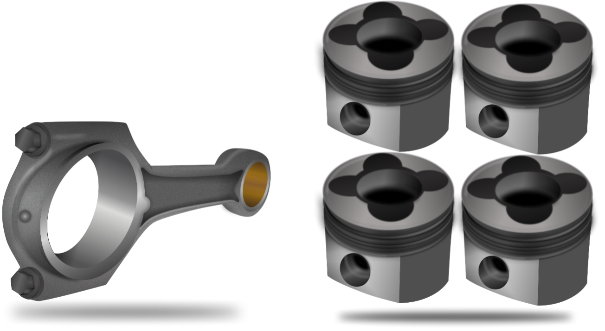{fig-align="center"}

## Componente do motor diesel

[__Pistão__]{.fg style="--col: #e64173"}

Função: 

- Pistão é o órgão receptor do movimento de expansão dos gases resultantes da combustão. Primeiro componente a se movimentar.
- Responsável pela conversão da energia da combustão em trabalho mecânico.
- Trasfere a energia para o virabrequim.

Características:

- Peça cilíndrica localizada dentro do cilindro sem contato com o mesmo.

## Componente do motor diesel

[__Anéis do pistão__]{.fg style="--col: #e64173"}

::: {layout-ncol=2}

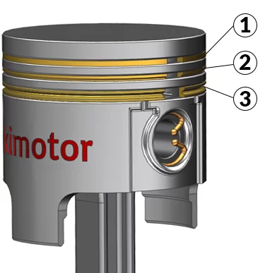{fig-align="center"}

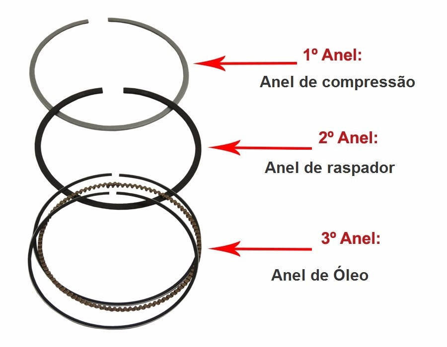{fig-align="center"}

:::

## Componente do motor diesel

[__Anéis do pistão__]{.fg style="--col: #e64173"}

Função: 

- Os de compressão são responsáveis pela vedaão da câmara do cilindro (fechamento hermético)
- Os de lubrificação executam o controle do fluxo de óleo entre o pistão e o cilindro.
- Dissipação do calor do pistão pelas paredes do cilindro.
- Redução da área de contato direta entre as paredes do cilindro e do pistão.

## Componente do motor diesel

[__Biela__]{.fg style="--col: #e64173"}

Função: 

- É um órgão transformador do movimento alternativo do pistão em movimento de rotação no virabrequim.
- Elemento de ligação entre o pistão e o virabrequim.

Características:

- Feita em aço, é resistente para poder transferir a energia entre as partes.
- Possui 3 partes
  - Cabeça: Orifício circular que permite ligação com o virabrequim.
  - Corpo: Fas a ligação entre o pé e a cabeça.
  - Pé: Orifício circular que permite ligação com o pistão.

## Componente do motor diesel

[__Cárter de óleo__]{.fg style="--col: #e64173"}

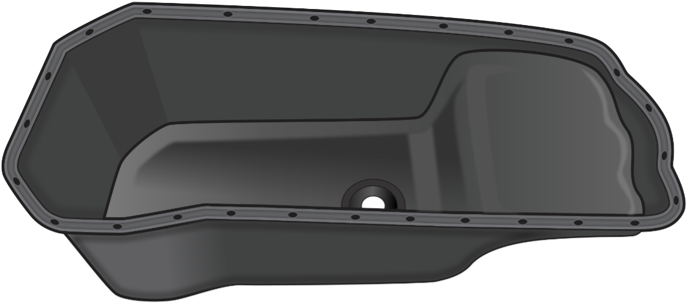{fig-align="center"}

## Componente do motor diesel

[__Cárter de óleo__]{.fg style="--col: #e64173"}

Função: 

- Depósito para o óleo lubrificante do motor.
- Assegura a lubrificação do motor.
- Reservatório do óleo de lubrificação e de eventuais detritos não retido pelos filtros.

Características:

- Invólucro rígido que fecha o bloco em sua parte inferior.

## Componente do motor diesel

Volante do motor

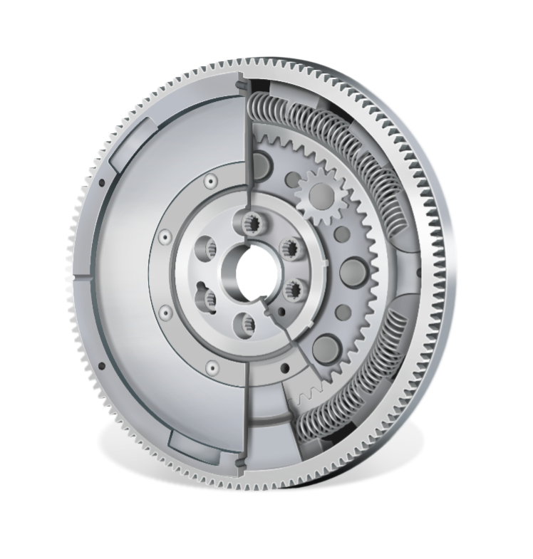{fig-align="center"}

## Componente do motor diesel

Válvulas

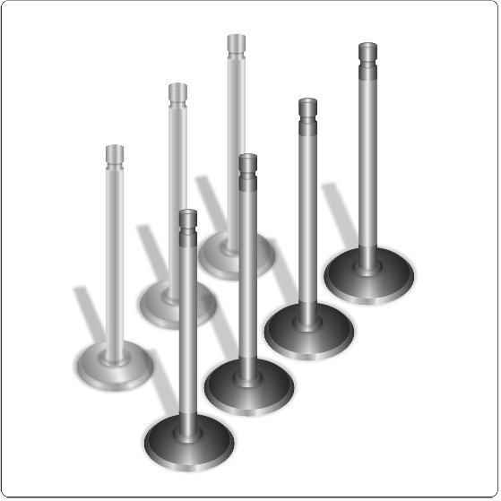{fig-align="center"}

## Componente do motor diesel

Cabeçote

::: {layout-ncol=2}

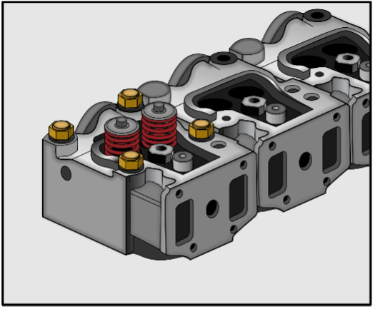{width=100%}

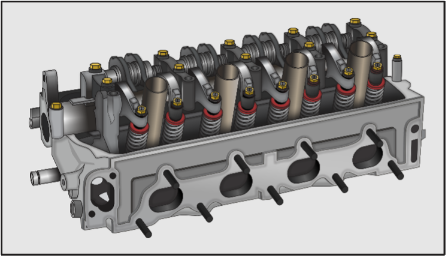{width=100%}

:::

## Componente do motor diesel

Comando de válvulas

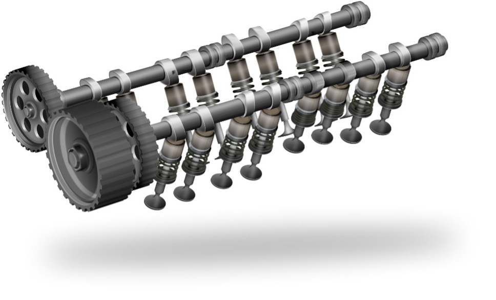{fig-align="center"}

## Motor completo

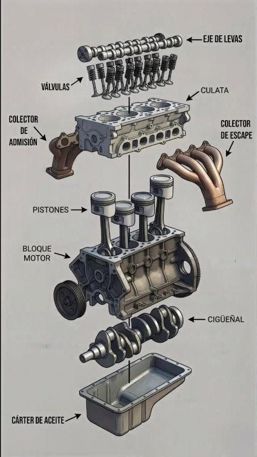{fig-align="center"}

## Componente do motor diesel

Camisa do cilindro

::: {layout-ncol=2}

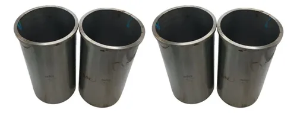{fig-align="center"}

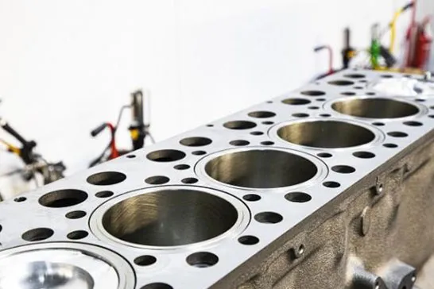{fig-align="center"}

:::

## Componente do motor diesel

Camisa do cilindro

Função: 

- Evitar desgaste do bloco pelo atrico entre pistão e bloco.
- Fornecer proteção para outros componentes de interior.

Características:

- Resistentes a altas temperaturas e pressões.
- Podem ser úmidas ou secas (em contato ou não com líquido de arrefecimento).

## Componente do motor diesel

Camisa do cilindro

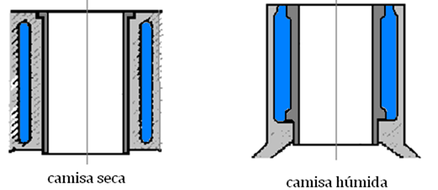

## Componente do motor diesel

Casquilhos ou bronzinas

::: {layout-ncol=2}

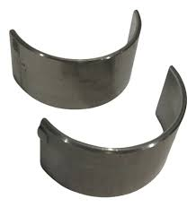{width=100%}

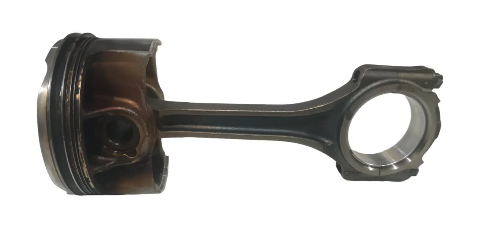{width=100%}

:::

## Componente do motor diesel

Casquilhos ou bronzinas

Função: 

- Reduzir atrito e desgaste entre os elementos.
- Auxiliam no correto alinhamento do virabrequim e comando de válculas no bloco.

Características:

- Entregada entre biela e virabrequim, pino e êmbolo, etc. 

## Diferenças entre Otto e Diesel
Forma do pistão

::: {layout-ncol=2}

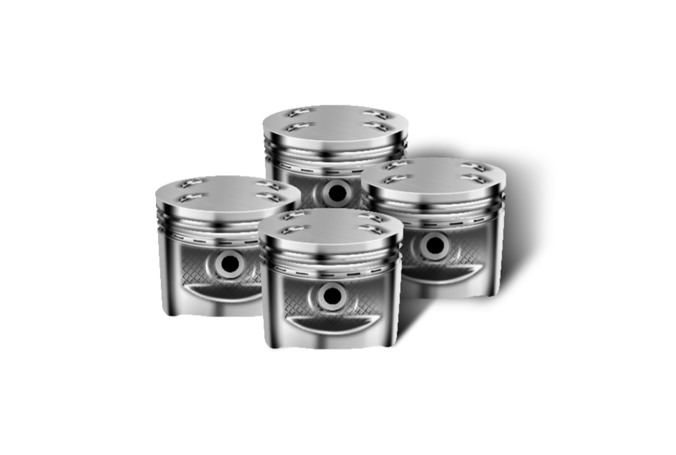{width=100%}

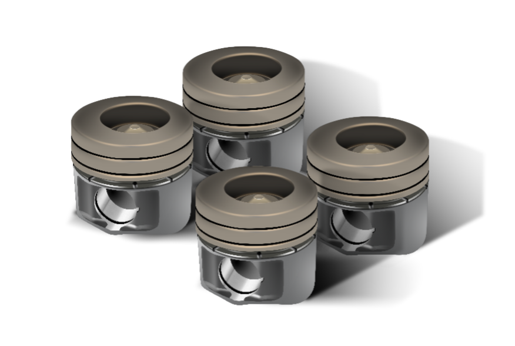{width=100%}

:::

## Diferenças entre Otto e Diesel

| Parâmetro | Ciclo Otto | Ciclo Diesel |
|:-----------|:-----------|:-------------|
| Combustível | Gasolina, Etanol, Metanol, GLP | Óleo Diesel, Biodiesel |
| Condição termodinâmica do ciclo principal | Adição de calor a volume constante | Adição de calor a pressão constante |
| Fase de admissão | Admite mistura de ar e combustível | Admite apenas ar |
| Relação ar/combustível | Pouco variável | Muito variável |
| Controle de carga | Variando a quantidade de mistura | Variando a quantidade de combustível |

## Diferenças entre Otto e Diesel

| Parâmetro | Ciclo Otto | Ciclo Diesel |
|:-----------|:-----------|:-------------|
| Taxa de compressão | 6–10:1 | 16–20:1 |
| Pressão mínima de compressão (kPa) | 1400 | 3240 |
| Forma de ignição | Centelha elétrica | Autoignição |
| Rotação | Motores leves; combustão homogênea; altas rotações | Motores pesados; combustão heterogênea; baixas rotações |
| Rotação de potência máxima | > 5000 rpm | < 3000 rpm |
| Rendimento térmico | 25–30% | 30–35% |

#  Arranjamento dos cilindros 
## Arranjamento dos cilindros

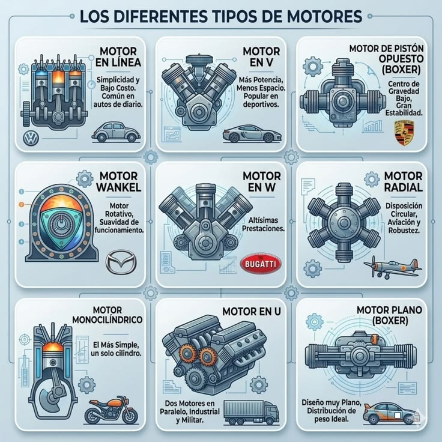{fig-align="center"}

## O que é Cilindrada?

- O que significa falar que o motor é 2.0? 

- O que é um carro 1000? 

# Motor 2 tempos

## Motor 2 tempos