# O que é um motor?

# Definições

## Definições

Motor

> Uma máquina que transforma energia térmica em energia mecânica

::: {.fragment}

> Os motores de combustão interna, transformam a energia térmica gerada pela combustão da mistura ar/combustível em energia mecânica

:::

::: {.fragment}

ex: Você andando de bicicleta. 

:::

::: {.fragment}

Sua energia (ATP) é transferida para os pedais e, por meio de um sistema de engrenagens, chega à roda, que se movimenta.

:::

# Classificação dos motores

## Quanto a fonte geradora

::: {.columns}

::: {.column}

::: {.fragment}

Motor a combustão

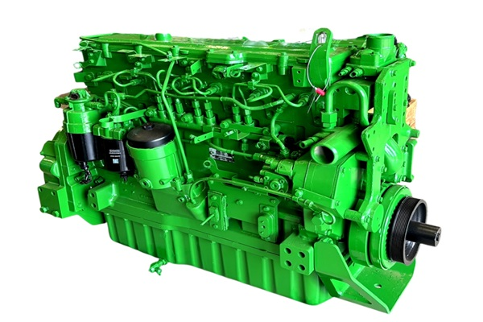{width=100%}

:::

:::

::: {.column}

::: {.fragment}
Motor elétrico

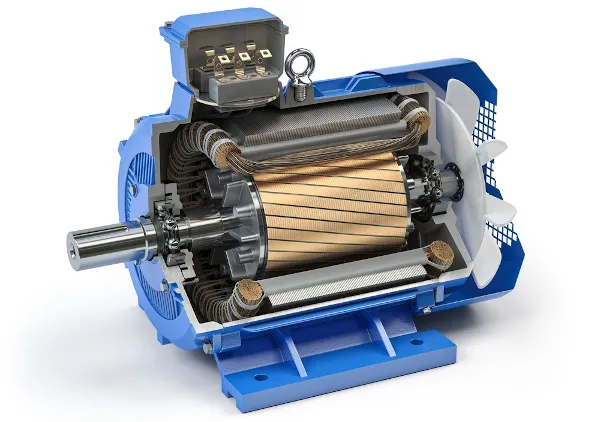{width=100%}

:::

:::

:::

::: {.fragment}

[__Motor híbrido__: Que é um sistema que se utiliza de ambos os tipos de motores para gerar movimento]{.fg style="--col: #e64173"}

:::

## Quanto a combustão

 

::: {.incremental}

- Combustão externa (máquina a vapor)

- Combustão interna
  - De pistão (ciclo otto e diesel)
  - Êmbolo rotativo (wankel)

:::

## Como ocorre a combustão

A combustão é uma reação química exotérmica (libera calor) entre uma substância (combustível) e um gás (comburente) para liberar calor. 

::: {.fragment}

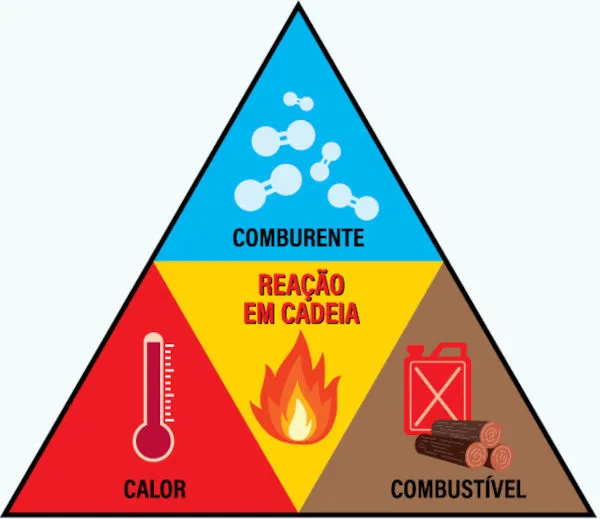{fig-align="center"}

:::

## Como ocorre a combustão

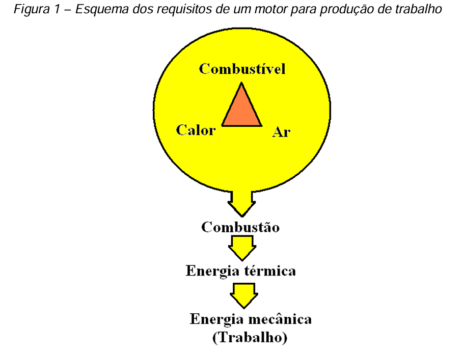{fig-align="center"}

## Como ocorre a combustão

Fórmula química da combustão

$$CH_{4} + 20_2 = CO_2 + 2H_{2}O + Calor$$

::: {.fragment}

Gasolina = C8H18 (octano)

Diesel (estrutura complexa) = CH3(CH2)14CH3(C16H34) (cetano)

:::

## Combustão externa

Ex: máquinas a vapor

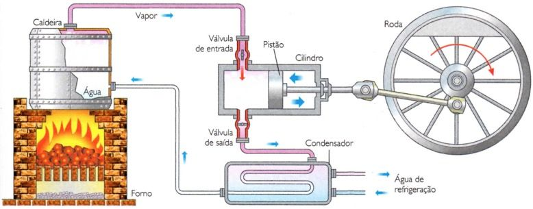{width=100%}

::: {.notes}

quando a água é aquecida ela se torna vapor e ocupa maior espaço o que gera pressão

:::

## Quanto a combustão

Exemplo de máquina a vapor

::: {layout-ncol=2}

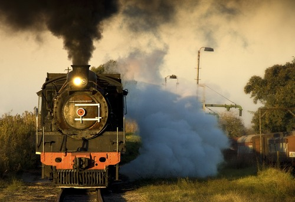{width=100%}

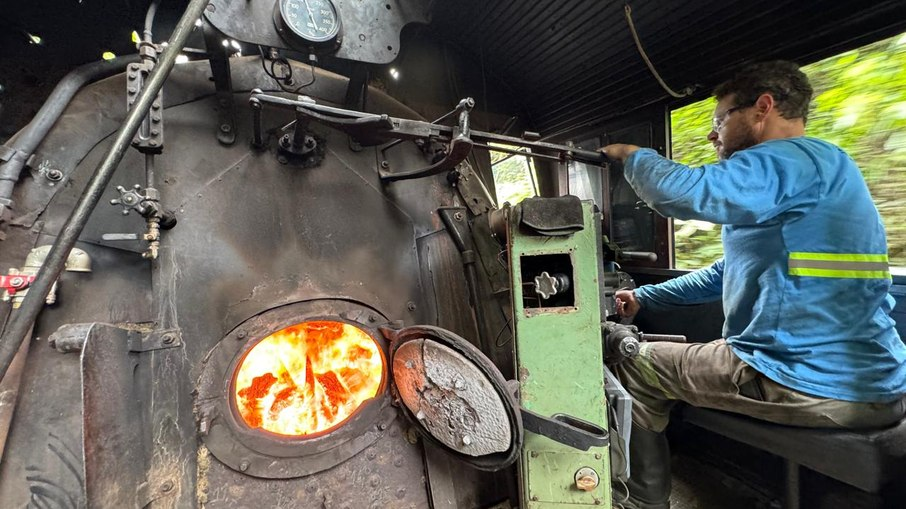{width=100%}

:::

# Combustão interna

## Combustão interna

::: {.fragment}

[__Ciclo Otto__]{.fg style="--col: #e64173"}

Utilizam combustível de baixa volatilidade, como gasolina e álcool. Para ignição necessitam de centelha produzida pelo sistema elétrico.

Empregado em situações agrícolas com menor demanda de potência e torque.

:::

::: {.fragment}

[__Ciclo Diesel__]{.fg style="--col: #e64173"}

Utilizam como combustível o óleo diesel. A inflamação do combustível injetado sob pressão na câmara de combustão ocorre pela compressão de ar e consequente elevação da temperatura.

:::

## Quanto ao número de ciclos

::: {.incremental}
 
- Motor de 4 tempos

- Motor de 2 tempos

:::

## Objetivo do motor

Gerar trabalho!

::: {.fragment}

$Trabalho~(J) = Força(N) * deslocamento(m)$

:::

::: {.fragment}

$Força(N) = massa(kg) * aceleração(\Delta_v/\Delta_t)$

:::

::: {.fragment}

Potência: Capacidade de transmitir energia por tempo.

- Realização de trabalho ou transmissão de calor.

Ex de potência: 1 cavalo puxa 75 kg em 1 s.
:::

# Histórico sobre motores

## Histórico

<!--   -->

::: {.timeline .horizontal .fragment-slide .tl-spacious}
::: {.event data-label="1862" }
**Alphonse Beau de Rochas (França)**

Publica e registra os termos teóricos de um "princípio" de um motor a 4 tempos com compressão prévia da mistura antes da ignição.

:::
::: {.event .fragment data-label="1867"}
**Exposição de Paris**

__Nikolaus August Otto__ apresenta um motor a combustão interna (4 tempos).
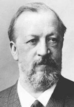

:::
::: {.event .fragment data-label="1876"}
**Motor a quatro tempos funcional de Otto**

Otto e Deutz produzem o primeiro motor prático e confiável no ciclo de 4 tempo (admissão, compressão, combustão e escape).

O ciclo ficou conhecido como **ciclo Otto**

:::
::: {.event .fragment data-label="1886" }
**Queda da patente de Otto na Alemanha**

O documento de Beau de Rocha é redescoberto, assim a patente de Otto é invalidada.

Várias fabricantes podem recriar o motor.

:::
::: {.event .fragment data-label="1879 – 1881" }
**Dois tempos**

Dugald Clerk patenteia um motor de 2 tempo com compressão estabelecendo uma alternativa ao ciclo Otto de 4 tempos.

:::

::: {.event .fragment data-label="1889" }
**Ciclo Otto em veículos**

Ocorre a primeira aplicação do motor de ciclo Otto em veículos utilizando combustível a gasolina.

:::
::: {.event .fragment data-label="1893" }
**Ciclo Diesel**

Engenheiro __Rudolf Diesel__ descreve um novo motor, no qual a ignição da mistura ar mais combustível era feita por compressão (**motor Diesel**).
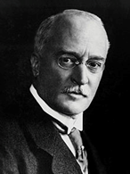

:::
::: {.event .fragment data-label="1897" }
**Ciclo Diesel**

Primeiro motor ciclo diesel é construído.

:::
:::

# Funcionamento do motor a combustão interna

## Funcionamento do motor a combustão interna

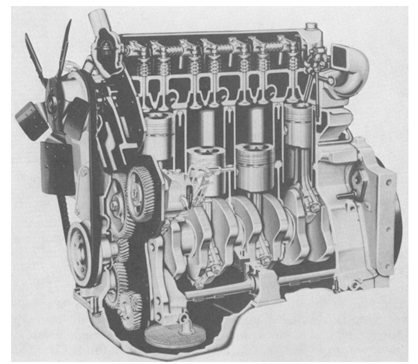{fig-align="center"}

## Funcionamento do motor a combustão interna

[__4 tempos ciclo diesel__]{.fg style="--col: #e64173"}

::: {.fragment}

- Admissão: O pistão desce, a válvula de admissão se abre e a de escape fecha. Ao descer, o pistão cria pressão no cilindro. O ar é forçado pela pressão atmosféria a entrar no cilindro pelo filtro de ar e pela tubulação de admissão. A quantidade que entra é sempre a mesma, independente da aceleração.

:::

::: {.fragment}

- Compressão: O pistão sobe, as válvulas de admissão e de escape ficam fechadas. O ar admitido é comprimido até ocupar o volume da câmara de combustão. O ar se aquece, e ao fim da compressão, o bico injetor pulveriza óleo diesel no interior da câmara de combustão.

:::

## Funcionamento do motor a combustão interna

[__4 tempos ciclo diesel__]{.fg style="--col: #e64173"}

::: {.fragment}

- Combustão: O pistão desce, acionado pela força de expansão dos gases queimados. As válvulas de admissão e de escape estão fechadas. A força de expansão é transmitida pelo pistão à biela e desta ao virabrequim, provocando assim movimento de rotação do motor.

:::

::: {.fragment}

- Escape: O pistão sobe, estando a válvula de escape aberta e a de admissão fechada. Os gases queimados são expulsos através da passagem dada pela válvula de escape.

:::

## Funcionamento do motor a combustão interna

Admissão

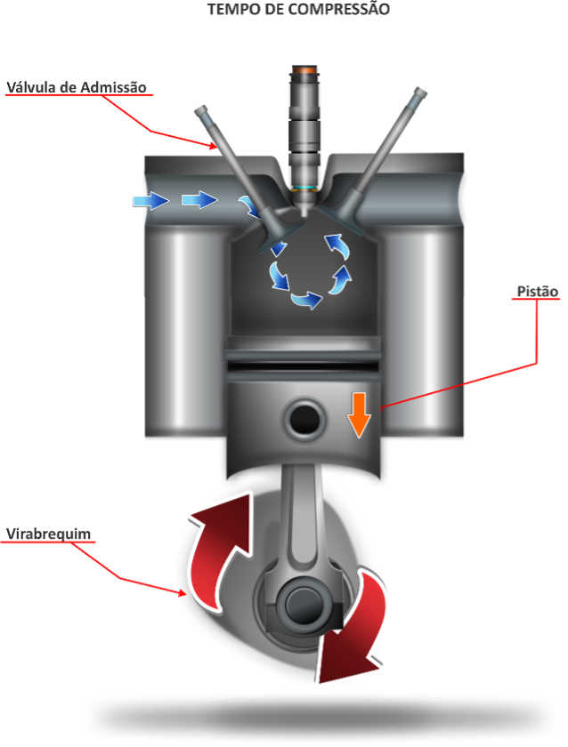{fig-align="center"}

## Funcionamento do motor a combustão interna

Compressão

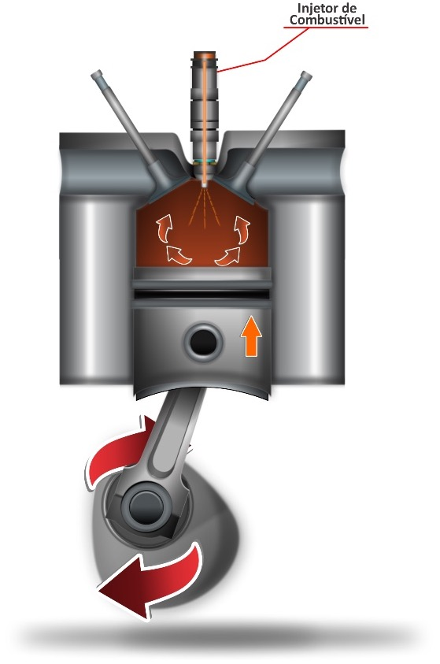{fig-align="center"}

## Funcionamento do motor a combustão interna

Explosão

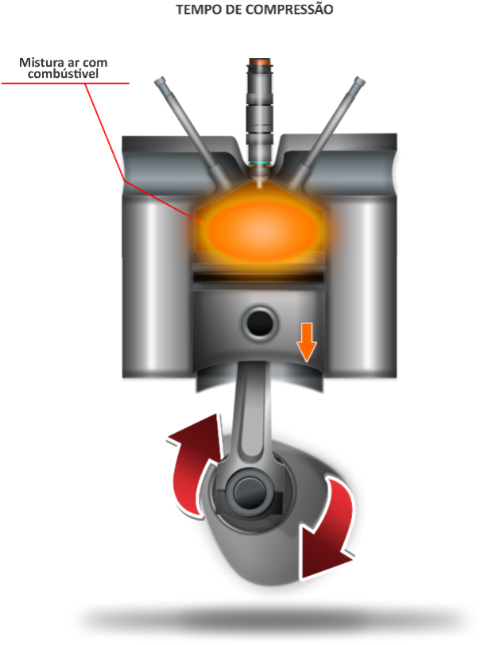{fig-align="center"}

## Funcionamento do motor a combustão interna

Descarga

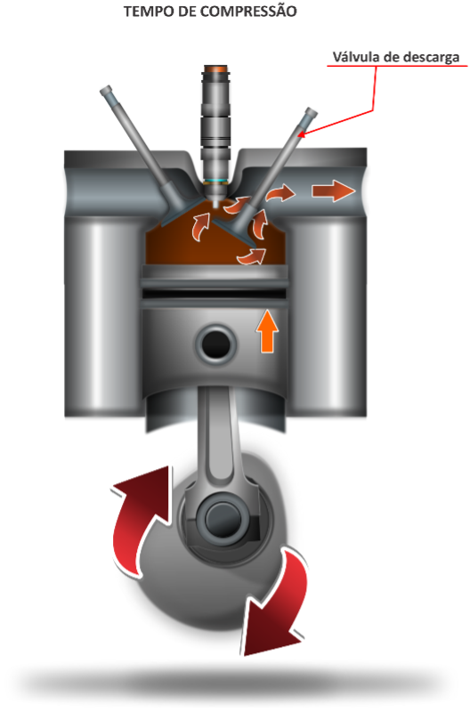{fig-align="center"}

## Funcionamento do motor a combustão interna

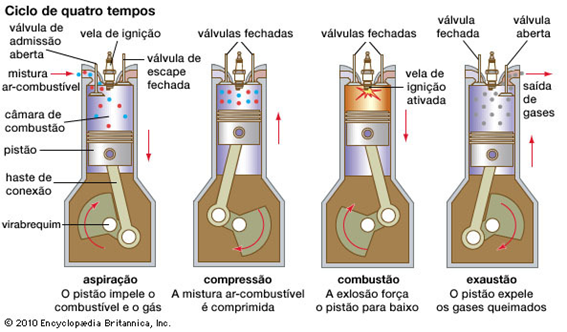{fig-align="center"}

## Funcionamento do motor a combustão interna

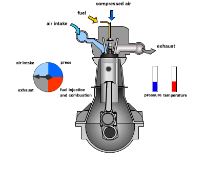{fig-align="center"}

## Funcionamento do motor a combustão interna

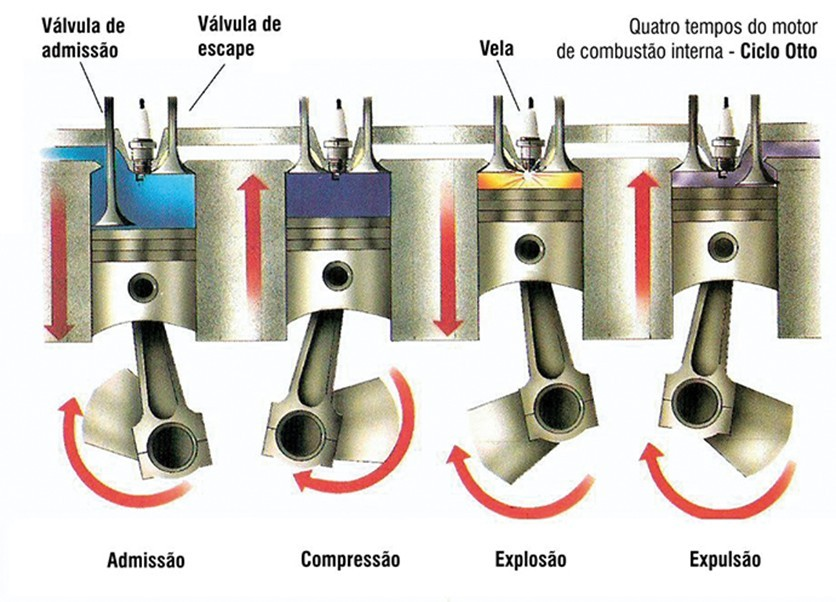{fig-align="center"}

## Funcionamento do motor a combustão interna

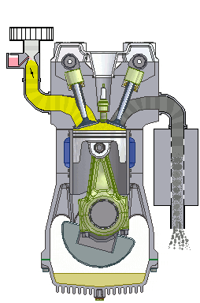

## Funcionamento do motor a combustão interna

<iframe width="2537" height="745" src="https://www.youtube.com/embed/Rw5Ewen7fGI" title="Como funciona um motor a diesel? Animação 3D" frameborder="0" allow="accelerometer; autoplay; clipboard-write; encrypted-media; gyroscope; picture-in-picture; web-share" referrerpolicy="strict-origin-when-cross-origin" allowfullscreen></iframe>

# Componentes do motor 

## Componentes do motor

::: {layout-ncol=2}

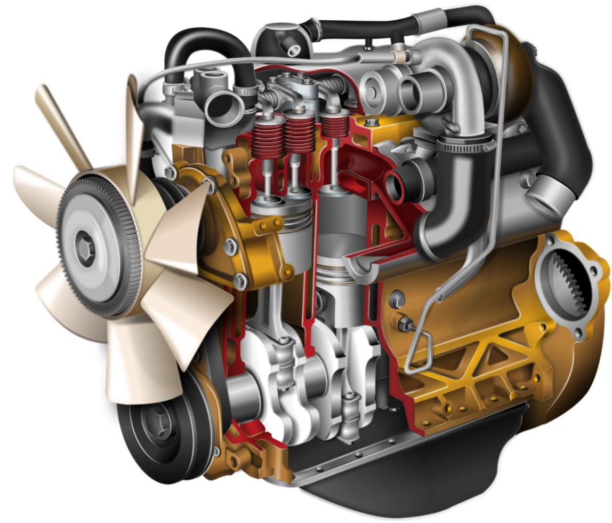{fig-align="center"}

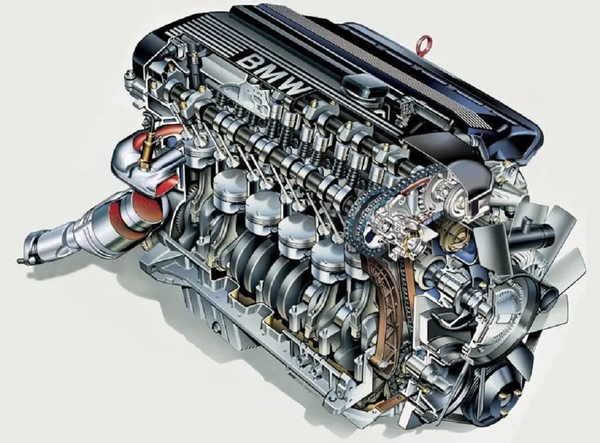{fig-align="center"}

:::

## Componentes do motor diesel

[__Bloco dos cilindros__]{.fg style="--col: #e64173"}

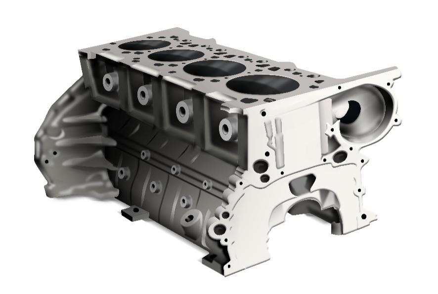{fig-align="center"}

## Componentes do motor diesel

[__Bloco dos cilindros__]{.fg style="--col: #e64173"}

Função: 

- Base onde se encontram todos os demais elementos do funcionamento do motor.
  - Cabeçote, válvulas, árvore de comando, cilindros, pistão, aneís de segmento, biela, casquilhos, árvore de manivelas, volante e cárter.
- Em máquinas agrícolas apresenta função estrutural e de sustentação.

## Componentes do motor diesel

[__Bloco dos cilindros__]{.fg style="--col: #e64173"}

Características:

- Peça de fundição.
- Em seu interior apresenta grandes orifícios cilíndricos (cilindros) onde se realiza a combustão.
- Apresenta cavidades para a passagem de água de arrefecimento.

## Componentes do motor diesel

[__Árvore de manivelas (virabrequim )__]{.fg style="--col: #e64173"}

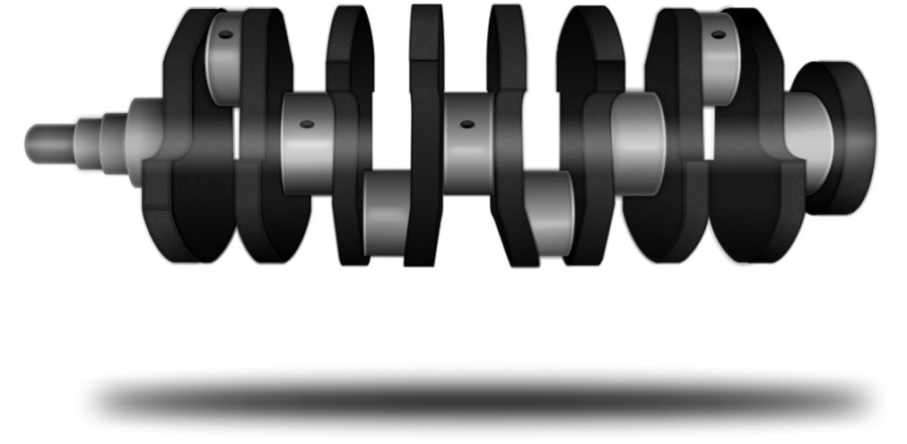{fig-align="center"}

## Componentes do motor diesel

[__Árvore de manivelas (virabrequim )__]{.fg style="--col: #e64173"}

Função: 

- Atua em conjunto com a biela como órgão transformador do movimento alternativo do pistão em movimento de rotação, transformando o trabalho realizado pelo pistão em torque.

Características:

- Peça de aço forjado com canais para conduzir o óleo lubrificante até os mancais e cabeças das bielas.
- Seu formato deriva do número e da distribuição dos cilindros (manivelas iguais ao número de cilindros).

## Componentes do motor diesel

[__Biela e pistão__]{.fg style="--col: #e64173"}

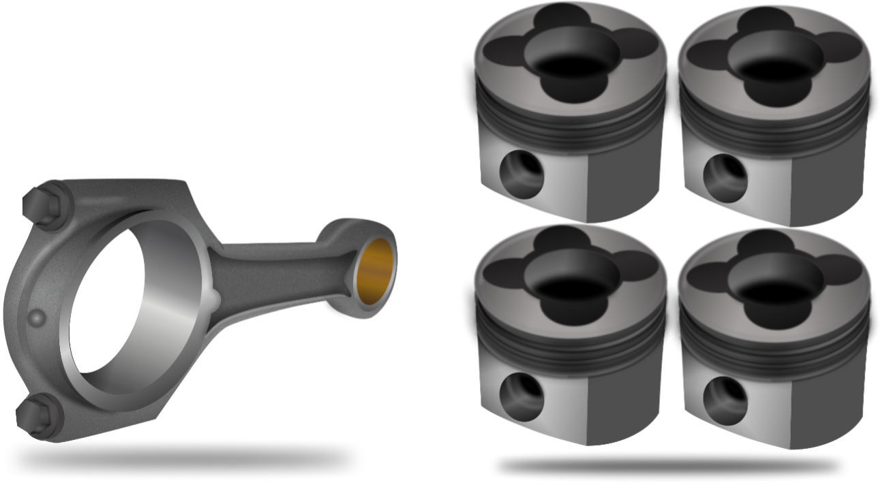{fig-align="center"}

## Componentes do motor diesel

[__Pistão__]{.fg style="--col: #e64173"}

Função: 

- Pistão é o órgão receptor do movimento de expansão dos gases resultantes da combustão. Primeiro componente a se movimentar.
- Responsável pela conversão da energia da combustão em trabalho mecânico.
- Trasfere a energia para o virabrequim.

Características:

- Peça cilíndrica localizada dentro do cilindro sem contato com o mesmo.

## Componentes do motor diesel

[__Anéis do pistão__]{.fg style="--col: #e64173"}

::: {layout-ncol=2}

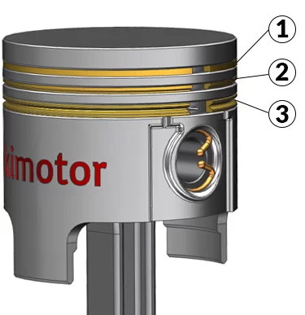{fig-align="center"}

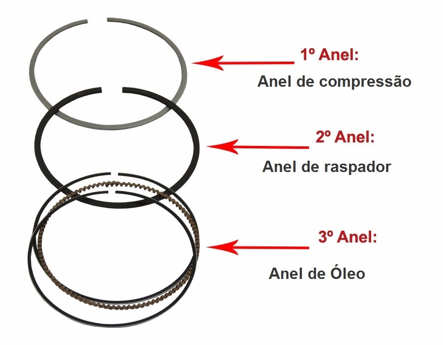{fig-align="center"}

:::

## Componentes do motor diesel

[__Anéis do pistão__]{.fg style="--col: #e64173"}

Função: 

- Os de compressão são responsáveis pela vedação da câmara do cilindro (fechamento hermético)
- Os de lubrificação executam o controle do fluxo de óleo entre o pistão e o cilindro.
- Dissipação do calor do pistão pelas paredes do cilindro.
- Redução da área de contato direta entre as paredes do cilindro e do pistão.

## Componentes do motor diesel

[__Biela__]{.fg style="--col: #e64173"}

Função: 

- É um órgão transformador do movimento alternativo do pistão em movimento de rotação no virabrequim.
- Elemento de ligação entre o pistão e o virabrequim.

## Componentes do motor diesel

[__Biela__]{.fg style="--col: #e64173"}

Características:

- Feita em aço, é resistente para poder transferir a energia entre as partes.
- Possui 3 partes
  - Cabeça: Orifício circular que permite ligação com o virabrequim.
  - Corpo: Faz a ligação entre o pé e a cabeça.
  - Pé: Orifício circular que permite ligação com o pistão.

## Componentes do motor diesel

[__Cárter de óleo__]{.fg style="--col: #e64173"}

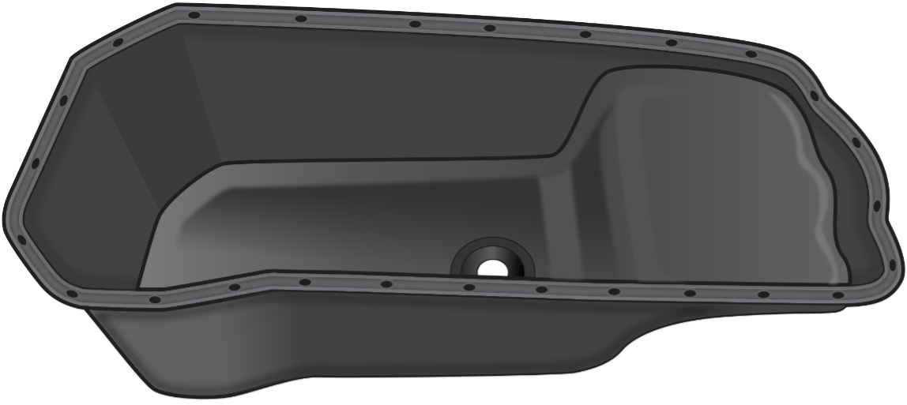{fig-align="center"}

## Componentes do motor diesel

[__Cárter de óleo__]{.fg style="--col: #e64173"}

Função: 

- Depósito para o óleo lubrificante do motor.
- Assegura a lubrificação do motor.
- Reservatório do óleo de lubrificação e de eventuais detritos não retido pelos filtros.

Características:

- Invólucro rígido que fecha o bloco em sua parte inferior.

## Componentes do motor diesel

[__Volante do motor__]{.fg style="--col: #e64173"}

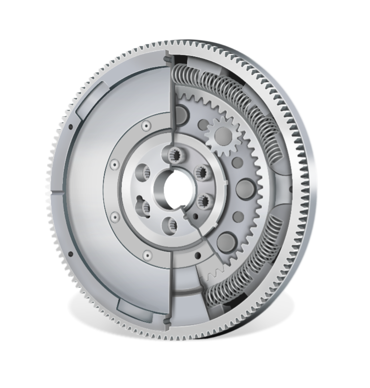{fig-align="center"}

## Componentes do motor diesel

[__Volante do motor__]{.fg style="--col: #e64173"}

Função: 

- Transfere o torque obtido no virabrequim para a caixa de velocidades.
- É responsável por absorver vibrações do motor e manter estável ou dificultar oscilações.

## Componentes do motor diesel

[__Válvulas__]{.fg style="--col: #e64173"}

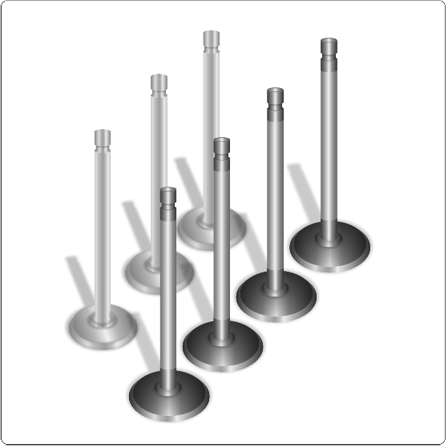{fig-align="center"}

## Componentes do motor diesel

[__Cabeçote__]{.fg style="--col: #e64173"}

::: {layout-ncol=2}

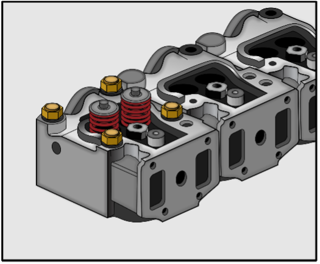{width=100%}

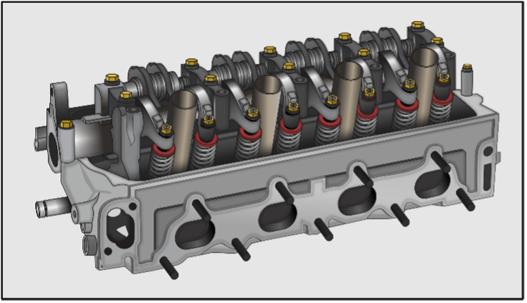{width=100%}

:::

## Componentes do motor diesel

[__Cabeçote__]{.fg style="--col: #e64173"}

Função: 

- Funciona como tampão para os cilindros e acomoda os mecanismos das válvulas de admissão e escape, bico injetor e canais de circulação do líquido de arrefecimento e lubrificação.

## Componentes do motor diesel

[__Junta do Cabeçote__]{.fg style="--col: #e64173"}

::: {layout-ncol=2}

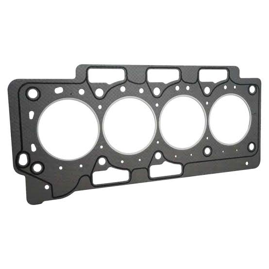{width=100%}

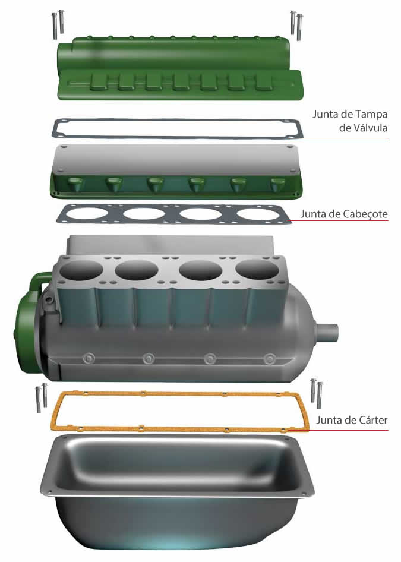{width=50%}

:::

## Componentes do motor diesel

[__Junta do Cabeçote__]{.fg style="--col: #e64173"}

Função: 

- Atua na vedação entre o bloco do motor e o cabeçote.
- Evita a mistura de óleo, líquido de arrefecimento e gases de combustão.

Características:

- Resistentes a altas temperaturas e pressões.
- Formada por um empilhamento de camadas de aço com revestimento especial.

## Componentes do motor diesel

[__Junta do Cabeçote__]{.fg style="--col: #e64173"}

Quando a junta perde a vedação, toda a circulação de líquido de arrefecimento pode ser comprometida.

::: {.incremental}

- Motor aquece mais que o normal.
- Fumaça branca no escapamento (indica mistura de líquido de arrefecimento na câmara de combustão).
- Vazamento de óleo e água (mudança no aspecto do óleo).
- Perda de potência.
- Falhas no motor.

:::

## Componentes do motor diesel

[__Comando de válvulas__]{.fg style="--col: #e64173"}

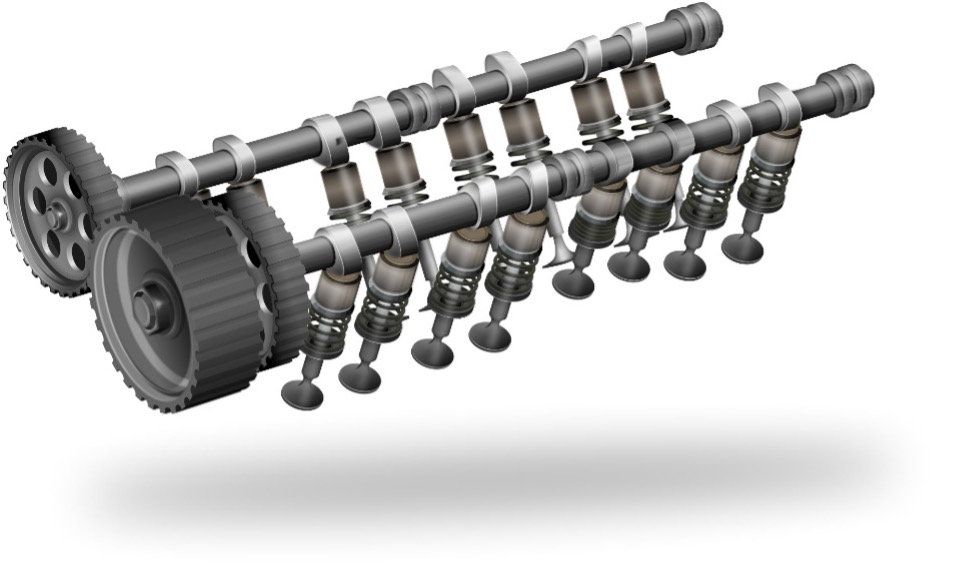{fig-align="center"}

## Motor completo

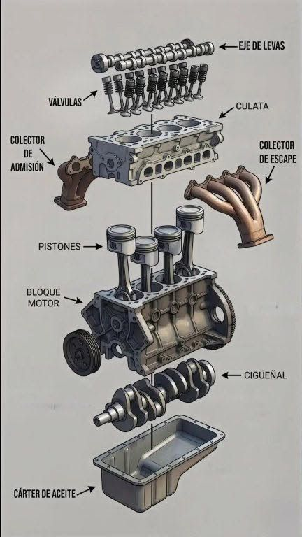{fig-align="center"}

## Componentes do motor diesel

[__Camisa do cilindro__]{.fg style="--col: #e64173"}

::: {layout-ncol=2}

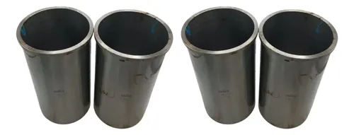{fig-align="center"}

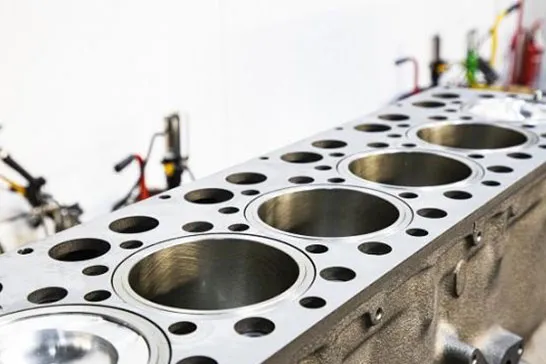{fig-align="center"}

:::

## Componentes do motor diesel

[__Camisa do cilindro__]{.fg style="--col: #e64173"}

Função: 

- Evitar desgaste do bloco pelo atrico entre pistão e bloco.
- Fornecer proteção para outros componentes de interior.

Características:

- Resistentes a altas temperaturas e pressões.
- Podem ser úmidas ou secas (em contato ou não com líquido de arrefecimento).

## Componente do motor diesel

[__Camisa do cilindro__]{.fg style="--col: #e64173"}

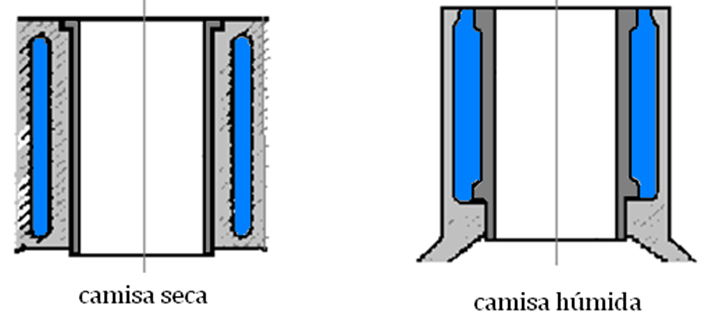

## Componente do motor diesel

[__Casquilhos ou bronzinas__]{.fg style="--col: #e64173"}

::: {layout-ncol=2}

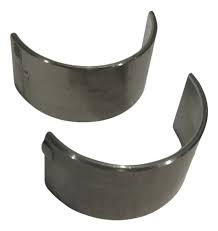{width=100%}

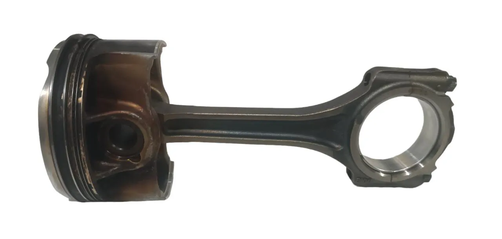{width=100%}

:::

## Componente do motor diesel

[__Casquilhos ou bronzinas__]{.fg style="--col: #e64173"}

Função: 

- Reduzir atrito e desgaste entre os elementos.
- Auxiliam no correto alinhamento do virabrequim e comando de válculas no bloco.

Características:

- Entregada entre biela e virabrequim, pino e êmbolo, etc. 

#  Arranjo dos cilindros 
## Arranjo dos cilindros

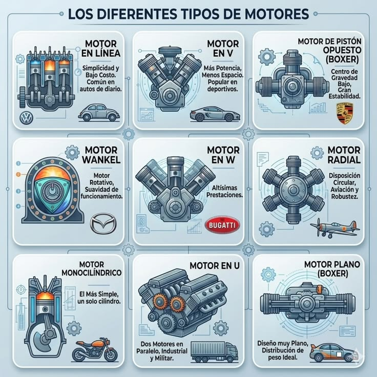{fig-align="center"}

# O que é Cilindrada?

## O que é Cilindrada?

- O que significa falar que o motor é 2.0? 

- O que é um carro 1000? 

## Cálculo da cilindrada

$$V = \frac{\pi * D^2 * h}{4}* n $$

$V = cilindrada~(cm^3, litro, pol^3)$

$D = diâmetro~do~pistão~(cm, pol)$

$h = curso~do~pistão~do~PMI~ao~PMS~(cm, pol)$

$n = número~de~cilindros$

## Cálculo da cilindrada

Ex: Um motor de 3 cilindros, com diâmetro dos cilindros de 10 cm e curso do êmbolo de 120 mm, qual a sua cilindrada?

::: {.fragment}

$$V = \frac{3.14 * 10^2*12}{4}*3 = 28274~cm^3$$

:::

::: {.fragment}

Ex: Um motor de 4 cilindros, com diâmetro dos cilindros de 5 cm e curso do êmbolo de 5 cm,  qual a sua cilindrada?

:::

## PMS e PMI

- PMS: Ponto morto superior.
- PMI: Ponto morto inferior.

::: {layout-ncol=2}

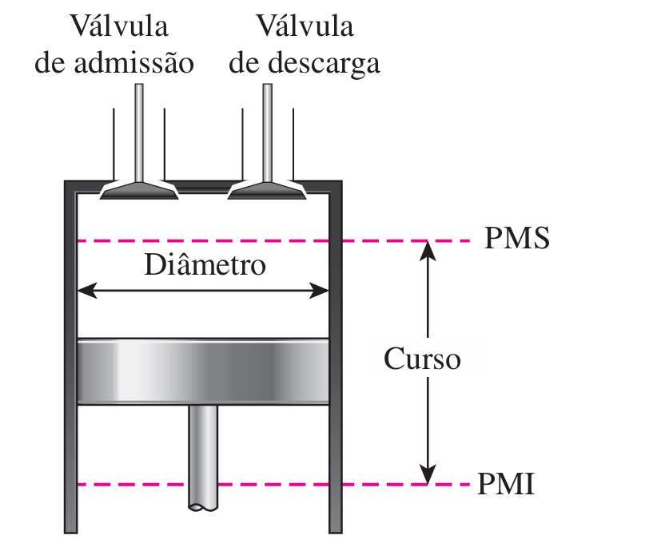

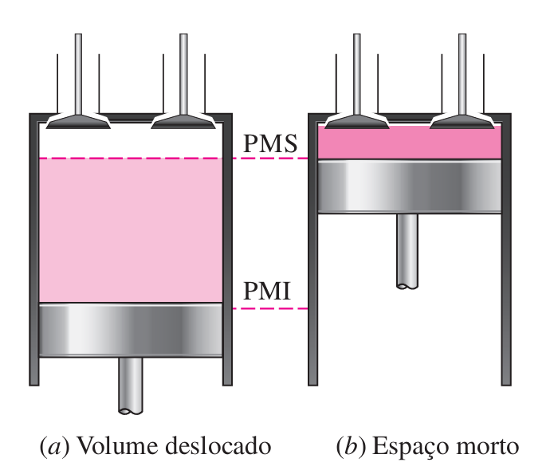

:::

## Ciclo Otto ideal

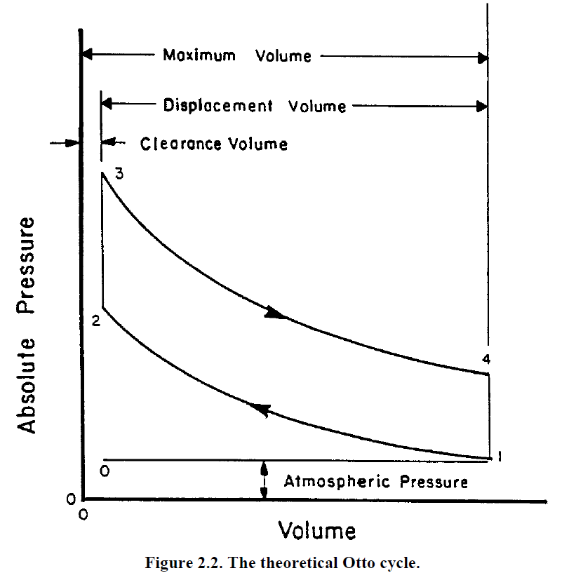{fig-align="center"}

## Ciclo Otto ideal

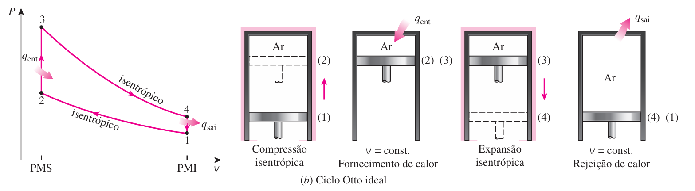{fig-align="center"}

## Ciclo Otto real

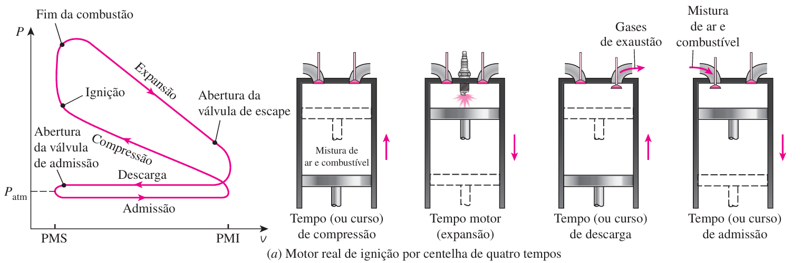{fig-align="center"}

## Ciclo Termodinâmico

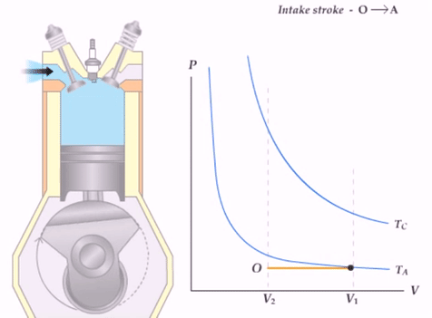{fig-align="center"}

## PMS e PMI

A relação entre o volume máximo formado no cilindro e o volume mínimo (morto) é chamada de __razão de compressão__ (r) do motor.

$$r = \frac{V_{max}}{V_{min}} = \frac{V_{PMI}}{V_{PMS}}$$

{fig-align="center"}

## Eficiência do motor Otto

A eficiência térmica do motor Otto pode ser expressa como:

$$\eta_{t,Otto}=1-\frac{1}{r^{k-1}}$$

$\eta_{t,Otto}= eficiência~térmica$

$r = razão~de~compressão$

$k=razão~dos~calores~específicos$

## Eficiência do motor Otto

Um motor de ciclo Otto de quatro cilindros possui diâmetro do cilindro de $90\ \text{mm}$, curso do pistão de $100\ \text{mm}$ e volume de folga (volume morto) de $106.024~cm^3$ por cilindro. (assuma, k = 1.4) Calcule:

1. O deslocamento volumétrico total do motor (CC);
2. A taxa de compressão;
3. A eficiência térmica teórica do ciclo Otto.

## Eficiência do motor Otto

Um motor de ciclo Otto de quatro cilindros possui diâmetro do cilindro de $90\ \text{mm}$, curso do pistão de $100\ \text{mm}$ e volume de folga (volume morto) de $106.024~cm^3$ por cilindro. (assuma, k = 1.4) Calcule:

1. O deslocamento volumétrico total do motor (CC);

::: {.fragment}

$V = \frac{\pi * 9^2 * 10}{4} * 4 = 2544~cm^3 = 2.5 CC$

:::

## Eficiência do motor Otto

Um motor de ciclo Otto de quatro cilindros possui diâmetro do cilindro de $90\ \text{mm}$, curso do pistão de $100\ \text{mm}$ e volume de folga (volume morto) de $106.024~cm^3$ por cilindro. (assuma, k = 1.4) Calcule:

2. A taxa de compressão;

::: {.fragment}

$V_{cilindro}=\frac{2544.69}{4}= 636~cm^3$

$V_{max}= 636+106 = 742~cm^3$

$V_{min} = 106~cm^3$

$$r=\frac{742}{106}=7$$

:::

## Eficiência do motor Otto

Um motor de ciclo Otto de quatro cilindros possui diâmetro do cilindro de $90\ \text{mm}$, curso do pistão de $100\ \text{mm}$ e volume de folga (volume morto) de $106.024~cm^3$ por cilindro. (assuma, k = 1.4) Calcule:

3. A eficiência térmica teórica do ciclo Otto.

::: {.fragment}

$$\eta_{t,Otto}=1-\frac{1}{7^{(1.4-1)}}=0.54 = 54\% $$

:::

## Eficiência do motor Otto

::: {layout-ncol=2}

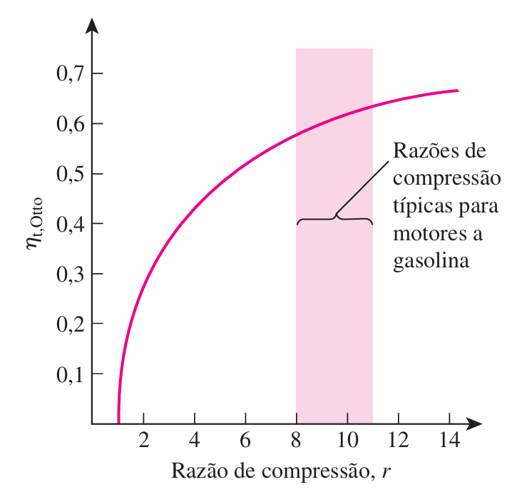

:::

## Ciclo diesel ideal

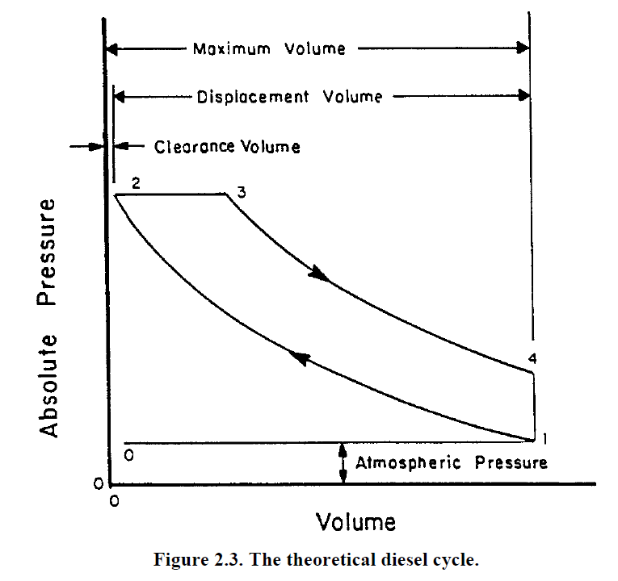{fig-align="center"}

## Eficiência Ciclo diesel 

$$\eta_{t,Diesel}=1-\frac{1}{r^{k-1}}*[\frac{r_{c}^k-1}{k(r_{c}-1)}] $$

$r = razão~de~compressão$

$r_c= razão~de~corte$

$k = razão~dos~calores~específicos$

## Eficiência Ciclo diesel 

Razão de corte

$$r_c = \frac{v_3}{v_2}$$

$v_3 = volume~cilindro~após~combustão$

$v_2 = volume~cilindro~antes~combustão$

## Eficiência Otto vs Diesel

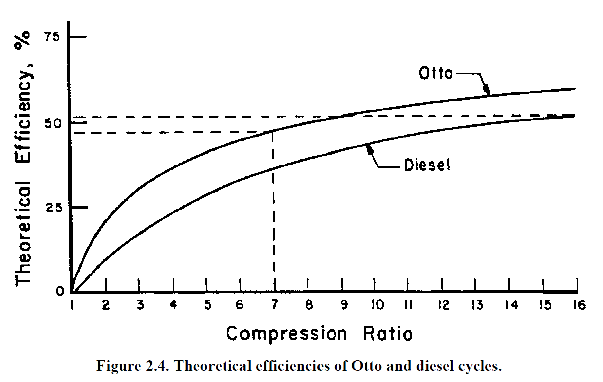

- Diferentes taxas de compressão

## Diferenças entre Otto e Diesel

Forma do pistão

::: {layout-ncol=2}

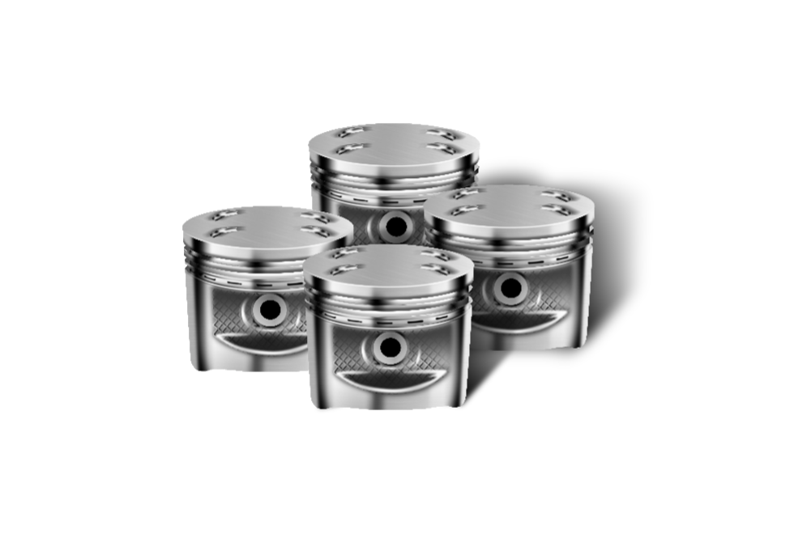{width=100%}

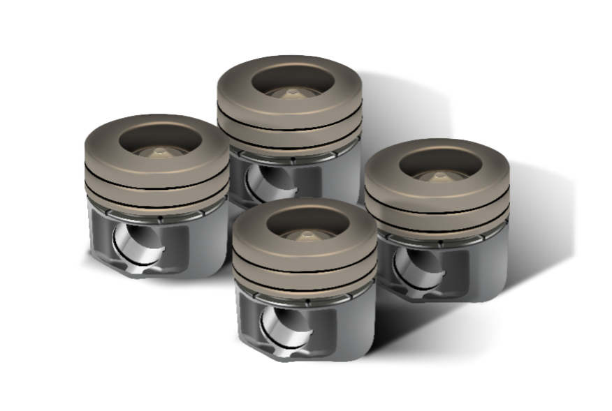{width=100%}

:::

## Diferenças entre Otto e Diesel

Ignição via vela

::: {layout-ncol=2}

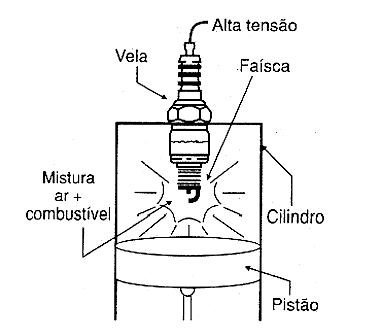{fig-align="center"}

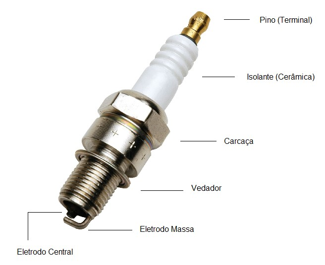{fig-align="center"}

:::

## Diferenças entre Otto e Diesel

| Parâmetro | Ciclo Otto | Ciclo Diesel |
|:-----------|:-----------|:-------------|
| Combustível | Gasolina, Etanol, Metanol, GLP | Óleo Diesel, Biodiesel |
| Condição termodinâmica do ciclo principal | Adição de calor a volume constante | Adição de calor a pressão constante |
| Fase de admissão | Admite mistura de ar e combustível | Admite apenas ar |
| Relação ar/combustível | Pouco variável | Muito variável |
| Controle de carga | Variando a quantidade de mistura | Variando a quantidade de combustível |

## Diferenças entre Otto e Diesel

| Parâmetro | Ciclo Otto | Ciclo Diesel |
|:-----------|:-----------|:-------------|
| Taxa de compressão | 6–10:1 | 16–20:1 |
| Pressão mínima de compressão (kPa) | 1400 | 3240 |
| Forma de ignição | Centelha elétrica | Autoignição |
| Rotação | Motores leves; combustão homogênea; altas rotações | Motores pesados; combustão heterogênea; baixas rotações |
| Rotação de potência máxima | > 5000 rpm | < 3000 rpm |
| Rendimento térmico | 25–30% | 30–35% |

# Motor 2 tempos

## Motor 2 tempos

Qual a diferença para o motor 4 tempo?

::: {.fragment}

São motores que em apenas 2 cursos do pistão executam os 4 tempos.

:::

::: {.fragment}

Em apenas um giro do virabrequim eles realizam todo o ciclo termodinâmico do motor.

:::

## Motor 2 tempos

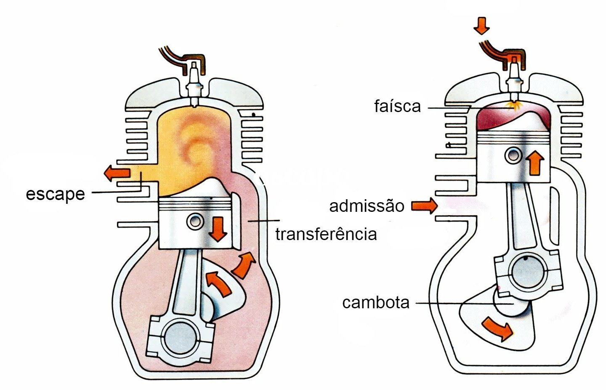{fig-align="center"}

Curso 1: admissão e compressão

Curso 2: combustão e exaustão

## Motor 2 tempos

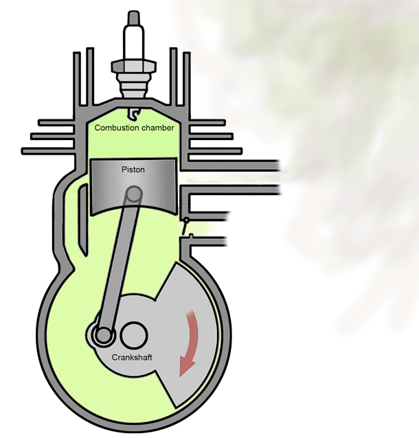{fig-align="center"}

## Motor 2 tempos

::: {.columns}

::: {.column}

Equipamentos com motor 2 tempos:

- Motosserras;
- Roçadoras;
- Motores estacionários;
- Monocultivatores;

:::

::: {.column}

::: {layout-ncol=2}

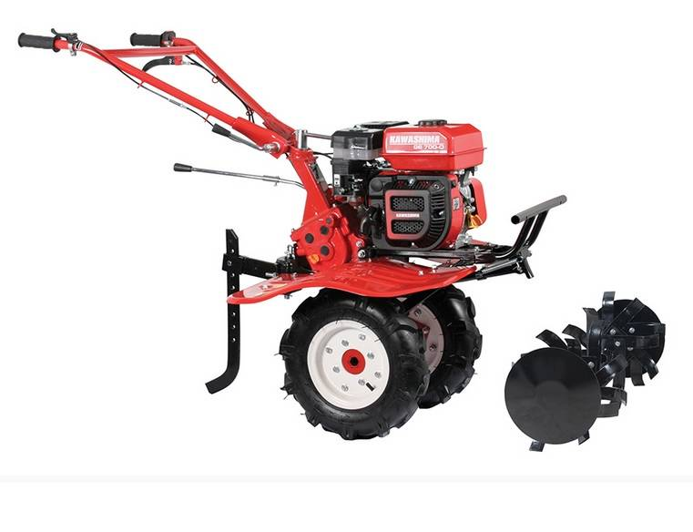{width="50%"}

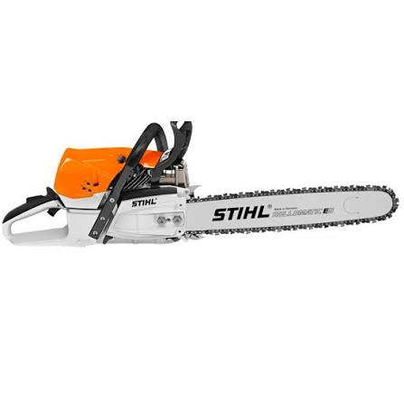{width="50%"}

:::

:::

:::

## Motor 2 tempos

[__2 x 4 tempos__]{.fg style="--col: #e64173"}

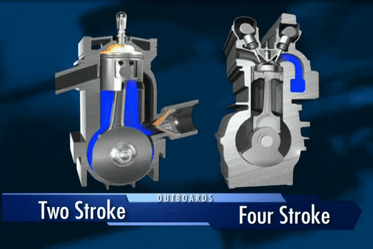{fig-align="center"}

## Motor 2 tempos

[__Diferenças__]{.fg style="--col: #e64173"}

::: {.columns}

::: {.column width="30%"}

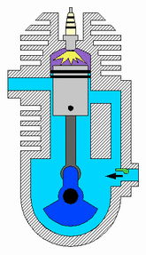{fig-align="center"}

:::

::: {.column width="70%"}

::: {.incremental}

- Não emprega válvulas para admissão e exaustão (usa-se janelas).
  - O pistão trabalha como "válvula".
  
- Não é necessário cabeçote.

- Cárter não tem função de armazenamento de lubrificante.
  - Óleo lubrificante é adicionado com o combustível.
  - Vida útil menor que motor 4 tempo.
  - Permite o uso em qualquer orientação.

- Mais poluente.

:::

:::

:::

::: {.notes}

Produz mais potência em uma mesma cilindrada e rotação.

:::

# Motor Wankel

## Motor Wankel

::: {layout-ncol=2}

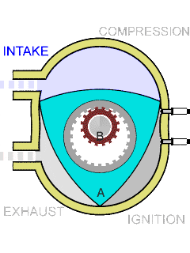{fig-align="center"}

{fig-align="center"}

:::

- Mais poluente.

# Motor de uso agrícola

## Motor de uso agrícola

::: {.incremental}

- Ambiente de trabalho.

- Força e modo de operação.

:::

# Fim!