# Como funciona um motor?
<hr>

# Sistemas complementares
<hr>

## Sistemas complementares
<hr>

::: {.incremental}

- Sistema de alimentação;
- Sistema de arrefecimento;
- Sistema de lubrificação;
- Sistema de partida;
- Sistema de exaustão;
<br>
<br>
<br>
- Combustíveis;
- Lubrificantes.

:::

## Sistema de alimentação
<hr>

Conjunto de mecanismos com a função de **alimentar** o motor com a quantidade adequada de ar e de combustível.


::: {.fragment}

Dois circuitos:

- Alimentação de ar;

- Alimentação de combustível (Diesel).

:::

## Sistema de alimentação
<hr>

```{dot}
//| fig-width: 10
//| fig-height: 6
//| fig-align: center

digraph {

    graph [
        rankdir=TB
        bgcolor="transparent"
        fontname="Arial"
        nodesep=4
        ranksep=0.20
        pad=0.02
        margin=0
        splines=ortho
        outputorder=edgesfirst
    ]

    node [
        shape=box
        style="rounded,filled"
        fontname="Arial"
        fontsize=20
        fontcolor="#263238"
        color="#B0BEC5"
        penwidth=1.2
        margin="0.14,0.07"
    ]

    edge [
        color="#78909C"
        penwidth=1.3
        arrowsize=0.65
    ]

    OBJ [
        label="Suprimento de ar e combustível\nao motor"
        shape=plaintext
        fontsize=21
        fontcolor="#37474F"
    ]

    ar [
        label="AR"
        shape=plaintext
        fontsize=21
        fontcolor="#35657A"
    ]

    comb [
        label="COMBUSTÍVEL"
        shape=plaintext
        fontsize=21
        fontcolor="#4A4A4A"
    ]

    subgraph cluster_ar {

        label=""
        color="transparent"
        penwidth=0
        margin=8

        A1 [label="Pré-filtro", fillcolor="#EAF4F9", color="#8FB9CC"]
        A2 [label="Filtro primário", fillcolor="#EAF4F9", color="#8FB9CC"]
        A3 [label="Filtro secundário", fillcolor="#EAF4F9", color="#8FB9CC"]
        A4 [label="Turbina\n(Turbocharger)", fillcolor="#EAF4F9", color="#8FB9CC"]
        A5 [label="Resfriador\n(Intercooler)", fillcolor="#EAF4F9", color="#8FB9CC"]
        A6 [label="Coletor de admissão", fillcolor="#DCEEF7", color="#6FA3BA", penwidth=1.5]

        A1 -> A2 -> A3 -> A4 -> A5 -> A6
    }

    subgraph cluster_comb {

        label=""
        color="transparent"
        penwidth=0
        margin=8

        C1 [label="Tanque", fillcolor="#F1F1F1", color="#B5B5B5"]
        C2 [label="Copo de sedimentação", fillcolor="#F1F1F1", color="#B5B5B5"]
        C3 [label="Bomba alimentadora", fillcolor="#F1F1F1", color="#B5B5B5"]
        C4 [label="Filtro de combustível", fillcolor="#F1F1F1", color="#B5B5B5"]
        C5 [label="Bomba injetora", fillcolor="#F1F1F1", color="#B5B5B5"]
        C6 [label="Bico injetor", fillcolor="#E7E7E7", color="#999999", penwidth=1.5]

        C1 -> C2 -> C3 -> C4 -> C5 -> C6
    }

    M [
        label="Cilindro\ndo motor"
        fillcolor="#F9E2D2"
        color="#D58D61"
        penwidth=2
        fontsize=22
        margin="0.20,0.10"
    ]

    E1 [
        label="Coletor de descarga"
        fillcolor="#EAF4F9"
        color="#8FB9CC"
    ]

    E2 [
        label="Abafador"
        fillcolor="#EAF4F9"
        color="#8FB9CC"
    ]

    E3 [
        label="Resíduos da combustão"
        fillcolor="#EAF4F9"
        color="#8FB9CC"
    ]

    
    { rank=same; ar; comb }


    { rank=same; A1; C1 }
    { rank=same; A2; C2 }
    { rank=same; A3; C3 }
    { rank=same; A4; C4 }
    { rank=same; A5; C5 }
    { rank=same; A6; C6 }


    OBJ -> ar [color="transparent"]
    OBJ -> comb [color="transparent"]

    ar -> A1 [color="transparent"]
    comb -> C1 [color="transparent"]


    A6 -> M
    C6 -> M


    M -> E1 -> E2 -> E3
}
```

## Sistema de alimentação
<hr>
 
[__Circuito de alimentação de ar:__]{.fg style="--col: #e64173"}

É o circuito que distribui o ar para o motor. Ar limpo e livre de impurezas.


::: {.fragment}

Funcionamento em 3 etapas:

::: {.incremental}

- Admissão;
- Filtragem;
- Exaustão.

:::

:::

## Sistema de alimentação
<hr>
 
[__Tipos de filtro:__]{.fg style="--col: #e64173"}

- Pré-filtro: Responsável por reter partículas maiores por meio de centrifugação.


::: {.fragment}

::: {layout-ncol=2}

{fig-align="center" width="300px"}

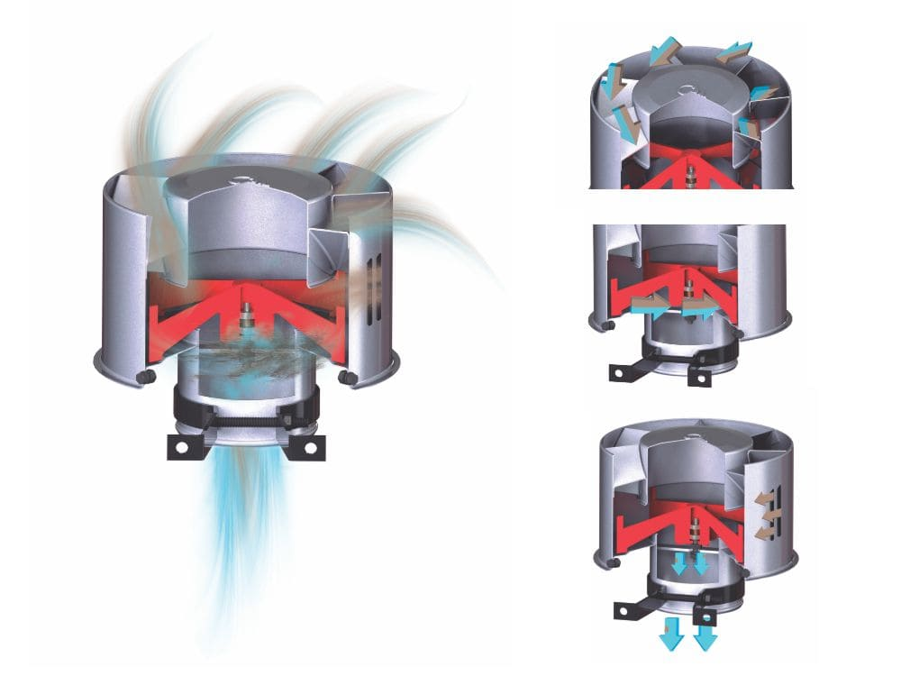{fig-align="center" width="450px"}

:::
:::

## Sistema de alimentação
<hr>
 
[__Tipos de filtro:__]{.fg style="--col: #e64173"}

- Pré-filtro: Responsável por reter partículas maiores por meio de centrifugação.

{fig-align="center"}


## Sistema de alimentação
<hr>

[__Tipos de filtro:__]{.fg style="--col: #e64173"}

- Banho de óleo: O ar entra em contato com uma cuba de óleo, onde as partículas menores são retidas.


::: {.fragment}

::: {layout-ncol=2}

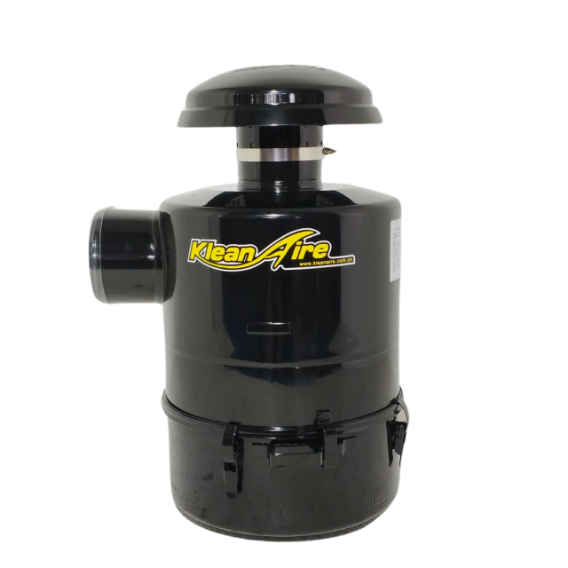{fig-align="center" width="350px"}

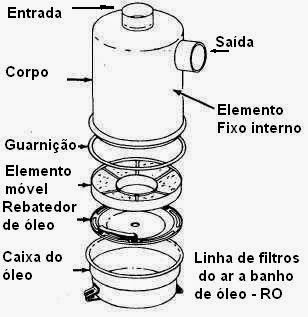{fig-align="center" width="300px"}

:::

:::

## Sistema de alimentação
<hr>
 
[__Tipos de filtro:__]{.fg style="--col: #e64173"}

- Filtro de cartucho: O filtro primário é de papel e o secundário de feltro. Retêm quase a totalidade das partículas sólidas em suspensão.

::: {.fragment}

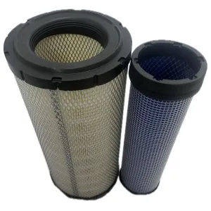{fig-align="center"}

:::

## Sistema de alimentação
<hr>
 
[__Aspiração natural:__]{.fg style="--col: #e64173"}

::: {.incremental}

- Motor de aspiração natural trabalha com a pressão atmosférica para preencher os cilindros de ar;
- Tempo de abertura da válvula de alimentação é menor;
- Limitação da potência do motor.

:::

## Sistema de alimentação
<hr>
 
[__Sobrealimentação:__]{.fg style="--col: #e64173"}

::: {.incremental}

- Aumento da entrada de ar no motor;
- Maior preenchimento de ar dentro do cilindro;
- Aumento da capacidade de geração de potência do motor;
- Não utiliza rotações altas;
- Aumenta o calor;
  - Desgaste dos componentes;
- Aumenta o volume de ar no cilindro;
  - Permite injeção de mais combustível;
  - Aumento da potência e torque (30%).

:::

## Sistema de alimentação
<hr>

[__Sobrealimentação:__]{.fg style="--col: #e64173"}

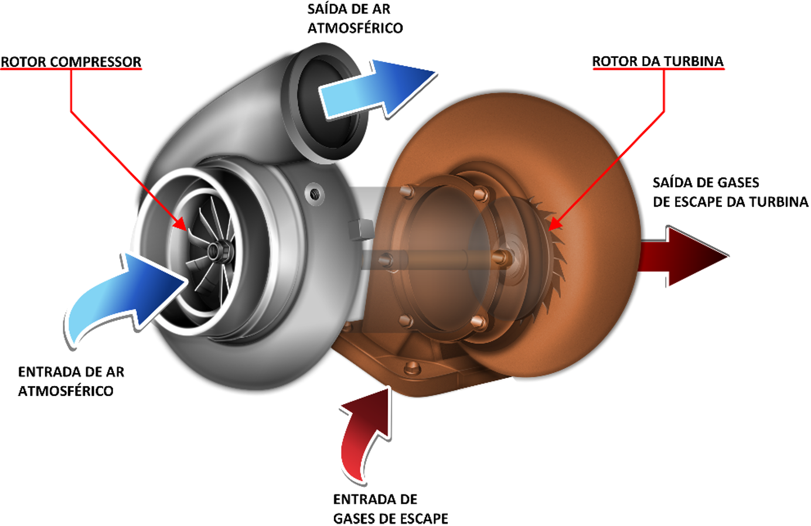{fig-align="center"}

::: {.notes}

A saída dos gases resultantes da queima
do combustível, acionam uma turbina, enquanto
os gases excedentes não utilizados
neste acionamento são expulsos por uma
válvula de alívio. Ao girar, a turbina movimenta
o compressor que aspira o ar ambiente,
comprimindo-o no motor, fazendo-o
passar pelo radiador para resfriá-lo e, posteriormente
ao cilindro (ciclo Diesel).

:::

## Sistema de alimentação
<hr>

[__Intercooler:__]{.fg style="--col: #e64173"}

::: {.incremental}

- Sistema de troca de calor;
  - Ar-ar (mais comum);
  - Ar-água;
- Reduz a temperatura do ar enviado aos cilindros;
- Ar com temperatura ~200ºC;
- Ar frio... volume menor, mais concentração dentro do cilindro.
  - Mais potência.

:::

::: {.notes}

Transformação isobárica – Lei de Charles
aumento da temperatura aumenta o volume em pressão constante

:::

## Sistema de alimentação
<hr>

[__Sobrealimentação:__]{.fg style="--col: #e64173"}

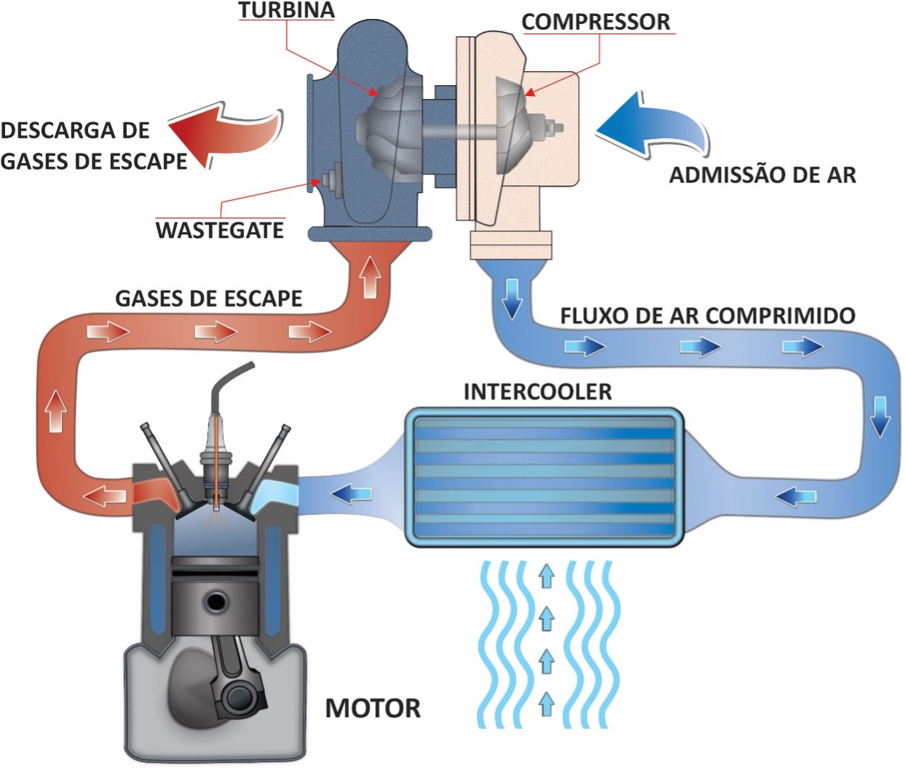{fig-align="center"}

## Sistema de alimentação
<hr>

[__Sobrealimentação:__]{.fg style="--col: #e64173"}

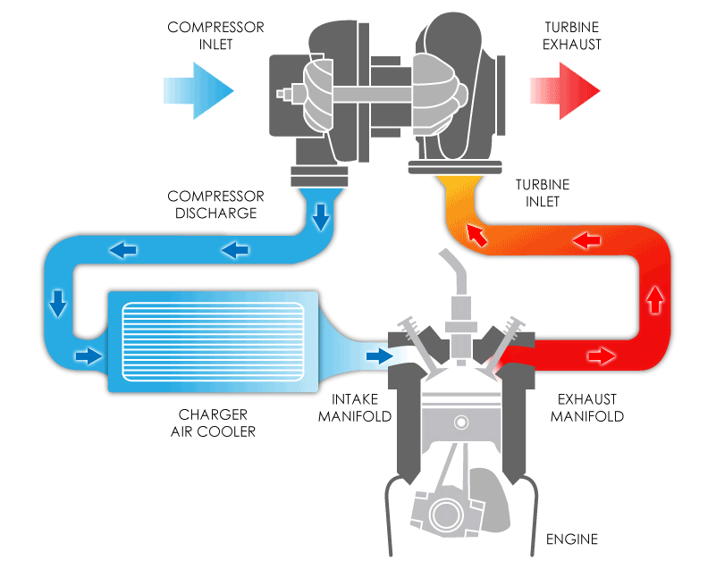{fig-align="center"}

## Sistema de alimentação
<hr>
 
[__Circuito de alimentação de combustível:__]{.fg style="--col: #e64173"}

É o circuito que tem a função de pulverizar o combustível na câmara de combustão em partículas finas.

::: {.incremental}

- Tanque;
- Copo sedimentador;
- Bomba alimentadora;
- Filtros de combustível;
- Bomba injetora;
- Bicos injetores;
- Dutos de alta e baixa pressão e retorno.

:::

## Sistema de alimentação
<hr>
 
[__Circuito de alimentação de combustível:__]{.fg style="--col: #e64173"}

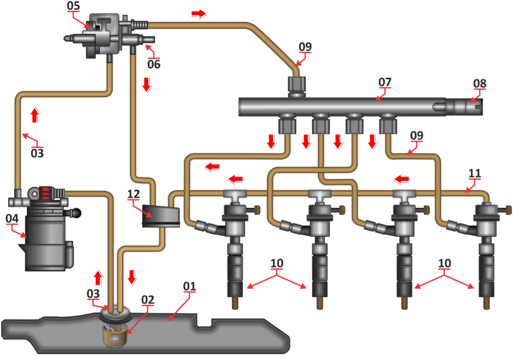{fig-align="center"}

## Sistema de alimentação
<hr>

[__Circuito de alimentação de combustível:__]{.fg style="--col: #e64173"}

::: {.columns}

::: {.column width="50%"}


:::

::: {.column width="40%" style="font-size:14px"}

1 - Tanque de Combustível;

2 - Bomba de Combustível;

3 - Linha de Combustível;

4 - Filtro de Combustível;

5 - Bomba de Alta Pressão;

6 - Regulador de Pressão;

7 - Common Rail;

8 - Sensor de Pressão;

9 - Linha de Alta Pressão;

10 - Injetores;

11 - Linha de Retorno;

12 - Reservatório de Retorno de combustível.

:::

:::

## Sistema de alimentação
<hr>

[__Circuito de alimentação de combustível:__]{.fg style="--col: #e64173"}

::: {.incremental}

- Tanque de combustível: Depósito para armazenamento de combustível durante os períodos de operação;
  - Fabricado de polietileno;
  - Deve ter autonomia de uma jornada de trabalho;
- Copo sedimentador: Função de decantar a água;
  - É o componente que permite drenar a água;
  - Sistema modernos não apresentam copo de sedimentação.

:::

## Sistema de alimentação
<hr>

[__Circuito de alimentação de combustível:__]{.fg style="--col: #e64173"}

::: {.incremental}
- Bomba alimentadora: Tem a função de retirar o óleo Diesel do tanque e colocar pressão para que o combustível passe pelos filtros e atinja a bomba injetora;
  - Permite a realização da sangria do combustível (processo de remover o ar das mangueiras após a troca de filtro ou por demais fatores).
  - Equipamentos modernos é de funcionamento elétrico;
- Filtros: têm a função de reter as partículas de impurezas presentes no combustível.

:::

## Sistema de alimentação
<hr>

[__Circuito de alimentação de combustível:__]{.fg style="--col: #e64173"}

Cuidado com abastecimento:

- É recomendado realizar o abastecimento do tanque de combustível após a jornada de trabalho (à noite). Isso evita a formação de gotículas de água que podem danificar o motor.

::: {.fragment}

- Outro fator que favorece o abastecimento durante a noite é que realizar o abastecimento pela manhã, antes da jornada de trabalho, pode provocar a movimentação dos sedimentos acumulados no fundo do tanque, o que pode danificar o sistema de filtragem.


:::

## Sistema de alimentação
<hr>

[__Circuito de alimentação de combustível:__]{.fg style="--col: #e64173"}

::: {layout-ncol=2}

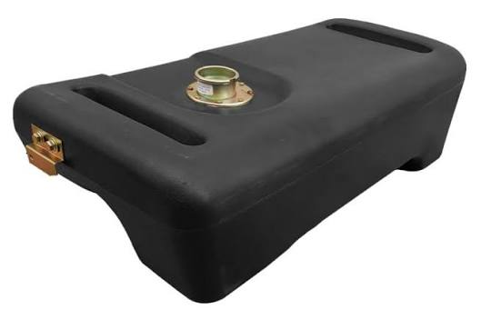

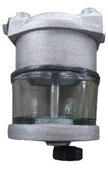


:::

## Sistema de alimentação
<hr>

[__Circuito de alimentação de combustível:__]{.fg style="--col: #e64173"}

::: {layout-ncol=2}

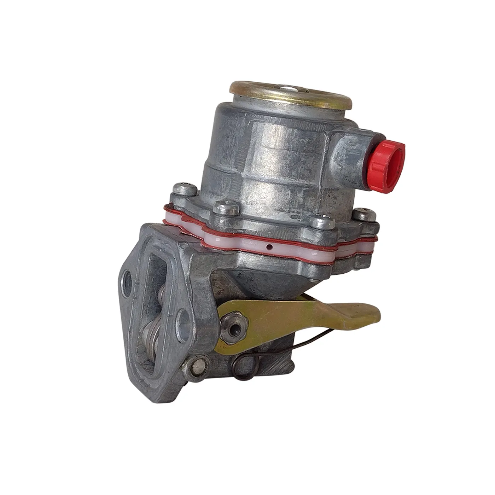{fig-align="center" width="450px"}

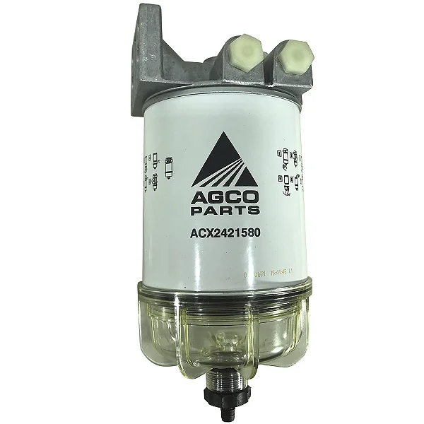{fig-align="center" width="400px"}

:::

## Sistema de alimentação
<hr>

[__Circuito de alimentação de combustível:__]{.fg style="--col: #e64173"}

::: {.incremental}

- Bomba injetora: Localizada entre os filtros de combustível e os bicos injetores, tem por função gerar uma vazão de combustível sob pressão, comprimindo o combustível até os bicos injetores;
  - Alta pressão é necessária para atomizar o combustível.
  - Bombas rotativas, pistão e eletrônica.
- A injeção eletrônica: Sistema de controle de combustível de alta eficiência e de baixa emissão (dosagem precisa).

:::

::: {.notes}

Na bomba rotativa a
lubrificação é feita pelo próprio óleo Diesel,
enquanto nas bombas de pistão, o óleo lubrificante
do motor é quem promove a lubrificação,
ou então, o próprio óleo do reservatório
da bomba é quem faz a lubrificação.

:::

## Sistema de alimentação
<hr>

[__Circuito de alimentação de combustível:__]{.fg style="--col: #e64173"}

::: {layout-ncol=2}

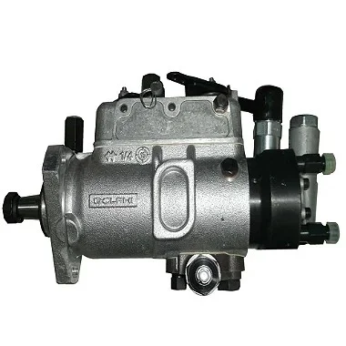{fig-align="center" width="450px"}

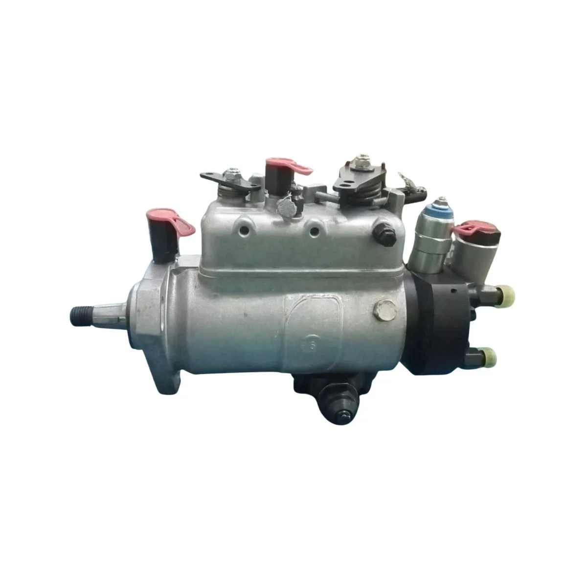{fig-align="center" width="500px"}

:::

## Sistema de alimentação
<hr>

[__Circuito de alimentação de combustível:__]{.fg style="--col: #e64173"}

::: {.incremental}

- Bicos injetores: São responsáveis por injetar o combustível de forma atomizada na câmara de combustão;

:::


::: {.fragment}

::: {layout-ncol=2}

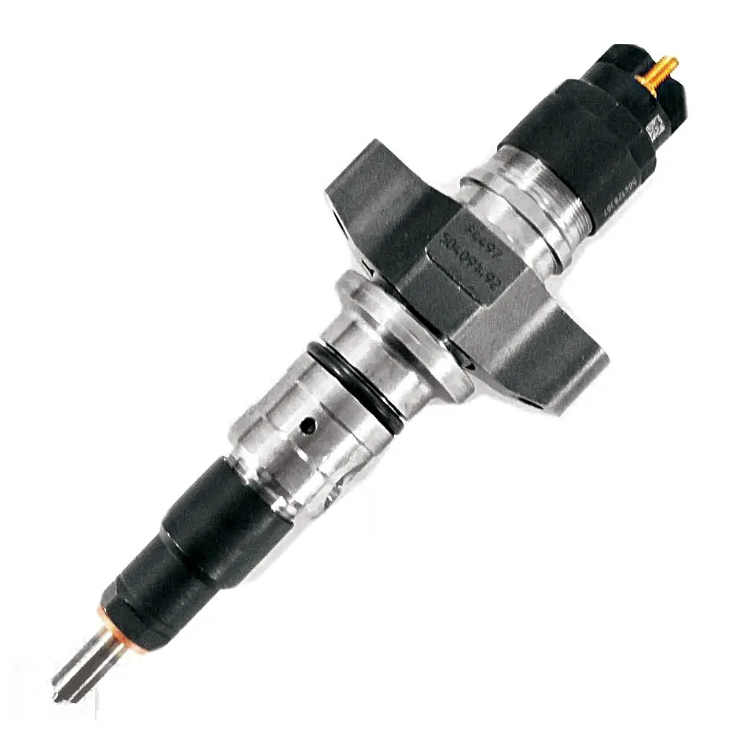{fig-align="center" width="450px"}

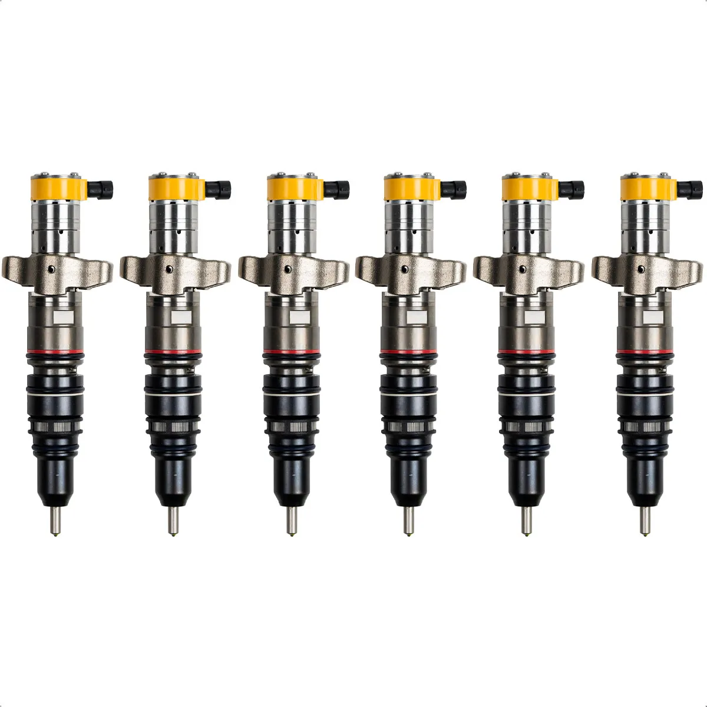{fig-align="center" width="500px"}

:::

:::

::: {.notes}

pressão de injeção 1300 - 2000 atm

:::

## Sistema de alimentação
<hr>

[__Circuito de alimentação de combustível:__]{.fg style="--col: #e64173"}

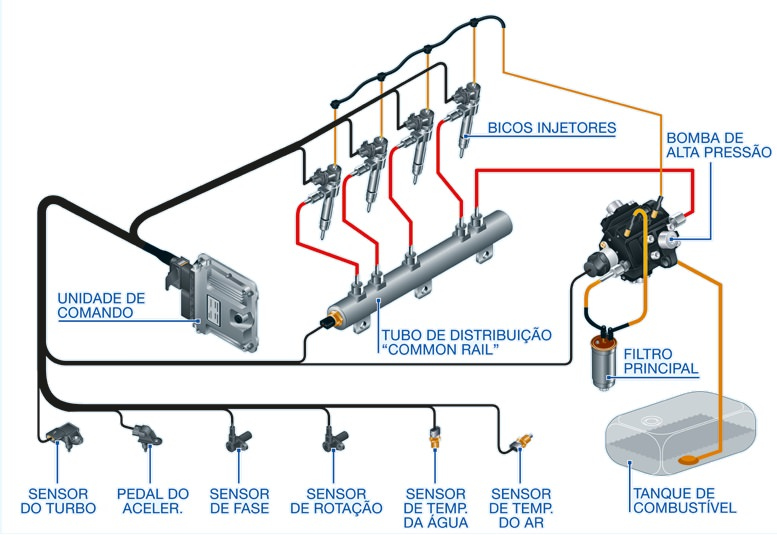{fig-align="center"}

## Sistema de alimentação
<hr>

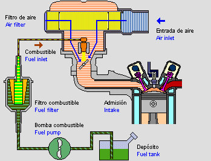{fig-align="center"}


# Sistema de arrefecimento
<hr>

## Sistema de arrefecimento
<hr>

A conversão da energia química do combustível para energia térmica depende de um ambiente com uma variação controlada de temperatura.


::: {.fragment}

O **sistema de arrefecimento** é o responsável por manter adequada a temperatura interna do motor e promover maior eficiência.

:::


::: {.incremental}

- Apenas 25 a 35% da energia é convertida em trabalho. 
- 65 a 75% é perdido na forma de calor.
  - Esse calor é transferido ao meio externo (ambiente) pelo sistema de arrefecimento;
- Podem ser do tipo: ar, água ou ar e água;
  - Motores agrícolas usam sistema de arrefecimento por água.
  - Superaquecimento só ocorrerá se faltar água.
:::


## Sistema de arrefecimento
<hr>

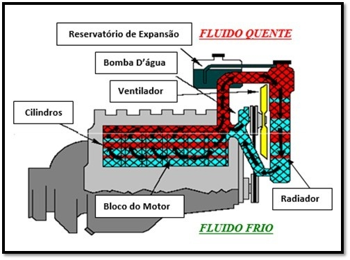{fig-align="center"}


## Sistema de arrefecimento
<hr>

Arrefecimento a água é controlado por meio da válvula termostática.


::: {.incremental}

- Bloqueia a passagem do líquido de arrefecimento, do motor para o radiador, quando o motor estiver abaixo da temperatura de trabalho;
- Quando a temperatura ultrapassa a temperatura de trabalho, a válvula se abre e permite a passagem de líquido para o radiador.

:::

::: {.fragment}

::: {layout-ncol=2}

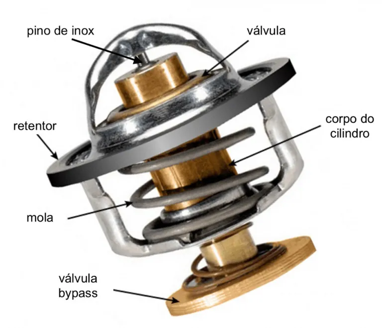{fig-align="center" width="350px"}

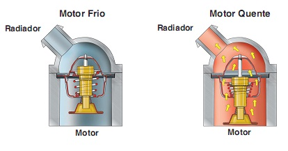{fig-align="center" width="500px"}

:::

:::

## Sistema de arrefecimento
<hr>

Radiador

Função de trocar calor com o ambiente

::: {layout-ncol=2}

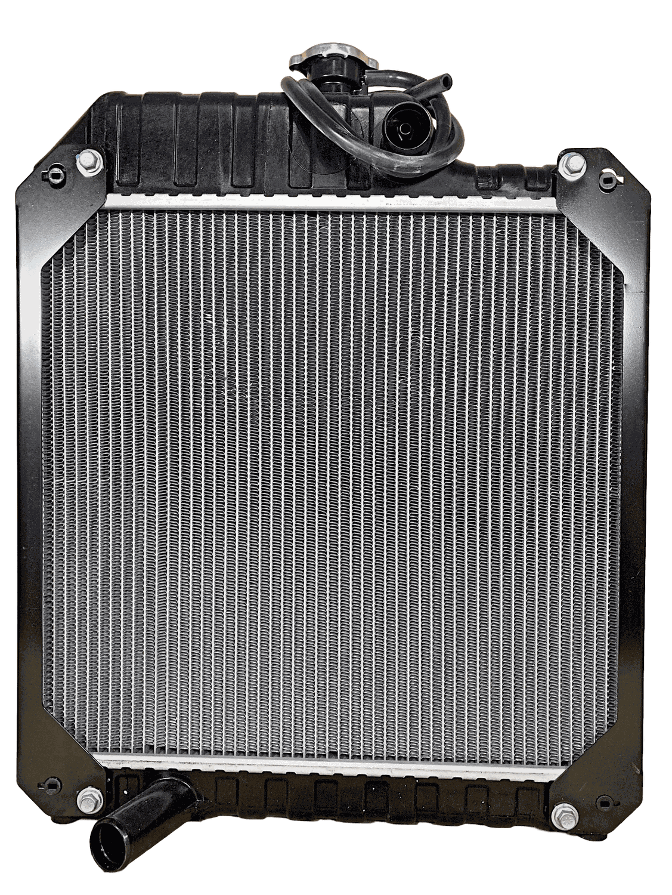{fig-align="center" width="350px"}

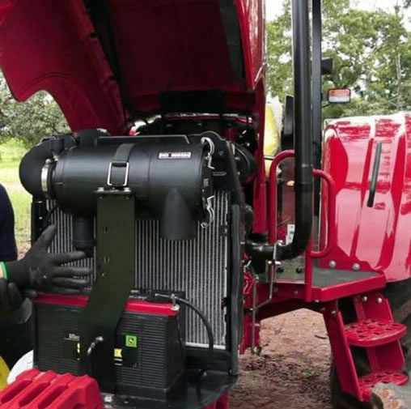{fig-align="center" width="450px"}

:::

## Sistema de arrefecimento
<hr>

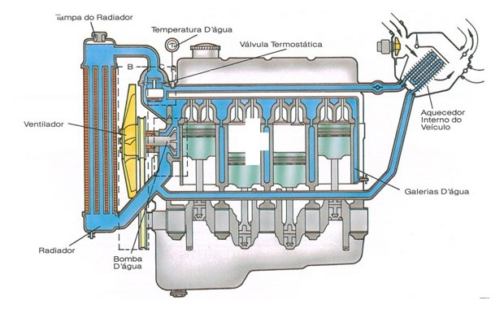{fig-align="center"}

## Sistema de arrefecimento
<hr>

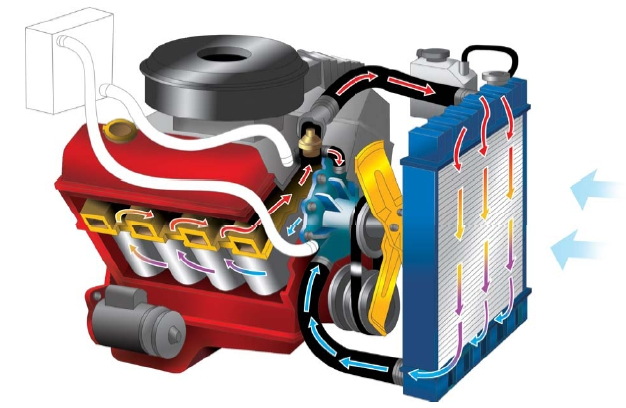{fig-align="center"}


# Sistema de lubrificação
<hr>

## Sistema de lubrificação
<hr>

Os movimentos relativos de peças do motor geram atrito e provocam aquecimento e desgaste do motor. A lubrificação é a interposição de substâncias oleosas entre as superfícies que estão em contato.

- Reduz o aquecimento e o desgaste dos componentes;
- Película oleosa entre peças.

## Sistema de lubrificação
<hr>

Funções básicas:

::: {.incremental}


::: {.columns}

::: {.column}

- Permitir a formação de uma película de óleo lubrificante na interface de contato entre as superfícies móveis.
  - Reduzir atrito;
  - Minimizar perda de energia mecânica;
  - Minimizar desgaste;
  - Tornar suave o movimento do motor.

:::

::: {.column}

- Permitir a circulação ininterrupta de óleo lubrificante nos pontos que exigem;
  - Manutenção da temperatura;
- Limpeza dos pontos de lubrificação;
  - Remoção de resíduos da combustão;
- Vedação do espaço entre a parede do cilindro e os anéis do pistão;
- Amortecer choques (ruídos);

:::

:::

:::

## Sistema de lubrificação
<hr>

[__Circuito de lubrificação:__]{.fg style="--col: #e64173"}

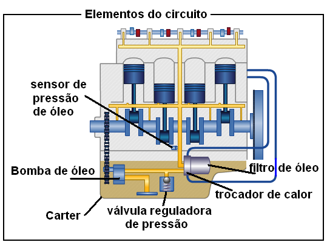{fig-align="center"}

::: {.notes}

A árvore de manivelas
possui orifícios que transportam o óleo
aos mancais das bielas e aos eixos fixos. Na
biela, um pequeno orifício coincidente com
um furo presente na árvore de manivelas,
faz com que o óleo seja esguichado para as
paredes do cilindro.
Como a bomba recebe acionamento do
eixo de distribuição, quando aumenta a rotação
do motor, a pressão também aumenta.
Há um limite operacional e, por isso, existe
a válvula de alívio para controlar a pressão,
a qual é indicada por um manômetro.

:::

## Sistema de lubrificação
<hr>

[__Sistema sob pressão:__]{.fg style="--col: #e64173"}

::: {.incremental}

- Cárter: reservatório armazenador do óleo lubrificante;
  - Local onde há a bomba de óleo;
- Bomba de óleo: responsável por distribuir o óleo armazenado no cárter para os componentes internos do motor;
- Válvula reguladora de pressão: próxima à saída da bomba, mantém constante a pressão, vazão uniforme;
- Filtros: retém as impurezas do óleo lubrificante;
- Manômetros: indicador da pressão do óleo, por meio da medição da resistência que o óleo encontra ao ser forçado a passar pelo sistema.

:::

## Sistema de lubrificação
<hr>

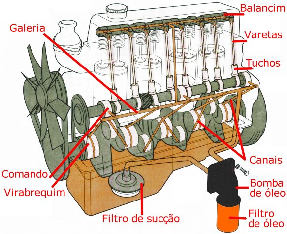{fig-align="center"}

## Sistema de lubrificação
<hr>

::: {.fragment}

**Cuide do nível do óleo!**

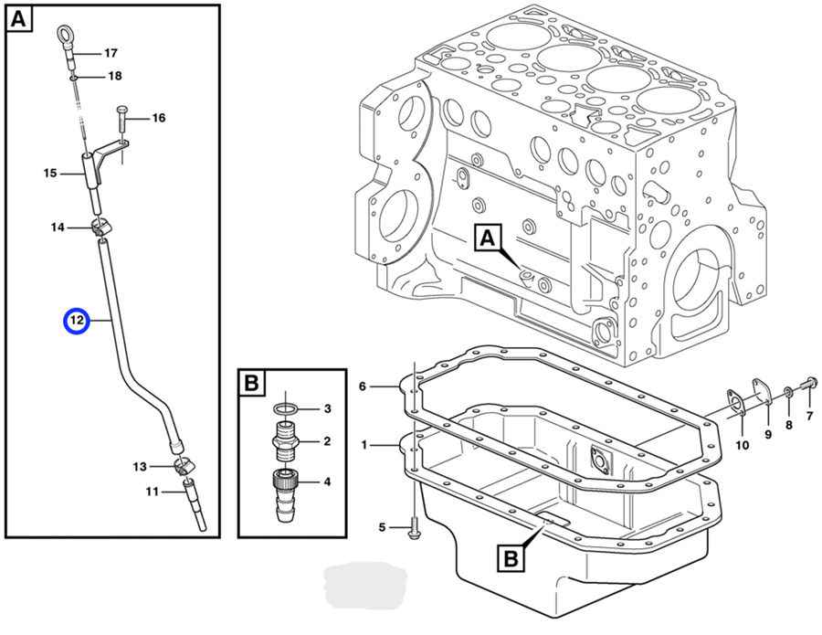{fig-align="center" width="550px"}

:::

# Sistema de partida
<hr>

## Sistema de partida
<hr>

Sistema responsável pelas primeiras explosões e movimentação do motor.


::: {.fragment}

Primeira energia fornecida ao motor.

:::

## Sistema de partida
<hr>

::: {.incremental}

Pode ser manual, com motores a gasolina, com gasolina ou elétrico

- Manual é encontrado em motores Diesel monocilíndricos;
  - Manual por manivela: O motor é iniciado girando a árvore de manivelas até rotação suficiente;
  - Manual por corda: O acionamento se dá pelo puxar de uma corda (ex: motosserras) enrolada no volante;
- Com motores a gasolina: Sistema de acionamento é composto por um motor a gasolina (manual) que transmite a energia ao motor a Diesel via engrenagens;

:::

## Sistema de partida
<hr>

::: {.incremental}

- Com gasolina: Válvula de arranque, é câmara auxiliar com vela de ignição (válvula reduz a razão de compressão e motor funciona como um ciclo Otto e depois se altera para ciclo Diesel);
- Elétrico: É um sistema mais complexo com motor de partida (motor de arranque).

:::

## Sistema de partida
<hr>

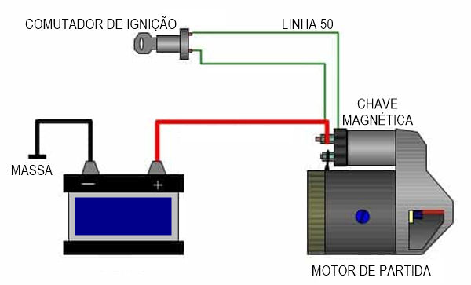{fig-align="center"}

## Sistema de partida
<hr>

A energia da bateria é transferida após o giro da chave de ignição. Um motor elétrico, denominado motor de arranque, é acionado e conectado ao volante do motor. Essa conexão é realizada por meio de duas engrenagens: o pinhão e a coroa.


::: {.fragment}

O pinhão é movimentado e se acopla à coroa do volante. Após o acoplamento, o motor de arranque transfere o movimento necessário para iniciar a rotação do motor. Quando o motor entra em funcionamento, o pinhão é automaticamente desacoplado da coroa.

:::

## Sistema de partida
<hr>

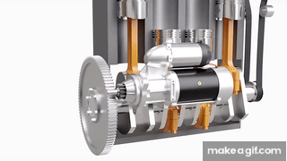{fig-align="center"}

# Sistema de exaustão
<hr>

## Sistema de exaustão
<hr>

Funções:

::: {.incremental}

- Conduzir os gases de escape: gases produzidos são descarregados na atmosfera;
- Purificar os gases de escape: remover componentes químicos nocivos e partículas poluentes;
- Reduzir o ruído do escape: amortecer o ruído para o mínimo permitido (preservação da audição).

:::

## Sistema de exaustão
<hr>

::: {.small style="font-size:13px"}

| Contaminante químico | Observação | Concentração (ppm) |
|:---|:---|---:|
| Acetaldeído | Carcinógeno do Grupo 1 da IARC | |
| Acroleína | Provável carcinógeno do Grupo 2A da IARC | |
| Anilina | Provável carcinógeno do Grupo 2A da IARC | |
| Arsênio | Carcinógeno do Grupo 1 da IARC; desregulador endócrino | |
| Benzeno | Carcinógeno do Grupo 1 da IARC | |
| Bifenila | Toxicidade moderada | |
| Bis(2-etil-hexil) ftalato | Desregulador endócrino | |
| 1,3-Butadieno | Carcinógeno do Grupo 1 da IARC | |
| Cádmio | Carcinógeno do Grupo 1 da IARC; desregulador endócrino | |
| Cloro | Subproduto da injeção de ureia | |
| Clorobenzeno | Toxicidade baixa a moderada | |
| Cresol | | |
| Dibutil ftalato | Desregulador endócrino | |
| 1,8-Dinitropireno | Fortemente carcinogênico | |
| Etilbenzeno | | |
| Formaldeído | Carcinógeno do Grupo 1 da IARC | |
| Chumbo inorgânico | Desregulador endócrino | |
| Metanol | | |
| Metil etil cetona | | |
| Naftaleno | Carcinógeno do Grupo 2B da IARC | |
| Níquel | Carcinógeno do Grupo 2B da IARC | |
| 3-Nitrobenzantrona (3-NBA) | Fortemente carcinogênico | 0,6–6 |
| 4-Nitrobifenila | Irritante; causa danos aos nervos, fígado e rins | 2,2 |
| Fenol | | |
| Fósforo | | |
| Pireno | | 3532–8002 |
| Benzo(e)pireno | | 487–946 |
| Benzo(a)pireno | Carcinógeno do Grupo 1 da IARC | 208–558 |
| Fluoranteno | Possível carcinógeno do Grupo 3 da IARC | 3399–7321 |
| Propionaldeído | | |
| Estireno | Carcinógeno do Grupo 2B da IARC | |
| Tolueno | Possível carcinógeno do Grupo 3 da IARC | |
| Xileno | Possível carcinógeno do Grupo 3 da IARC | |

:::

## Sistema de exaustão
<hr>

[__Sistemas de pós-tratamento:__]{.fg style="--col: #e64173"}


::: {.fragment}

São sistemas para melhorar o tratamento dado aos gases emitidos

::: {.incremental}

- Recirculação dos gases de escape: EGR;
  - Introduz gás não reativo (já queimado) para a câmara de combustão;
  - Reduz a temperatura e produz menos NO~x~;
  - Reduz a eficiência térmica;
- Redução catalítica seletiva: SCR;
  - Injeta um agente redutor líquido (ex: ARLA 32);
  - Reações químicas que convertem o NO~x~ em N~2~, água e CO~2~.
:::

:::

## Sistema de exaustão
<hr>

[__Sistemas EGR:__]{.fg style="--col: #e64173"}

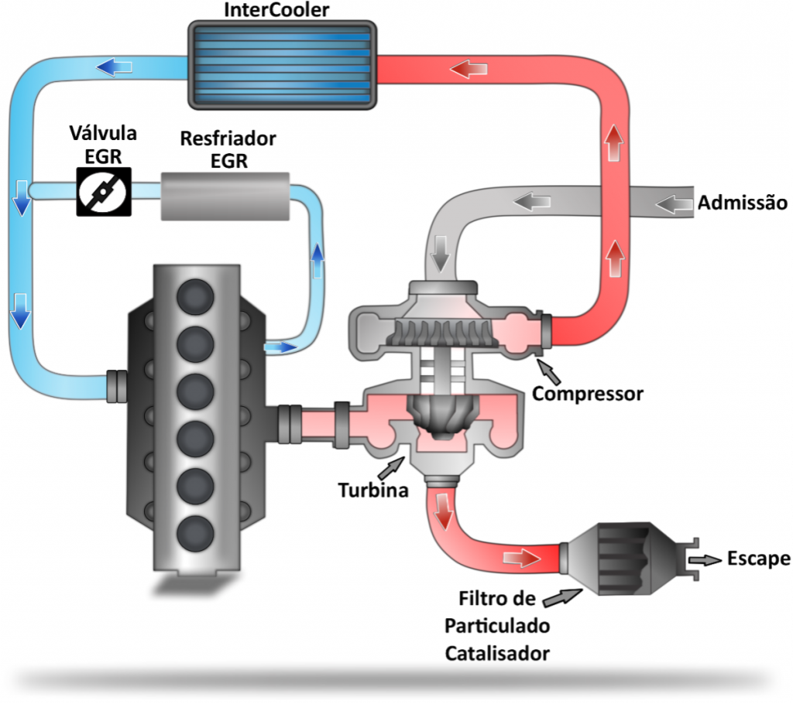{fig-align="center"}

## Sistema de exaustão
<hr>

[__Sistemas SCR:__]{.fg style="--col: #e64173"}

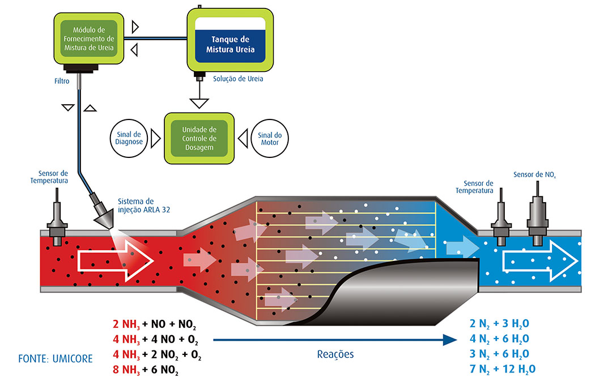{fig-align="center"}

## Sistema de exaustão
<hr>

[__Transformação da ureia:__]{.fg style="--col: #e64173"}

$$H_2NCONH_2 + H_2O = 2NH_3 + CO_2$$


$$8NH_3 + 6NO_2 = 7N_2 + 12H_2$$


# Combustível
<hr>


## Combustível
<hr>


::: {.fragment}

Qualquer substância cuja reação de oxidação-redução é altamente exotérmica.

:::


::: {.fragment}

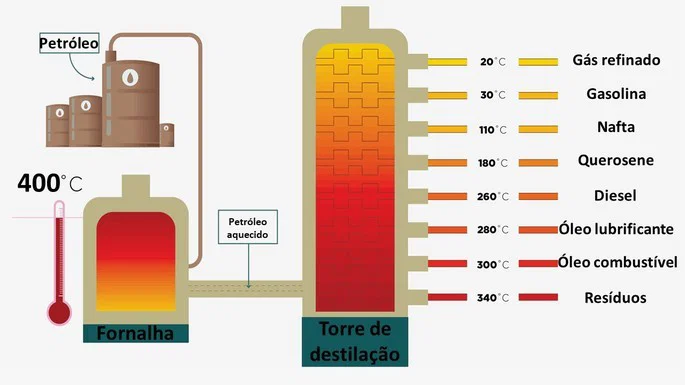{fig-align="center"}

:::


::: {.fragment}

Podemos criar petróleo?

:::

## Combustível
<hr>

A maioria dos combustíveis utilizados hoje é derivada do petróleo.

::: {.fragment}

Com o devido processamento e refino, novos combustíveis alternativos com propriedades semelhantes ou iguais às do petróleo serão descobertos.

:::

::: {.fragment}

Existirá um dia em que o petróleo será esgotado!

:::

## Combustível
<hr>

Qual a principal vantagem dos combustíveis à base de petróleo?


::: {.fragment}

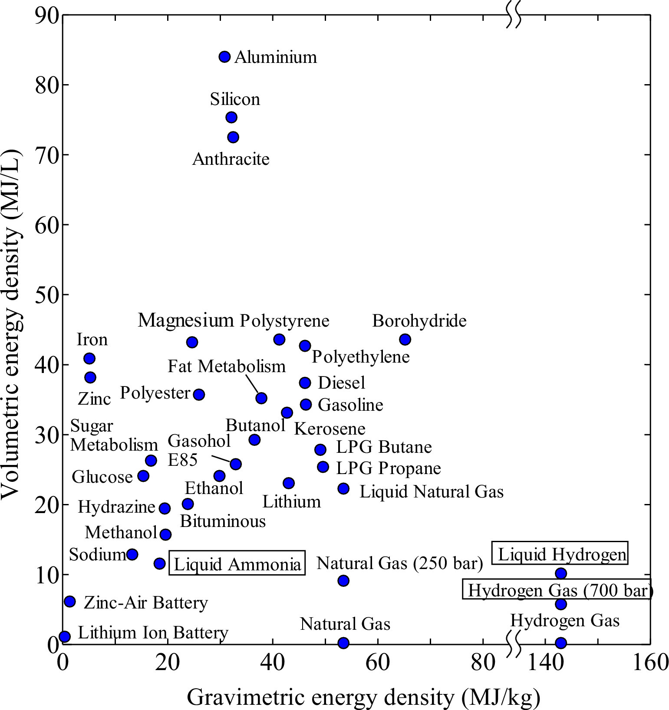{fig-align="center" width="480px"}

:::

## Combustível
<hr>

[__Octanagem:__]{.fg style="--col: #e64173"}

É o índice de octano (C~8~H~18~), uma medida da resistência do combustível à compressão (escala de 0 a 100).
- Quanto mais elevado, maior a capacidade de ser comprimido na câmara de combustão sem que ocorra a autoignição.


::: {.fragment}

[__Cetanagem:__]{.fg style="--col: #e64173"}

É o número de cetano, índice que mede a qualidade de ignição de um combustível utilizado em um motor de ciclo Diesel.
- Quanto maior for o valor, menor será o tempo para queima.

:::

::: {.notes}

Gasolina com ar explode, mas sozinha ela não consegue autoignição

:::

## Combustível
<hr>

Octanagem x Cetanagem

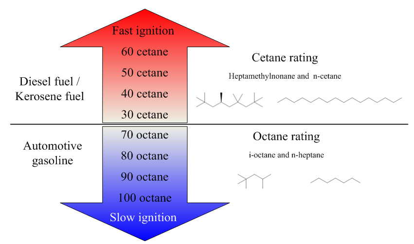{fig-align="center"}

## Combustível
<hr>

[__Gasolina:__]{.fg style="--col: #e64173"}

::: {.fragment}

Mistura inflamável de hidrocarbonetos de cadeias carbônicas menores (5 a 10 C).

- Tipo A (sem etanol);
- Tipo C (etanol anidro);

:::

## Combustível
<hr>

[__Gasolina:__]{.fg style="--col: #e64173"}

Apenas a tipo C é comercializada no Brasil

::: {.fragment}

| Característica | C-Comum | C-Premium |
|:---|:---|---:|
| Cor | Amarelada | Levemente alaranjada |
| Octanagem min | 87 | 91 |
| Enxofre max (ppm) | 50 | 50 |
| Aditivos | Pode conter | Contém |

:::


## Combustível
<hr>

[__Diesel:__]{.fg style="--col: #e64173"}

::: {.fragment}

Tipos:


::: {.columns}

::: {.column}

::: {.incremental}

- Óleo Diesel S10 e S500 de uso rodoviário:
  - Veículos automotivos;
  - Máquinas agrícolas;
  - Máquinas de construção;
  - Máquinas industriais;

:::

:::

::: {.column}

::: {.incremental}

- Óleo Diesel S1800 de uso não rodoviário:
  - Mineração a céu aberto;
  - Transporte ferroviário;

:::

:::

::: {.column}

::: {.incremental}

- Óleo Diesel marítimo:
  - Embarcações.

:::

:::

:::

:::

## Combustível
<hr>

[__Diesel:__]{.fg style="--col: #e64173"}

::: {.fragment}

S10 e S500 = **S** é o símbolo do elemento enxofre (presente de forma natural no combustível).

:::

::: {.fragment .small}

| Característica | S10 | S500 |
|:---|:---:|:---:|
| **Cor** | Incolor a amarelado | Vermelho |
| **Enxofre (ppm)** | **10** | **500** |
| **Lubricidade** | Baixa | Alta |
| **Poluentes** | Menos | Mais |
| **Número de cetano** | **48** | **42** |
| **Desempenho** | Mais eficiente | Menos eficiente |
| **Quantidade de hidrogênio** | Mais | Menos |
| **Capacidade de solubilizar sedimentos** | Maior | Menor |

:::

## Combustível
<hr>

::: {.small style="font-size:24px"}

[__Alternativos:__]{.fg style="--col: #e64173"}

| Categoria | Combustível | Sigla/descrição |
|:---|:---|:---|
| **Líquidos viscosos (bioDiesel)** | Éster metílico de óleos vegetais | |
| | Éster metílico de gorduras animais | |
| | Resíduos de óleo de cozinha | |
| | Óleo vegetal hidrotratado | HVO |
| **Líquidos não viscosos** | Álcool de cana-de-açúcar | |
| | Álcool de celulose | |
| | Álcool de cereais | |
| | Álcool de beterraba sacarina | |
| | Éter dimetílico | DME |
| **Gases** | Gás natural comprimido | GNC |
| | Gás liquefeito de petróleo | GLP |
| | Biogás | |
| | Hidrogênio | |
| **Sintéticos** | Gás para líquido | GTL |
| | Carvão liquefeito | CTL |
| | Biomassa para líquido | BTL |

:::

# Lubrificantes
<hr>

## Lubrificantes
<hr>

[__Funções primárias:__]{.fg style="--col: #e64173"}

Limitar e controlar o atrito, prevenção ao superaquecimento, reduzir desgaste e proteção contra a corrosão.


::: {.fragment}

[__Funções secundárias:__]{.fg style="--col: #e64173"}

Remoção de contaminantes, vedação, amortecimento e isolamento térmico.

:::

## Lubrificantes
<hr>

As características do óleo lubrificante interferem em suas funções.


::: {.fragment}

A origem e a composição dos óleos modificam o objetivo e suas propriedades


::: {.fragment}

Origem: animal, vegetal, mineral e sintética

:::


::: {.fragment}

Aditivos: anticorrosivos, detergentes, dispersantes, etc.

:::


:::

## Lubrificantes
<hr>

[__Características importantes:__]{.fg style="--col: #e64173"}

::: {.incremental}

- Viscosidade: indica a resistência ao escoamento;
- Índice de viscosidade: variação da viscosidade em relação a uma faixa de temperatura;
- Densidade: relação entre a massa e o volume.

:::

## Lubrificantes
<hr>

[__Viscosidade e temperatura:__]{.fg style="--col: #e64173"}


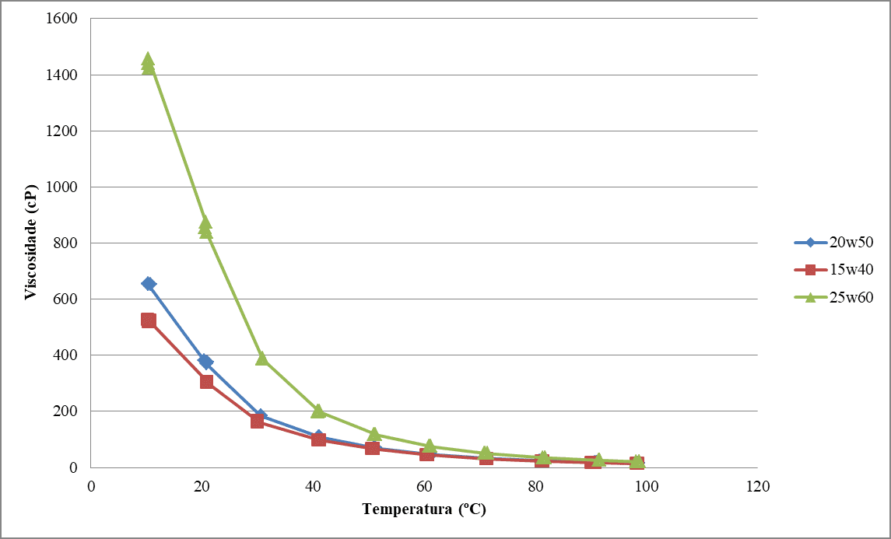{fig-align="center"}

## Lubrificantes
<hr>

[__Sistemas de classificação:__]{.fg style="--col: #e64173"}

::: {.incremental}

- SAE: Society of Automotive Engineers;
- API: American Petroleum Institute;
- ACEA: European Automobile Manufacturers Association

:::

## Lubrificantes
<hr>

[__Sistemas de classificação SAE:__]{.fg style="--col: #e64173"}

::: {.fragment}

Classifica os lubrificantes com base na viscosidade, sem considerar fatores relativos ao desempenho e serviço

:::

::: {.fragment}

Os lubrificantes são divididos em dois grupos

::: {.incremental}

- Monoviscosos: identificados por um único número;
- Multiviscosos: identificados por dois números separados pela letra "W" (winter = inverno).

:::

:::

## Lubrificantes
<hr>

[__Sistemas de classificação SAE:__]{.fg style="--col: #e64173"}

Exemplos:

::: {.incremental}
- O óleo SAE 10W possui uma baixa viscosidade e é adequado para ambiente de baixa temperatura (monograu).
- O óleo SAE 40 possui alta viscosidade (proteção ao motor) e é adequado para ambiente de alta temperatura (monograu).
- O óleo SAE 10W40 pode trabalhar tanto em baixa como em alta temperatura e possui uma viscosidade mais complexa (multigrau).

:::

## Lubrificantes
<hr>

::: {layout-ncol=2}

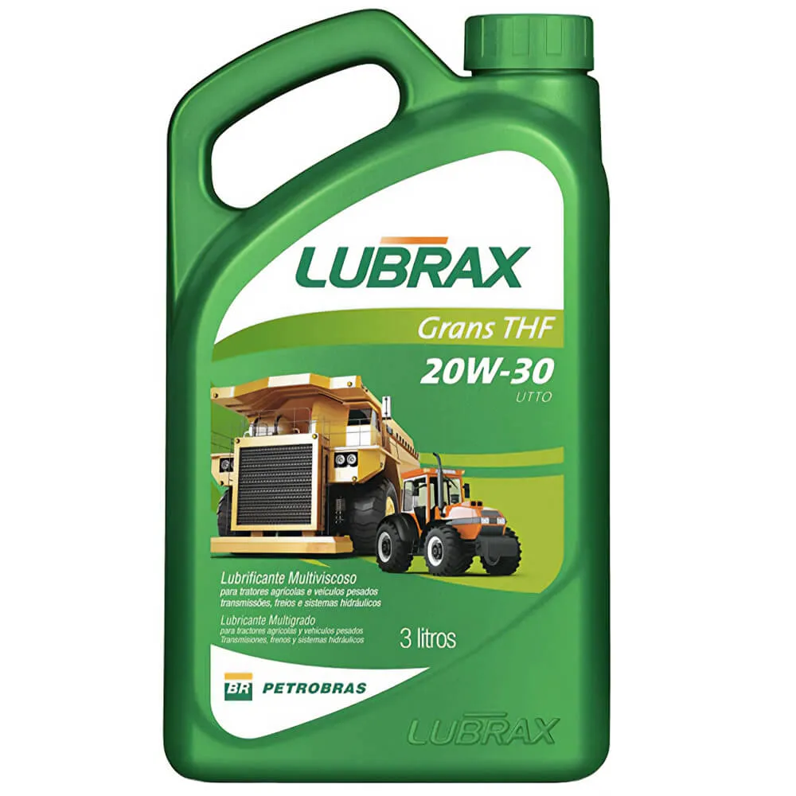

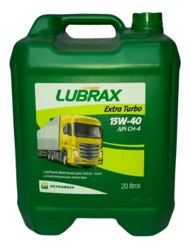

:::

## Lubrificantes
<hr>

::: {.small style="font-size: 20px"}

[__Sistemas de classificação SAE:__]{.fg style="--col: #e64173"}

| Grau de viscosidade SAE | Viscosidade máxima para acionamento em baixa temperatura (MPa·s) | Temperatura (°C) | Viscosidade máxima para bombeamento em baixa temperatura (MPa·s) | Temperatura (°C) | Viscosidade cinemática a 100 °C — Mínimo (mm²/s) | Máximo (mm²/s) | Alta viscosidade de cisalhamento (cP) |
|---|---:|---:|---:|---:|---:|---:|---:|
| 0W  | < 6200  | -35 | < 60000 | -40 | 3,8  | -      | -   |
| 5W  | < 6600  | -30 | < 60000 | -35 | 3,8  | -      | -   |
| 10W | < 7000  | -25 | < 60000 | -30 | 4,1  | -      | -   |
| 15W | < 7000  | -20 | < 60000 | -25 | 5,6  | -      | -   |
| 20W | < 9500  | -15 | < 60000 | -20 | 5,6  | -      | -   |
| 25W | < 13000 | -10 | < 60000 | -15 | 9,3  | -      | -   |
| 8   | -       | -   | -       | -   | 4,0  | < 6,1  | 1,7 |
| 12  | -       | -   | -       | -   | 5,0  | < 7,1  | 2,0 |
| 16  | -       | -   | -       | -   | 6,1  | < 8,2  | 2,3 |
| 20  | -       | -   | -       | -   | 6,9  | < 9,3  | 2,6 |
| 30  | -       | -   | -       | -   | 9,3  | < 12,5 | 2,9 |
| 40¹ | -       | -   | -       | -   | 12,5 | < 16,3 | 3,5 |
| 40² | -       | -   | -       | -   | 12,5 | < 16,3 | 3,7 |
| 50  | -       | -   | -       | -   | 16,3 | < 21,9 | 3,7 |
| 60  | -       | -   | -       | -   | 21,9 | < 26,1 | 3,7 |

:::

## Lubrificantes
<hr>

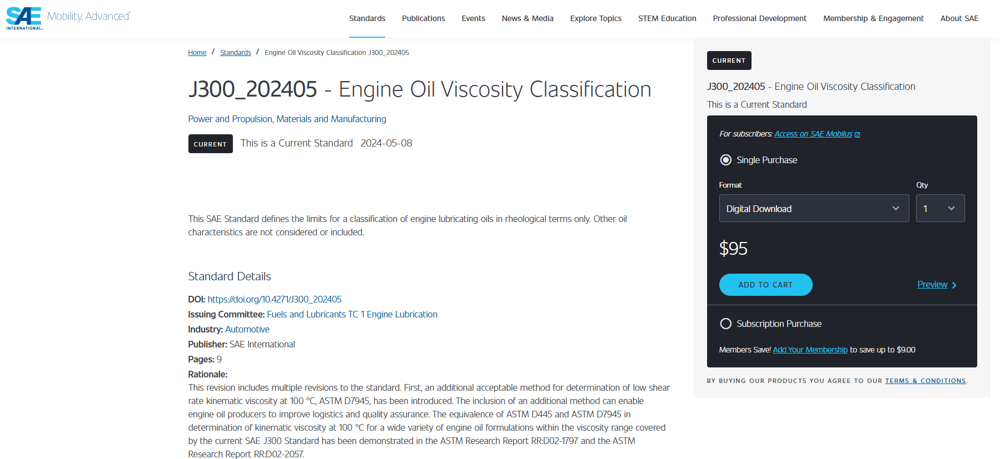{fig-align="center"}

## Lubrificantes
<hr>

[__Sistemas de classificação API:__]{.fg style="--col: #e64173"}

::: {.fragment}

Classifica os lubrificantes com base no desempenho.

:::

::: {.fragment}

Os lubrificantes são divididos em dois grupos

::: {.incremental}

- Série S (Spark ignition = ignição por faísca): destinados a motores de ciclo Otto;
- Série C (Compression ignition = ignição por compressão): destinados a motores ciclo Diesel.

:::

:::

## Lubrificantes
<hr>

[__Sistemas de classificação API:__]{.fg style="--col: #e64173"}

O segundo algarismo informa o nível de qualidade do óleo lubrificante, em ordem alfabética.

## Lubrificantes
<hr>

::: {.small style="font-size: 21px"}

| Categoria API | Status | Serviço[^1] |
|:---:|:---:|:---|
| **CK-4** | Atual | Atende aos padrões de 2017 |
| **CJ-4** | Atual | Atende aos padrões de 2010 |
| **CI-4** | Atual | Atende aos padrões de 2010 |
| **CH-4** | Atual | Atende aos padrões de 1998 |
| **CG-4** | Obsoleto | Não adequado após 2009 |
| **CF-4** | Obsoleto | Não adequado após 2009 |
| **CF-2** | Obsoleto | Não adequado após 2009 |
| **CF** | Obsoleto | Não adequado após 2009 |
| **CE** | Obsoleto | Não adequado após 1994 |
| **CD-II** | Obsoleto | Não adequado após 1994 |
| **CD** | Obsoleto | Não adequado após 1994 |
| **CC** | Obsoleto | Não adequado após 1990 |
| **CB** | Obsoleto | Não adequado após 1961 |
| **CA** | Obsoleto | Não adequado após 1959 |
| **FA-4**[^2] | Atual | Atende aos padrões de 2017 |

[^1]: Indica o ano dos padrões de emissão aos quais a categoria atende ou até o qual é considerada adequada.

[^2]: Categoria destinada a motores que atendem aos padrões de emissão para veículos rodoviários de 2017.

:::

## Lubrificantes
<hr>

[__Sistemas de classificação ACEA:__]{.fg style="--col: #e64173"}

Baseado nos requisitos europeus.

Faz o uso de letras para definir a aplicação e algarismos (1 a 7) para características do lubrificante.

::: {.incremental}

- A é para veículos de passeio (gasolina e/ou etanol);
- B e C para veículos leves;
- E para veículos pesados (Diesel).

:::

# Fim!
