# O que é um trator?

## O que é um trator?

> Máquina autopropelida dotada de rodas, com ou sem pneus, ou esteiras, projetada principalmente para tracionar implementos agrícolas a ela acoplados - ABNT, 1997

::: {.fragment}

> Uma máquina autopropelida provida de meios que, além de lhe conferirem apoio estável sobre uma superfície horizontal e impenetrável, capacitam-no a tracionar, transportar e fornecer potência mecânica, para movimentar os órgãos ativos de máquinas e implementos agrícolas - Mialhe (1980)

:::

## O que é um trator?

> É um veículo para operação fora de estrada e em estrada, podendo transportar, guiar, tracionar e acionar implementos ou máquinas (móveis ou estacionárias) e tracionar reboques - Renius (1999)

::: {.fragment}

> Uma unidade móvel de potência composta de motor, transmissão, sistema de direção e de sustentação e componentes complementares, onde se acoplam implementos e máquinas com diversas funções - Schlosser (2001)

:::

## O trator agrícola

**Trator é uma máquina de tracionar!**

::: {incremental}

- Máquinas mais versáteis na agricultura;
- Função de realizar trabalho;
- Tracionar;
- Transportar;
- Fornecer potência para outras máquinas e implementos.

:::

# Histórico sobre tratores

## 

<!--   -->

::: {.timeline .vertical-alt .tl-label-opposite .tl-dot-center .fragment-slide style="--tl-color-dot: #bd210f; --tl-gap: 12rem; --tl-empty-height: 1rem"}
::: {.event data-label="1784" .tl-card}
**William Murdock**

Primeiro modelo de motor a vapor de alta pressão

:::
::: {.event .fragment data-label="Século XIX" .tl-card}
**Relatos**

Uso de motor a vapor para mover arado

:::
::: {.event .fragment data-label="1850" .tl-card}
** **

Comercialização de motores a vapor (estacionários e portáteis)

:::
::: {.event .fragment data-label="Final do XIX" .tl-card}
****

Motor a vapor disputa mercado agrícola com a tração animal

:::
::: {.event .fragment data-label="1876" .tl-card}

****

Nikolaus August Otto registra a patente do motor a combustão interna

:::

::: {.event .fragment data-label="1892" .tl-card}
**John Froelich**

Cria o primeiro trator a gasolina

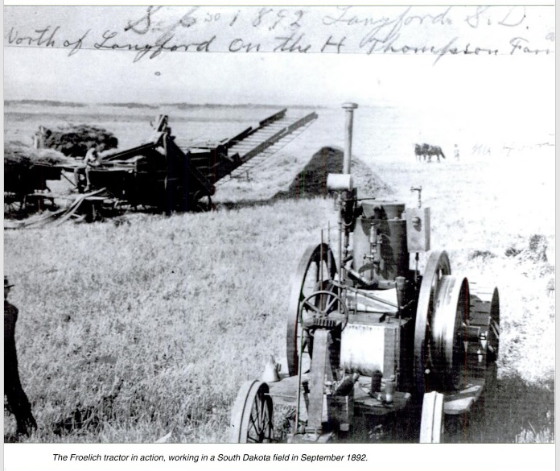

:::
::: {.event .fragment data-label="1893" .tl-card}
**Waterloo Gasoline Motor Company**

Froelich recebe investidores para abrir a empresa

<!--  -->

:::
::: {.event .fragment data-label="1895" .tl-card}
**Waterloo Boy**

A empresa foi vendida para John W. Miller e o nome mudou para: "Waterloo Gasoline Engine Company"

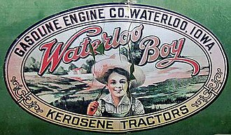

:::
::: {.event .fragment data-label="1913" .tl-card}
**Produção em massa**

A produção de tratores é feita em série, anteriormente artesanal

:::
::: {.event .fragment data-label="1918" .tl-card}
**Waterloo Boy**

A empresa é comprada pela John Deere

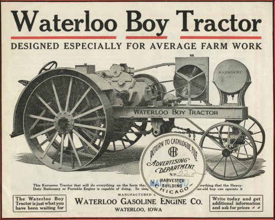

:::
::: {.event .fragment data-label="1925" .tl-card}
**Ford**

70% o mercado de tratores era da Ford

:::
::: {.event .fragment data-label="1926" .tl-card}
**Sistema 3 pontos**

Herry Ferguson e o sistema "três pontos" 

:::
::: {.event .fragment data-label="1931" .tl-card}
**Pneus de borracha**

Empresa Continental desenvolve pneus pneumáticos

:::
::: {.event .fragment data-label="1980 - 1990" .tl-card}
**Empresas**

Grandes fusões e aquisições entre empresas de máquinas agrícolas

:::
::: {.event .fragment data-label="1990" .tl-card}
**O Ferguson**

O trator padrão

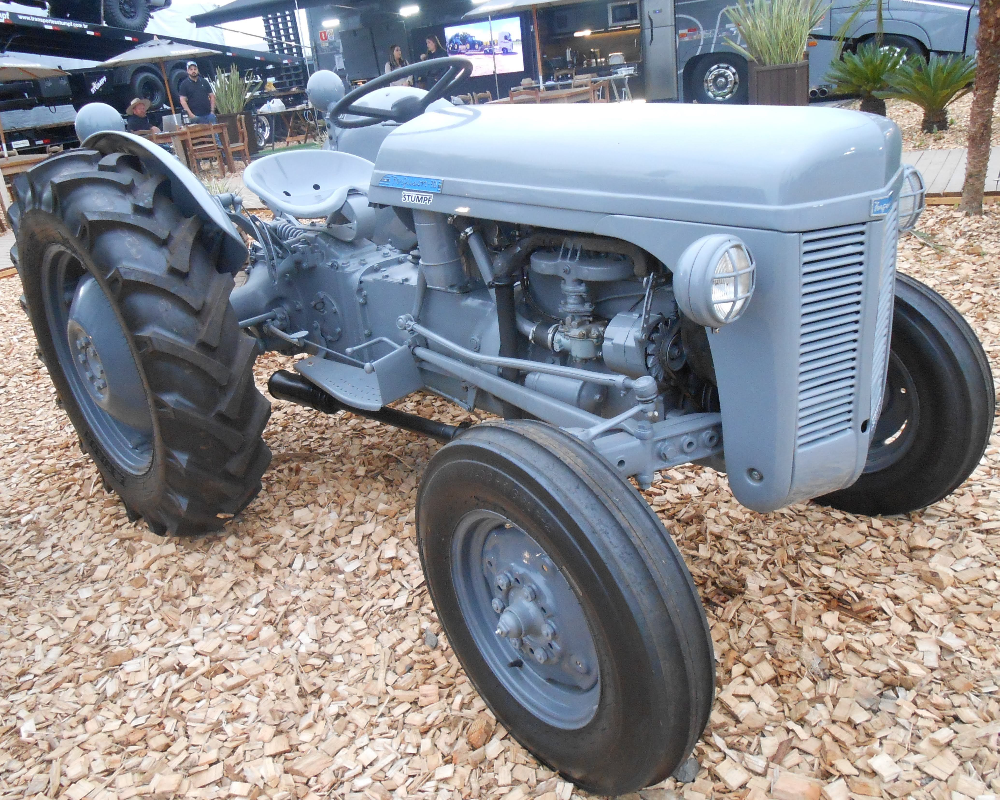

:::
:::

## Histórico sobre tratores

John nunca recebeu reconhecimento por sua conquista, mas hoje é considerado o **pai do trator**!

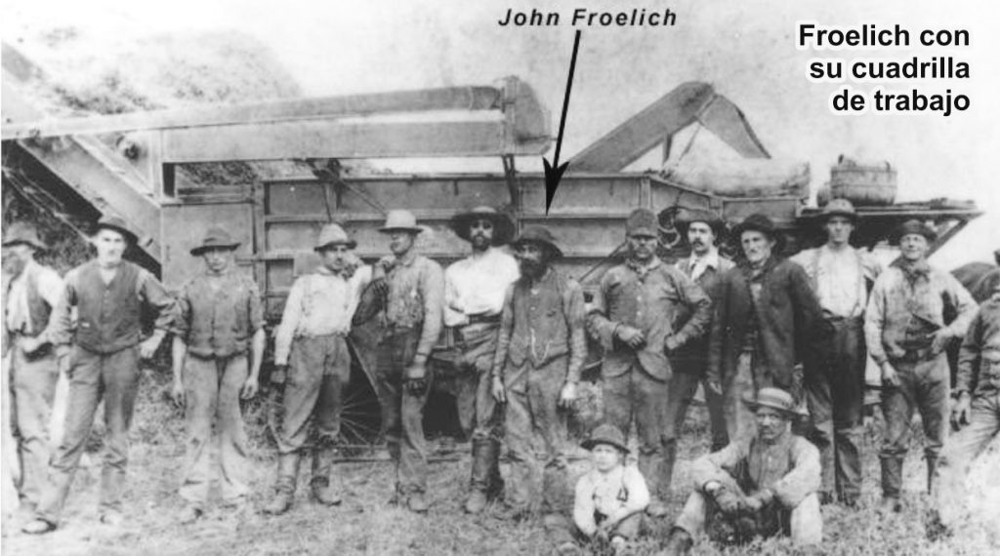{fig-align="center"}

## Marcas

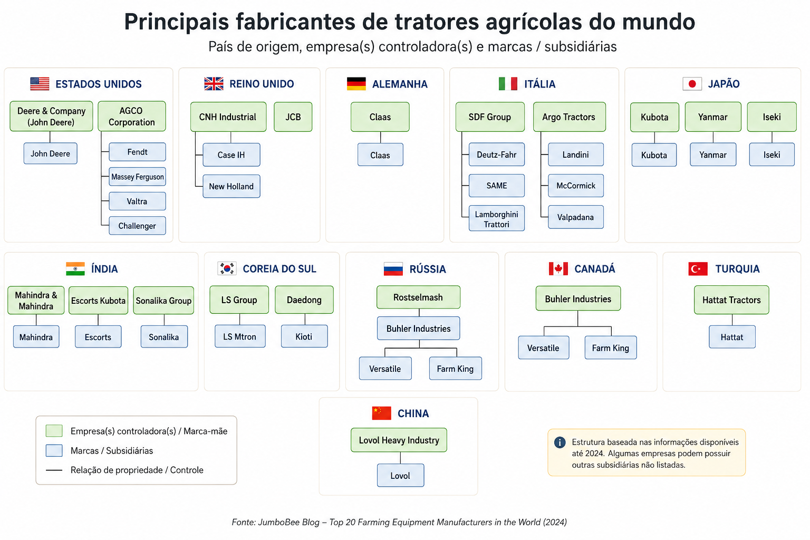{fig-align="center"}

# Classificação dos tratores

## Classificação dos tratores

::: {.incremental}

- Quanto ao uso;
- Tipo de rodado;
- Tração;
- Condições de equilíbrio;
- Transferência de massa;
- Empregabilidade.

:::

## Classificação dos tratores

[__Quanto ao uso:__]{.fg style="--col: #e64173"}

::: {.incremental}

- Tratores agrícolas;
- Tratores florestais;
- Tratores industriais;
- Tratores compactos;
- Tratores especiais;
- Tratores para jardinagem;
- Tratores para terraplanagem;
- Tratores autônomos;

:::

## Classificação dos tratores

[__Quanto ao uso:__]{.fg style="--col: #e64173"}

::: {.columns}

::: {.column width="50%"}

Os **Tratores agrícolas** são projetados para atuar em conjunto com outras máquinas ou implementos.

::: {.fragment}

Tarefas:

::: {.incremental}

- Preparo do solo;
- Semeadura;
- Cultivo;
- Pulverização;
- Colheita.

:::
:::

:::

::: {.column width="50%"}

:::

:::

## Classificação dos tratores

[__Quanto ao uso:__]{.fg style="--col: #e64173"}

::: {.columns}

::: {.column width="50%"}

Os **Tratores florestais** são destinados às atividades de manejo de florestas.

::: {.fragment}

Características:

::: {.incremental}

- Grande porte e massa;
- Trânsito em terrenos adversos (obstáculos);
- Grande potência e tração.

:::
:::

:::

::: {.column width="50%"}

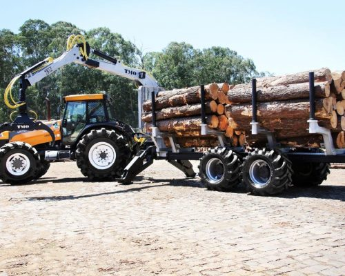

:::

:::

## Classificação dos tratores

[__Quanto ao uso:__]{.fg style="--col: #e64173"}

::: {.columns}

::: {.column width="50%"}

Os **Tratores industriais** são utilizados para aplicações industriais (obras e aeroportos).

::: {.fragment}

Características:

::: {.incremental}

- Possuem barra de tração;
- Ausência de sistema de 3 pontos;
- Ausência de tomada de potência;
- Potência dependente da operação.

:::
:::

:::

::: {.column width="50%"}

::: {layout-ncol=1}

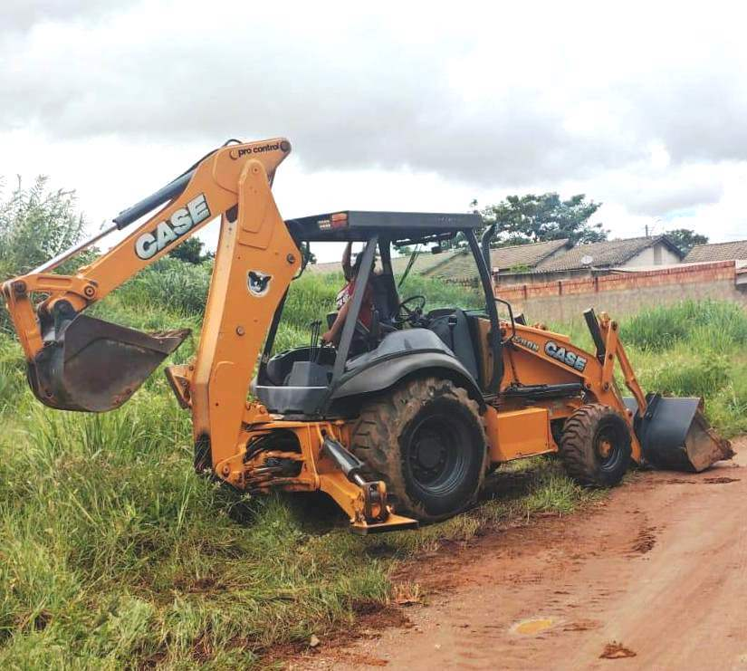{width="300px" fig-align="center"}

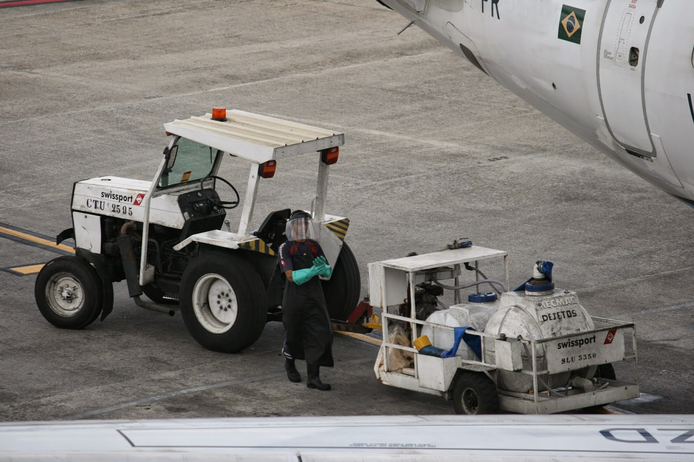{width="300px" fig-align="center"}

:::

:::

:::

## Classificação dos tratores

[__Quanto ao uso:__]{.fg style="--col: #e64173"}

::: {.columns}

::: {.column width="50%"}

Os **Tratores compactos** são pequenos tratores agrícolas. Utilizados em propriedades de menor tamanho.

::: {.fragment}

Características:

::: {.incremental}

- Dimensões reduzidas;
- Manobras em espaço estreito;
- Possuem tomada de potência e sistema de 3 pontos.

:::
:::

:::

::: {.column width="50%"}

::: {layout-ncol=1}

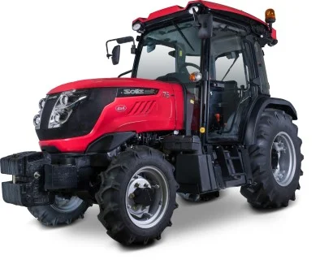{width="300px" fig-align="center"}

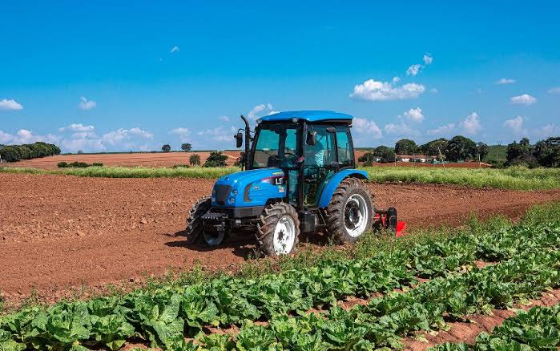{width="300px" fig-align="center"}

:::

:::

:::

## Classificação dos tratores

[__Quanto ao uso:__]{.fg style="--col: #e64173"}

::: {.columns}

::: {.column width="50%"}

Os **Tratores especiais** são projetados para operações específicas ou trabalho em ambiente adverso (cultura com espaçamento reduzido e terrenos acidentados). 

::: {.fragment}

Características:

::: {.incremental}

- Executam manobras em espaços reduzidos;
- Também chamados de "fruteiros" ou "cafeeiros".

:::
:::

:::

::: {.column width="50%"}

::: {layout-ncol=1}

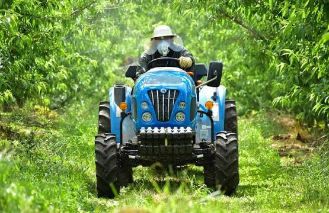{width="300px" fig-align="center"}

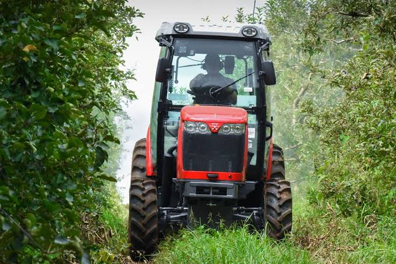{width="300px" fig-align="center"}

:::

:::

:::

## Classificação dos tratores

[__Quanto ao uso:__]{.fg style="--col: #e64173"}

::: {.columns}

::: {.column width="50%"}

Os **Tratores para jardinagem** são de baixa potência e para uso em jardins ou gramados. 

::: {.fragment}

Características:

::: {.incremental}

- Até 10 cv.

:::
:::

:::

::: {.column width="50%"}

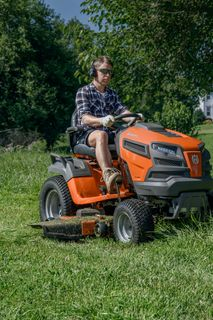{width="300px" fig-align="center"}

:::

:::

## Classificação dos tratores

[__Quanto ao uso:__]{.fg style="--col: #e64173"}

::: {.columns}

::: {.column width="50%"}

Os **Tratores autônomos** "não" necessitam de operadores.

:::

::: {.column width="50%"}

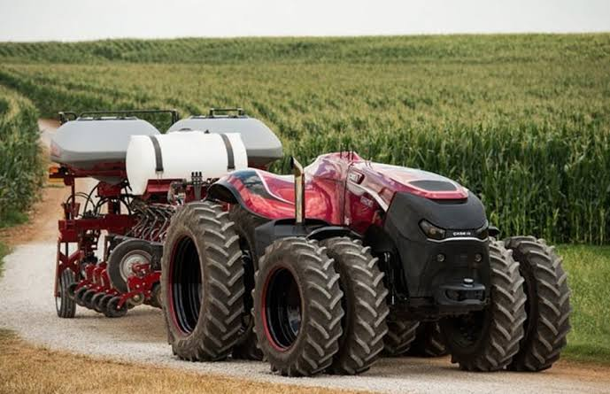{fig-align="center"}

:::

:::

## Classificação dos tratores

[__Quanto ao tipo de rodado e tração:__]{.fg style="--col: #e64173"}

::: {.incremental}

- Rodas;
- Semi-esteiras;
- Esteiras.

:::

## Classificação dos tratores

[__Quanto ao tipo de rodado e tração:__]{.fg style="--col: #e64173"}

::: {.columns}

::: {.column width="30%"}

**Tratores de duas rodas**

Possuem duas rodas motrizes e um par de alças (rabiças). O operador conduz o trator caminhando ou de forma sentada atrás do trator.

:::

::: {.column width="70%"}

::: {layout-nrow=2}

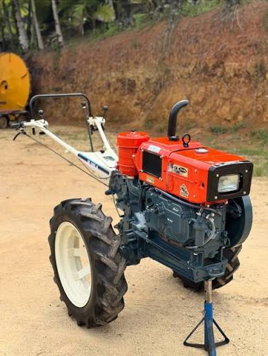{fig-align="center" width="220px"}

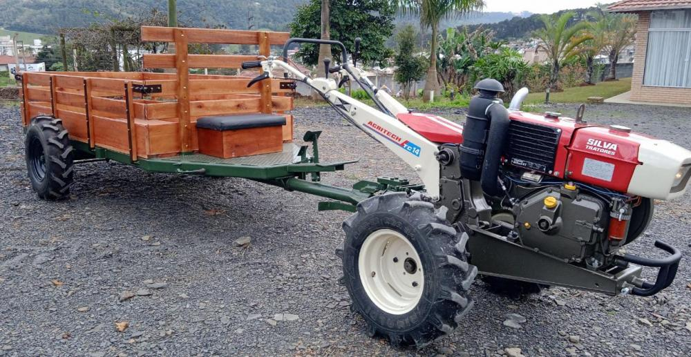{fig-align="center" width="280px"}

:::

:::

:::

## Classificação dos tratores

[__Quanto ao tipo de rodado e tração:__]{.fg style="--col: #e64173"}

::: {.columns}

::: {.column width="40%"}

**Tratores de três rodas (triciclos)**

Possuem duas rodas motoras traseiras e uma frontal movida.

:::

::: {.column width="60%"}

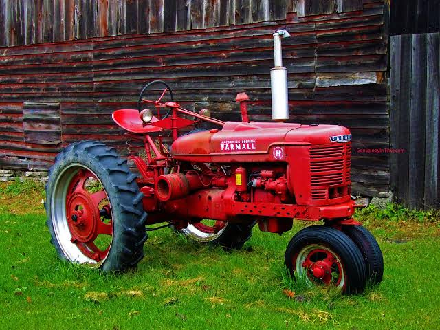{fig-align="center"}

:::

:::

## Classificação dos tratores

[__Quanto ao tipo de rodado e tração:__]{.fg style="--col: #e64173"}

::: {.columns}

::: {.column width="55%"}

**Tratores de quatro rodas**

Possuem duas rodas motrizes no eixo traseiro e duas rodas movidas no eixo dianteiro.

::: {.incremental}

- Rodas traseiras são de maior diâmetro;
- Rodas dianteiras de menor diâmetro;
- Sustentação por 4 pontos de apoio;
  - Maior estabilidade.

:::

:::

::: {.column width="45%"}

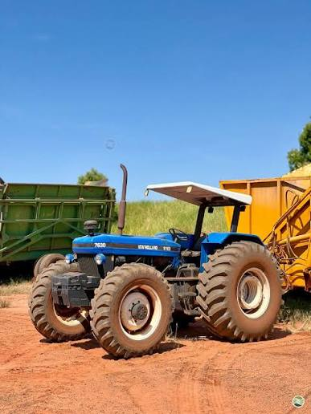{fig-align="center"}

:::

:::

## Classificação dos tratores

[__Quanto ao tipo de rodado e tração:__]{.fg style="--col: #e64173"}

::: {.columns}

::: {.column width="50%"}

**Tratores de semiesteiras**

Combinam duas rodas motrizes na frente e duas esteiras na parte traseira.

::: {.incremental}

- Maior tração e mobilidade (em relação ao trator de rodas);
- Distribuição do peso nas esteiras (mais pontos de contato);
- Maior manutenção.

:::

:::

::: {.column width="50%"}

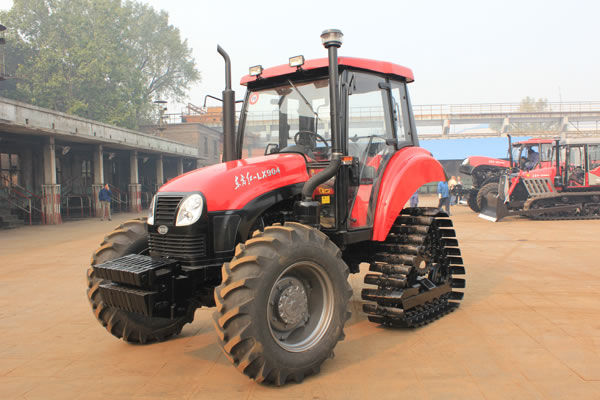{fig-align="center"}

:::

:::

## Classificação dos tratores

[__Quanto ao tipo de rodado e tração:__]{.fg style="--col: #e64173"}

::: {.columns}

::: {.column width="50%"}

**Tratores de esteiras**

Os rodados são constituídos por 2 ou 4 esteiras. Esteiras possuem rodas motoras denteadas e rodas guias movidas ligadas por correntes.

::: {.incremental}

- Direcionamento: diferença de velocidade entre esteiras;
- Esteiras de borracha ou aço;
- Perfil: triangular, retangular ou trapezoidal.

:::

:::

::: {.column width="50%"}

::: {layout-nrow=2}

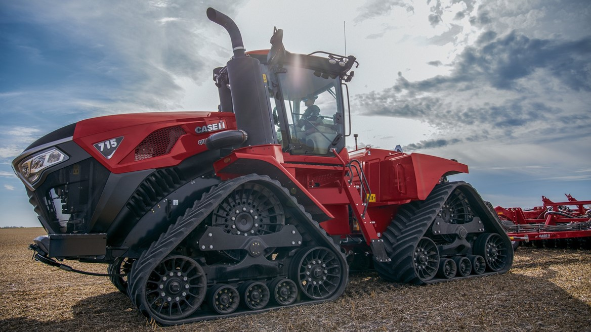{fig-align="center" width="300px"}

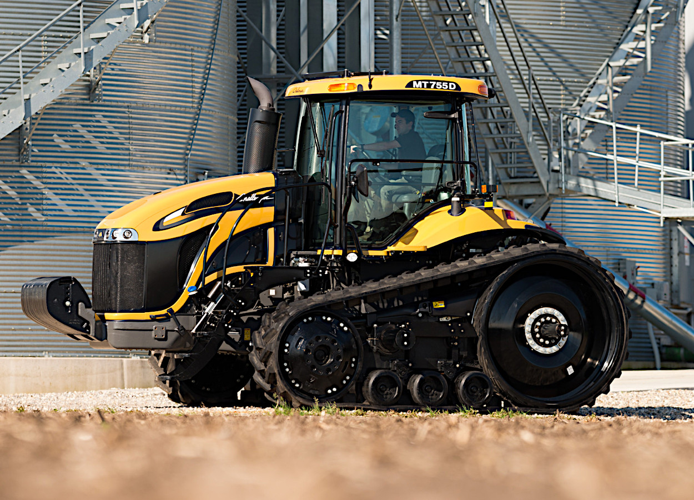{fig-align="center" width="300px"}

:::

:::

:::

## Classificação dos tratores

[__Quanto ao tipo de rodado e tração:__]{.fg style="--col: #e64173"}

**Tratores de esteiras**

::: {.incremental}

- Possuem elevada potência;
- São de aquisição inviável para pequenos e médios produtores;
- Destinados a serviços mais pesados (alta tração);
- Maior estabilidade;
- Maior aderência (centro de gravidade);
- Menor compactação do solo (área de contato).

:::

## Classificação dos tratores

[__Quanto à tração:__]{.fg style="--col: #e64173"}

Classificação apenas para tratores de rodas

::: {.incremental}

- 4x2;
- 4x2 TDA;
- 4x4;
- 6x6.

:::

## Classificação dos tratores

[__Quanto à tração:__]{.fg style="--col: #e64173"}

**Tratores 4x2**

Apresentam 4 rodas, com duas traseiras motrizes e 2 dianteiras direcionais.

::: {.incremental}

- Rodas traseiras são de maior diâmetro e possuem pneus com garras para tração;
- Rodas dianteiras menores e pneus sem a presença de garras.

:::

::: {.fragment}

Também conhecidos como tratores **standards**

:::

## Classificação dos tratores

[__Quanto à tração:__]{.fg style="--col: #e64173"}

**Tratores 4x2**

::: {layout-nrow=1}

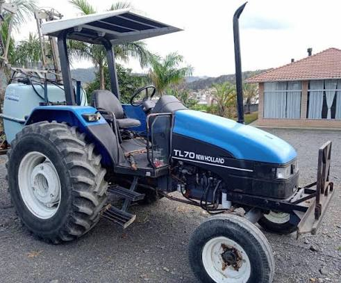{fig-align="center"}

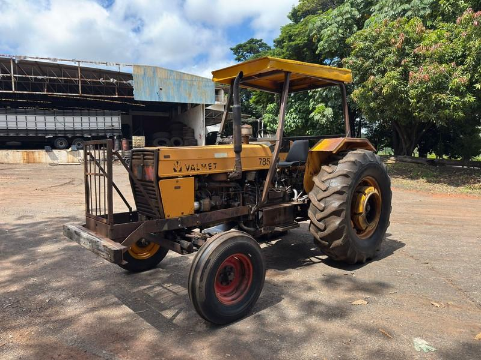{fig-align="center"}

:::

## Classificação dos tratores

[__Quanto à tração:__]{.fg style="--col: #e64173"}

**Tratores 4x2 TDA**

Apresentam 4 rodas de tração, mas a tração no eixo dianteiro é opcional. A tração também é chamada de tração dianteira auxiliar ou assistida (TDA).

::: {.incremental}

- Dois eixos de tração;
- Rodas traseiras de maior diâmetro em relação às dianteiras;
- Todos os pneus possuem garras para tração;

:::

::: {.fragment}

A ligação da TDA liga também os eixos (dianteiro e traseiro). O eixo dianteiro gira com maior rotação que o eixo traseiro (avanço cinemático). Esses tratores também são chamados de tratores **traçados**.

:::

## Classificação dos tratores

[__Quanto à tração:__]{.fg style="--col: #e64173"}

**Tratores 4x2 TDA**

::: {layout-nrow=1}

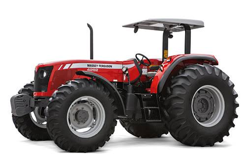{fig-align="center"}

{fig-align="center"}

:::

## Classificação dos tratores

[__Quanto à tração:__]{.fg style="--col: #e64173"}

**Tratores 4x2 TDA acionamento**

::: {layout-nrow=1}

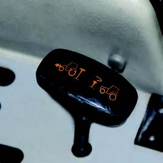{fig-align="center"}

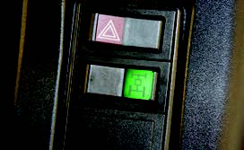{fig-align="center" width="500px"}

:::

## Classificação dos tratores

[__Quanto à tração:__]{.fg style="--col: #e64173"}

**Tratores 4x4**

Possuem 4 rodas de mesmo diâmetro com tração total nos dois eixos e todos os pneus possuem garras.

Direção geralmente via articulação do chassi.

## Classificação dos tratores

[__Quanto à tração:__]{.fg style="--col: #e64173"}

**Tratores 4x4**

::: {layout-nrow=1}

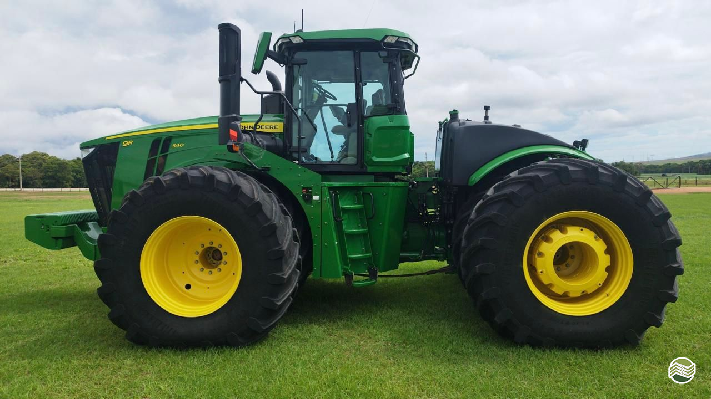{fig-align="center"}

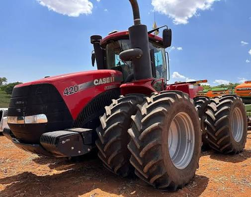{fig-align="center"}

:::

## Classificação dos tratores

[__Quanto à tração:__]{.fg style="--col: #e64173"}

**Tratores 6x6**

Possuem 3 eixos, com tração nas 6 rodas.

- Maior capacidade de carga;
- Estabilidade superior;
- Estabilidade e eficiência nas operações.

## Classificação dos tratores

[__Quanto à tração:__]{.fg style="--col: #e64173"}

**Tratores 6x6**

::: {layout-nrow=1}

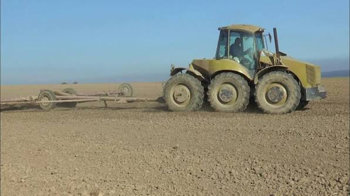{fig-align="center"}

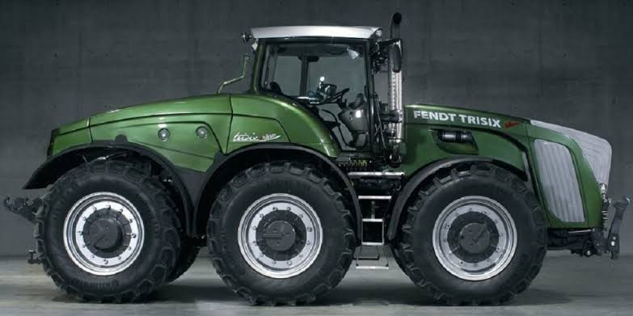{fig-align="center"}

:::

## Classificação dos tratores

[__Quanto à potência motora:__]{.fg style="--col: #e64173"}

| **Classe** | **Potência (cv)** | **Potência (kW)** |
|:----------:|:----------------:|:----------------:|
| **I** | ≤ 49,9 | ≤ 36,9 |
| **II** | 50,0 a 99,9 | 37,0 a 73,9 |
| **III** | 100,0 a 199,9 | 74,0 a 146,9 |
| **IV** | ≥ 200,0 | ≥ 147,0 |

::: {.footer}
ANFAVEA (2016)
:::

---

## Classificação dos tratores

[__Quanto à potência motora:__]{.fg style="--col: #e64173"}

::: {.smaller}

| Classe | Denominação | Potência (cv) | Descrição |
|:------:|:------------|:------------:|:----------|
| I | Muito pequeno | < 50 |  |
| II | Pequeno | 50,1 – 79,9 | 3, 4 e 5 cilindros e cilindrada > 3,5 litros |
| III | Médio | 80 – 109,9 | 4, 5 e 6 cilindros |
| IV | Grande | 110 – 159,9 | 6 cilindros |
| V | Muito grande | 160 – 199,9 | > 6 cilindros |
| VI | Extra grande | ≥ 200 | > 6 cilindros e massa sem lastro > 8000 kg |

:::

::: {.footer}
Adaptado de Farias (2014)
:::

## Classificação dos tratores

[__Quanto à potência motora:__]{.fg style="--col: #e64173"}

| **Classe** | **Potência (cv)** | **Potência (kW)** |
|:----------:|:----------------:|:----------------:|
| **I** | até 49 | até 36 |
| **II** | 50 a 99 | 36,8 a 72,8 |
| **III** | 100 a 149 | 73,5 a 109,6 |
| **IV** | 150 a 249 | 110,3 a 183,1 |
| **V** | 250 a 349 | 183,9 a 256,7 |
| **VI** | 350 a 449 | 257,4 a 330,2 |
| **VII** | 450 a 549 | 331,0 a 403,8 |
| **VIII** | 550 a 649 | 404,5 a 477,3 |

::: {.footer}
Adaptado de Schlosser et al. (2023)
:::

## Classificação dos tratores

[__Quanto à conformação do chassi:__]{.fg style="--col: #e64173"}

Os tratores podem ser do tipo rígidos ou articulados.

::: {.fragment}

De chassi rígido, a estrutura é uma peça única que conecta as partes dianteira e traseira da máquina.

:::

::: {.fragment}

De chassi articulado, possuem uma articulação central. São conhecidos pela alta potência, mas menos versáteis em acoplamento e em manobras.

:::

## Classificação dos tratores

[__Quanto à conformação do chassi:__]{.fg style="--col: #e64173"}

::: {layout-nrow=1}

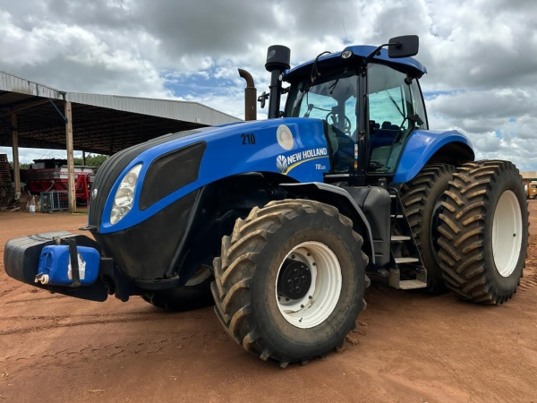{fig-align="center"}

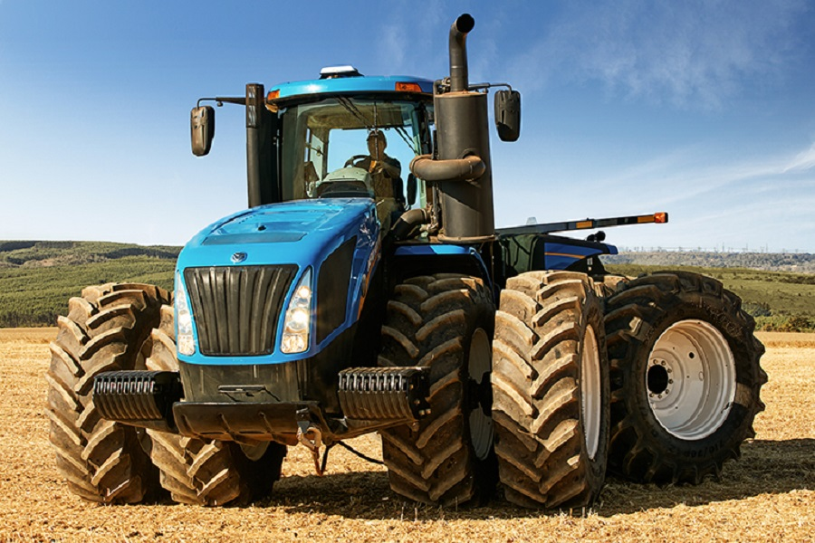{fig-align="center"}

:::

## Classificação dos tratores

[__Quanto à configuração do posto do operador:__]{.fg style="--col: #e64173"}

Classificação com relação ao ambiente de operação.

Os tratores podem ou não apresentar uma plataforma de operação.

::: {.incremental}

- Acavalados;
- Semiplataformados;
- Plataformados;
- Cabinados.

:::

## Classificação dos tratores

[__Quanto à configuração do posto do operador:__]{.fg style="--col: #e64173"}

**Acavalados** são os tratores que não possuem plataforma para operação.

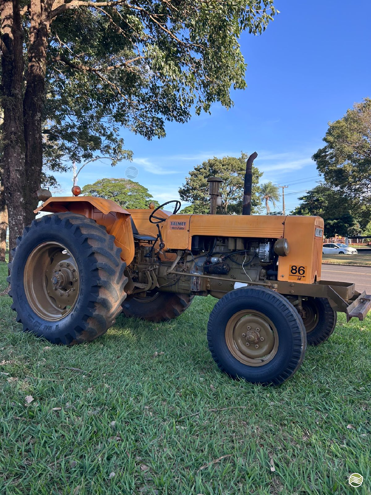{fig-align="center"}

## Classificação dos tratores

[__Quanto à configuração do posto do operador:__]{.fg style="--col: #e64173"}

A plataforma é onde está o posto de trabalho. Integrada aos para-lamas, é uma plataforma aberta localizada na parte traseira do trator. Geralmente apresenta um toldo ou estrutura de proteção contra capotamento, assento com regulagens de suspensão e de posição.

## Classificação dos tratores

[__Quanto à configuração do posto do operador:__]{.fg style="--col: #e64173"}

::: {layout-nrow=1}

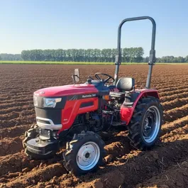{fig-align="center" width="300px"}

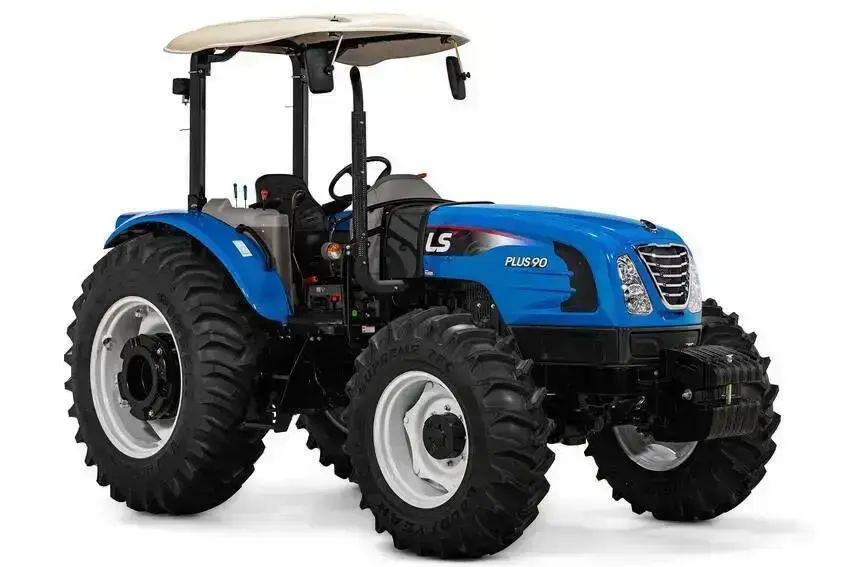{fig-align="center" width="450px"}

:::

## Classificação dos tratores

[__Quanto à configuração do posto do operador:__]{.fg style="--col: #e64173"}

**Cabinados** são os tratores que possuem uma cabine fechada e climatizada.

{fig-align="center"}

## Classificação dos tratores

[**__Quanto à configuração do posto do operador:__**]{.fg style="--col: #e64173"}

::: {.zoom-container style="--zoom-inicial: 1; --zoom-final: 1.35; --zoom-x: 50%; --zoom-y: 250%; --pos-x: center; --pos-y: flex-start; --duracao-zoom: 1.2s;"}

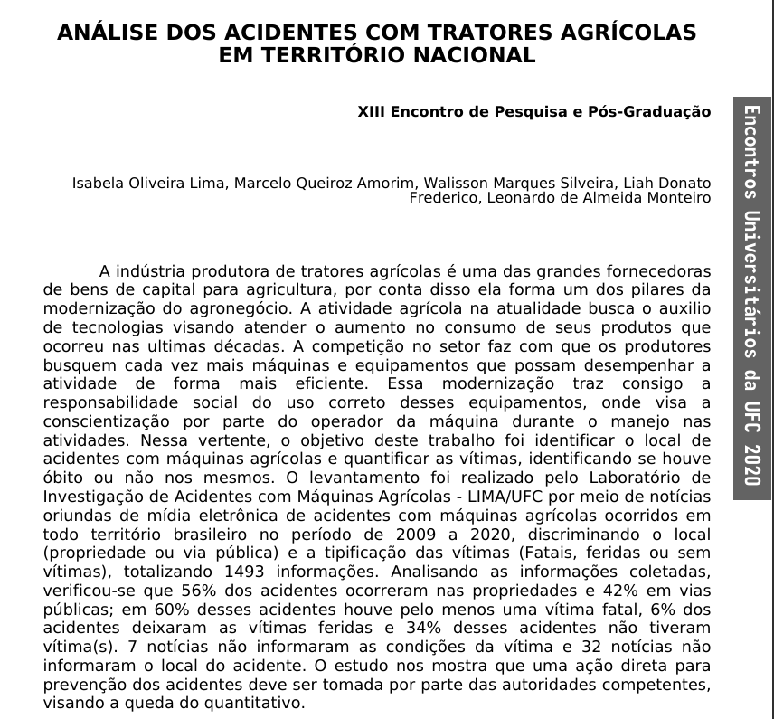{.imagem-zoom}

::: {.fragment .trigger-zoom}
:::

:::

## Classificação dos tratores

**"Os dados coletados ao longo de 12 anos, também revelam que a região Sul do país tem o maior índice de acidentes"**

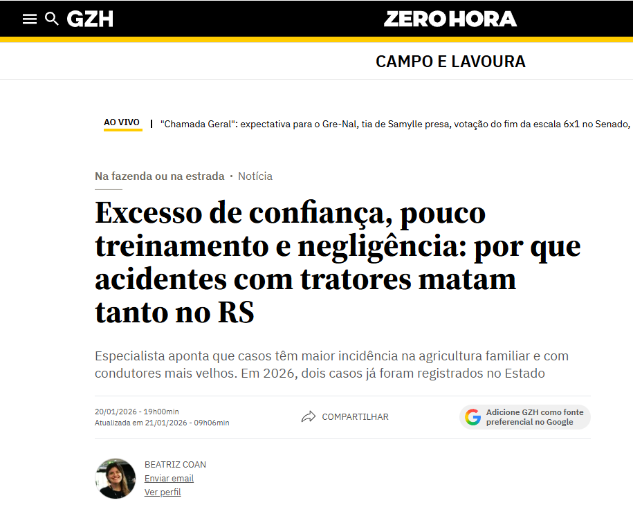{fig-align="center"}

## Classificação dos tratores

[__Quanto à configuração do posto do operador:__]{.fg style="--col: #e64173"}

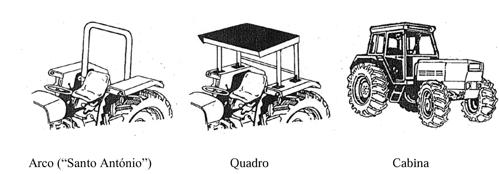{fig-align="center"}

## Classificação dos tratores

Estrutura de proteção contra capotamento (Rollover protection structure)

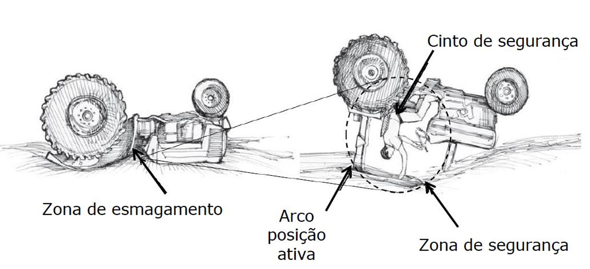{fig-align="center"}

## Classificação dos tratores

Estrutura de proteção contra capotamento (Rollover protection structure)

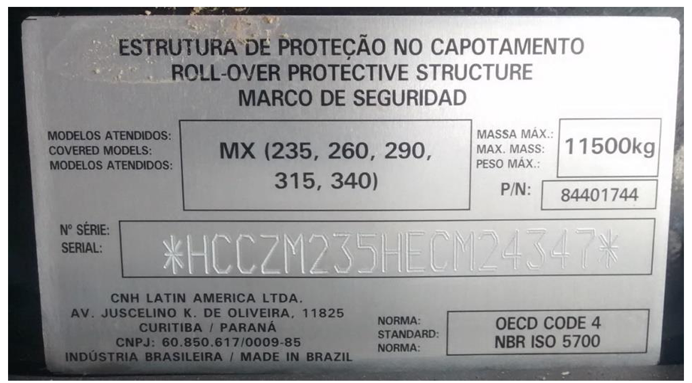{fig-align="center" width="300px"}

## Classificação dos tratores

Estrutura de proteção contra capotamento

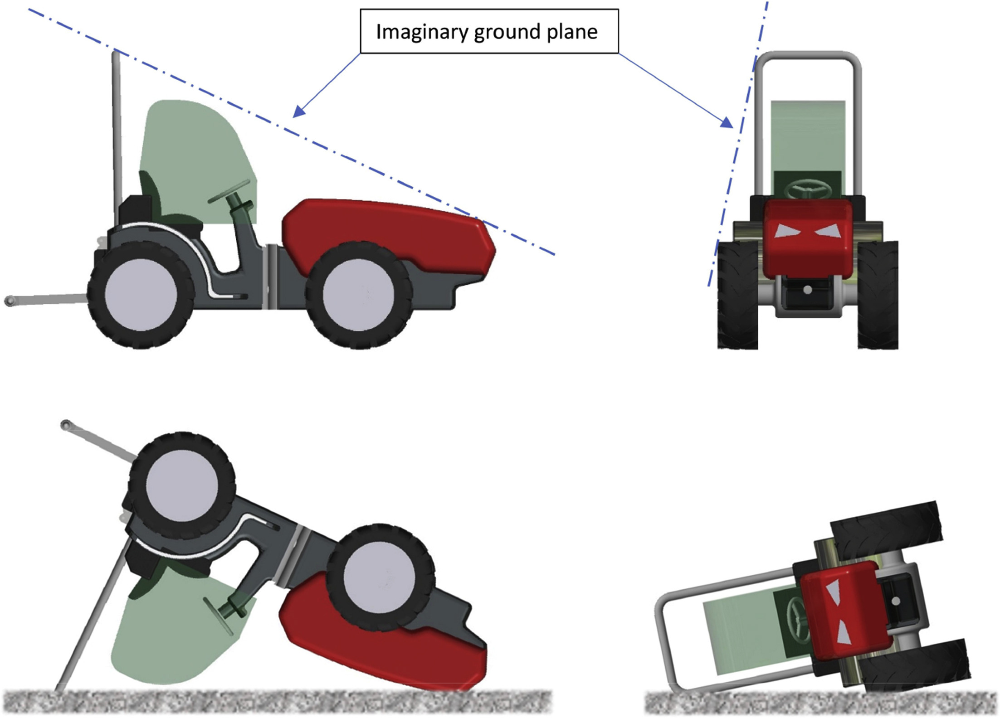{fig-align="center"}

## Classificação dos tratores

[__Fases do capotamento (curiosidade):__]{.fg style="--col: #e64173"}

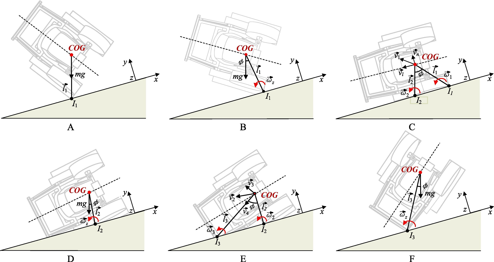{fig-align="center"}

## Classificação dos tratores

[__Fases do capotamento (curiosidade):__]{.fg style="--col: #e64173"}

::: {style="font-size:26px"}

- Fase A: Iniciando um movimento de capotamento, a projeção vertical do COG do trator se estende além do ponto onde os pneus tocam o chão.
- Fase B: O trator gira livremente ao redor do ponto de contato inicial I1.
- Fase C: O lado externo do pneu do trator toca o chão e, subsequentemente, o ponto de contato inicial é transferido para o ponto de contato I2.
- Fase D: O trator continua girando livremente ao redor do novo ponto de contato I2.
- Fase E: À medida que o grau de capotamento se intensifica, o ROPS ou o topo do veículo começa a resistir ao impacto da capotagem. Durante essa fase, o operador pode estar sujeito a compressão ou colisão.
- Fase F: Se a energia de capotamento não for completamente dissipada, o trator continuará rolando morro abaixo na encosta.

:::

::: {.footer}
Wang, L. et al. (2024)
:::

# Constituição dos tratores agrícolas

## Constituição dos tratores agrícolas

Tratores agrícolas são compostos por vários componentes. Cada componente é responsável por determinadas funções.

::: {.columns}

::: {.column}

::: {.incremental}

- Chassi;
- Motor (já visto);
- Sistema de transmissão (próxima aula);
- Rodados (próxima aula);

:::

:::

::: {.column}

::: {.incremental}

- Órgãos de acoplamento;
  - Barra de tração;
  - Sistema hidráulico de 3 pontos;
- Órgãos de transmissão de energia;
  - Tomada de potência;
  - Sistema hidráulico auxiliar.

:::

:::

:::

## Constituição dos tratores agrícolas

**Sistemas complementares:**

- Sistema hidráulico;
- Sistema elétrico;
- Sistema eletrônico;
- Sistema de direção;
- Sistema de frenagem;
- Sistema de suspensão.

## Constituição dos tratores agrícolas

[__Estrutura de suporte (chassi):__]{.fg style="--col: #e64173"}

É a estrutura geral do trator, que permite a união de todos os órgãos constituintes da máquina.

::: {.fragment}

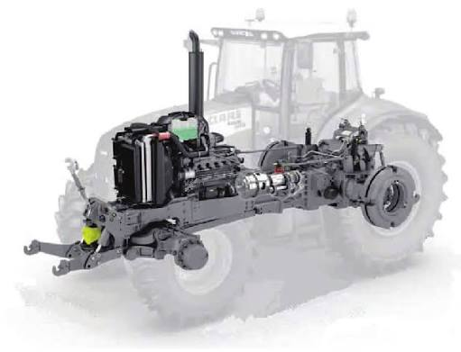{fig-align="center"}

:::

## Constituição dos tratores agrícolas

[__Estrutura de suporte (chassi):__]{.fg style="--col: #e64173"}

::: {.incremental}

- Deve ser capaz de oferecer a resistência necessária aos esforços da tração;
- Deve suportar a carga do motor e dos demais componentes;
- Deve também suportar a transferência de carga advinda da máquina e implementos acoplados.
  - Carga extra;

:::

## Constituição dos tratores agrícolas

[__Estrutura de suporte (chassi):__]{.fg style="--col: #e64173"}

::: {.incremental}

- Monobloco;
- Convencional;
- Semichassi;
- Articulado.

:::

## Constituição dos tratores agrícolas

[__Estrutura de suporte (chassi):__]{.fg style="--col: #e64173"}

O monobloco é constituído do bloco do motor, a carcaça da caixa de câmbio, transmissão final e semieixos.

::: {.fragment}

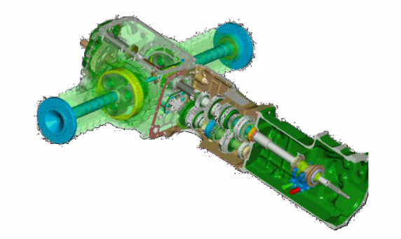{fig-align="center"}

:::

## Constituição dos tratores agrícolas

[__Estrutura de suporte (chassi):__]{.fg style="--col: #e64173"}

**Chassi monobloco**

::: {.incremental}

- pode conferir mais vibração durante a operação;

- Têm um potencial maior para o rompimento na ligação entre as partes;

- Possui uma manutenção mais complexa.

:::

## Constituição dos tratores agrícolas

[__Estrutura de suporte (chassi):__]{.fg style="--col: #e64173"}

O chassi convencional ou modular é caracterizado por perfis metálicos que unem os dois eixos e servem de base para o apoio das demais partes do motor.

::: {.fragment}

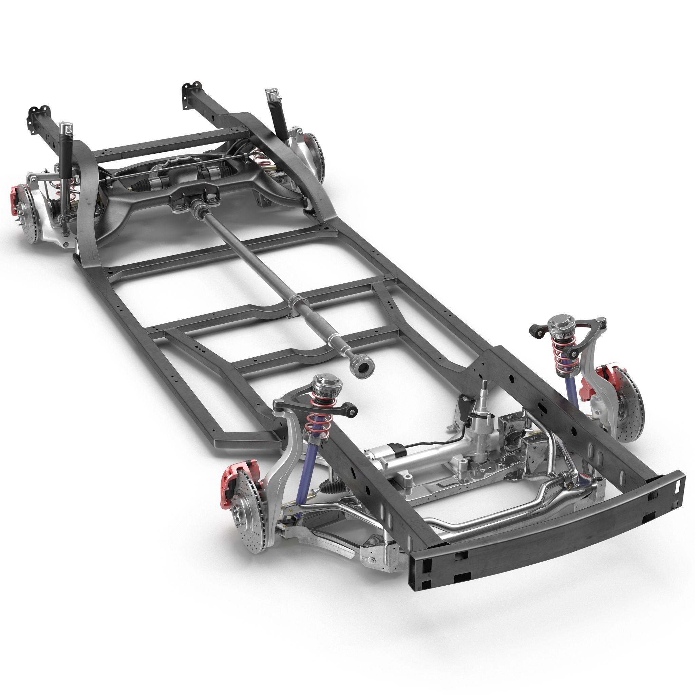{fig-align="center" width="350px"}

:::

## Constituição dos tratores agrícolas

[__Estrutura de suporte (chassi):__]{.fg style="--col: #e64173"}

**Chassi convencional**

::: {.incremental}

- Maior isolamento das vibrações (operação mais suave e confortável);

- Mais leve que outros tipos de estruturas (maior eficiência energética);

- Trator mais dependente de lastro;

- O custo desse tipo de configuração tende a ser maior.

:::

## Constituição dos tratores agrícolas

[__Estrutura de suporte (chassi):__]{.fg style="--col: #e64173"}

O semichassi é aquele onde a parte dianteira do trator (motor) é montada em um chassi separado e os demais componentes são acoplados a esse chassi.

::: {.fragment}

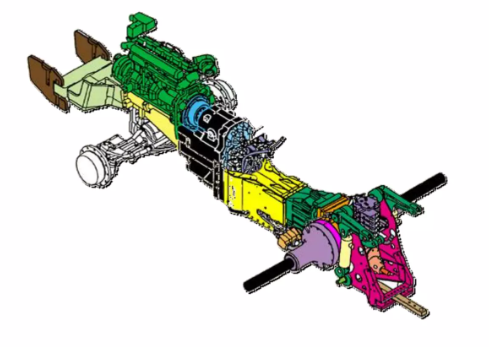{fig-align="center" width="350px"}

:::

## Constituição dos tratores agrícolas

[__Estrutura de suporte (chassi):__]{.fg style="--col: #e64173"}

**Semichassi**

::: {.incremental}

- Utilizado em tratores acima de 180 CV;

- Evita que os esforços da tração sejam absorvidos pelo motor.

:::

## Constituição dos tratores agrícolas

[__Estrutura de suporte (chassi):__]{.fg style="--col: #e64173"}

Chassi articulado é uma estrutura com o propósito de aprimorar a manobrabilidade.

::: {.fragment}

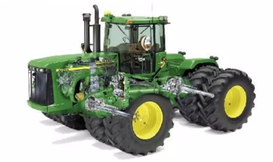{fig-align="center" width="350px"}

:::

## Constituição dos tratores agrícolas

[__Estrutura de suporte (chassi):__]{.fg style="--col: #e64173"}

**Chassi articulado**

::: {.incremental}

- Empregado em tratores de alta potência;

- O tamanho do veículo dificulta a manobra;

- São empregadas articulações;
  - Horizontais;
  - Verticais;
  - Ambas;

- Distribuição mais equilibrada de peso;
  - Maior estabilidade;
  - Maior tração;

:::

## Constituição dos tratores agrícolas

[__Estrutura de suporte (chassi):__]{.fg style="--col: #e64173"}

**Chassi articulado**

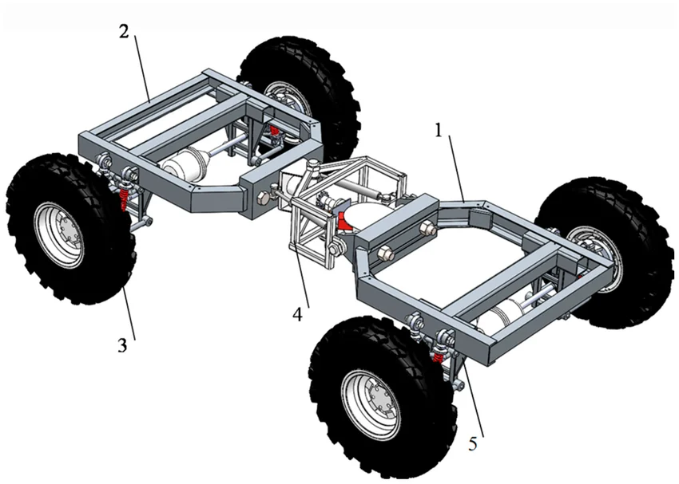{fig-align="center"}

# Órgãos de engate e transferência de energia

## Órgãos de engate e transferência de energia

O que são?

::: {.fragment}

**Acoplamento:** é a união entre dois ou mais corpos, formando um único conjunto.

:::

::: {.fragment}

**Transferência de energia:** é a transição de energia de um corpo para outro.

:::

## Órgãos de engate e transferência de energia

**Engate x acoplamento**

::: {.fragment}

**Engate:** é o mesmo que prender com engate, atrelar, ligar.

:::

::: {.fragment}

**Acoplar:** é estabelecer a união entre dois sistemas. Há interação, com ação de um sobre o outro.

:::

## Órgãos de engate e transferência de energia

[__Tipos de acoplamento:__]{.fg style="--col: #e64173"}

::: {.incremental}

- Acoplamento mecânico ao chassi;
- Acoplamento mecânico de tração;
- Acoplamento hidráulico com mangueiras;
- Acoplamento mecânico de torção.

:::

## Órgãos de engate e transferência de energia

[__Acoplamento mecânico ao chassi (montagem integral):__]{.fg style="--col: #e64173"}

::: {layout-nrow=1}

::: {.fragment}

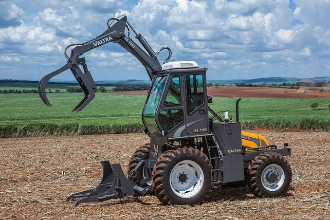{fig-align="center"}

:::

::: {.fragment}

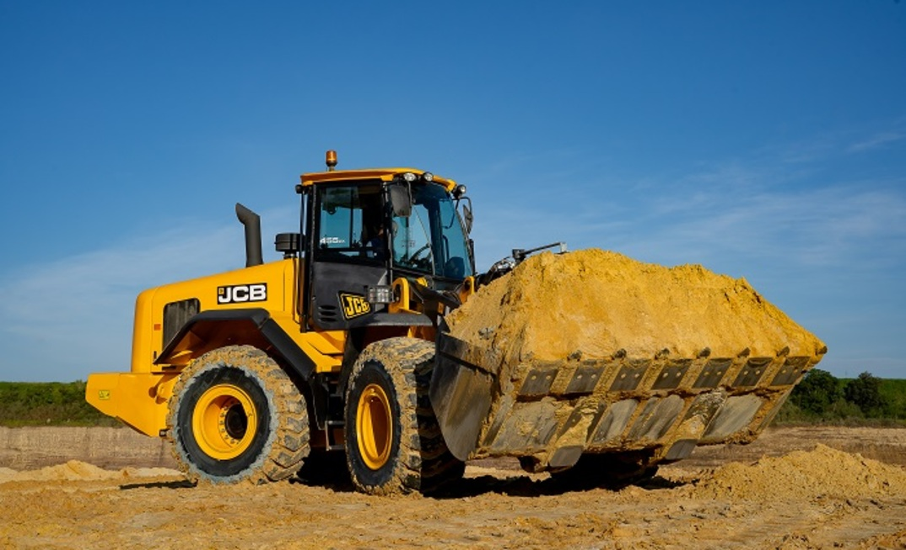{fig-align="center"}

:::
:::

## Órgãos de engate e transferência de energia

[__Acoplamento mecânico ao chassi (montagem integral):__]{.fg style="--col: #e64173"}

São os implementos e máquinas agrícolas que são acoplados diretamente ao chassi do trator. Operam como se fossem máquinas autopropelidas, mas se diferenciam desses bem como dos equipamentos montados.

## Órgãos de engate e transferência de energia

[__Órgãos de acoplamento por tração:__]{.fg style="--col: #e64173"}

O engate pode ser realizado por um ponto, uma linha (dois pontos) ou por um plano (três pontos).

## Órgãos de engate e transferência de energia

[__Órgãos de acoplamento por tração:__]{.fg style="--col: #e64173"}

::: {layout-nrow=1}

::: {.fragment}

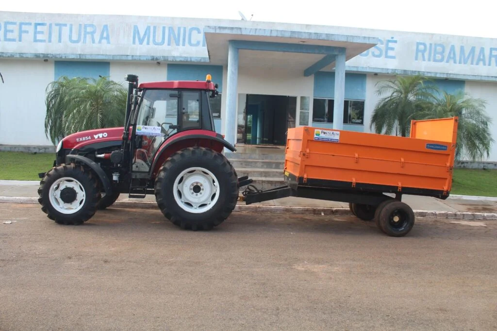{fig-align="center" width="350px"}

:::
::: {.fragment}

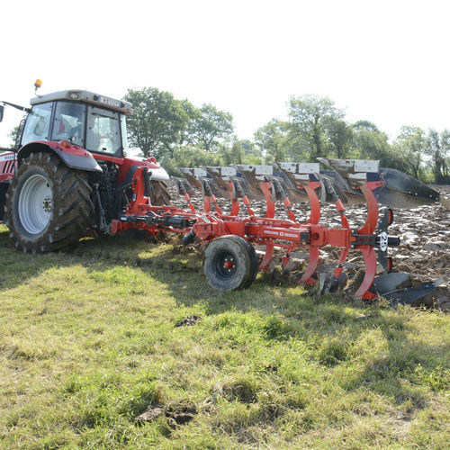{fig-align="center" width="300px"}

:::
::: {.fragment}

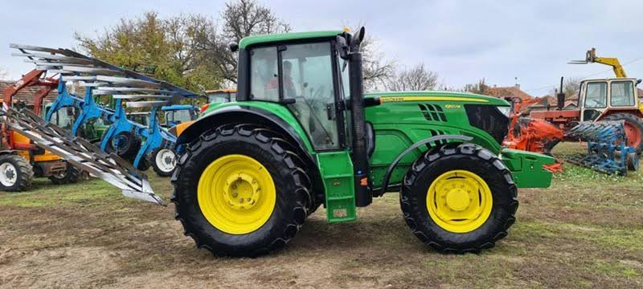{fig-align="center" width="350px"}

:::
:::

## Órgãos de engate e transferência de energia

[__Equipamento de arrasto:__]{.fg style="--col: #e64173"}

O engate é realizado em apenas um ponto por meio da **barra de tração**. Esse engate confere mobilidade horizontal e vertical ao equipamento.

::: {.fragment}

::: {layout-nrow=1}

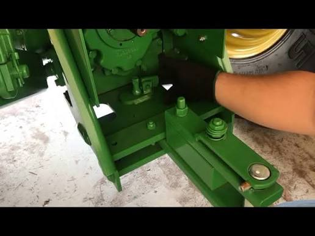{fig-align="center" width="350px"}

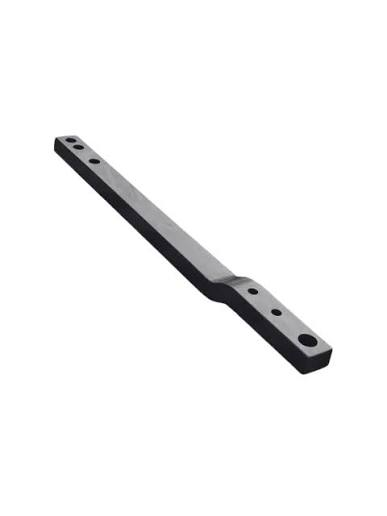{fig-align="center" width="350px"}

:::

:::

## Órgãos de engate e transferência de energia

[__Barra de tração:__]{.fg style="--col: #e64173"}

::: {.columns}

::: {.column width="40%"}

::: {.fragment}

Elemento de conexão mecânica entre o trator e o implemento. Situada no centro do trator, na parte posterior inferior, na altura do seu centro de gravidade. Permite o acoplamento e a tração de implementos de arrasto, podendo ser usada de modo fixo ou oscilante.

:::

:::

::: {.column width="60%"}

::: {.fragment}

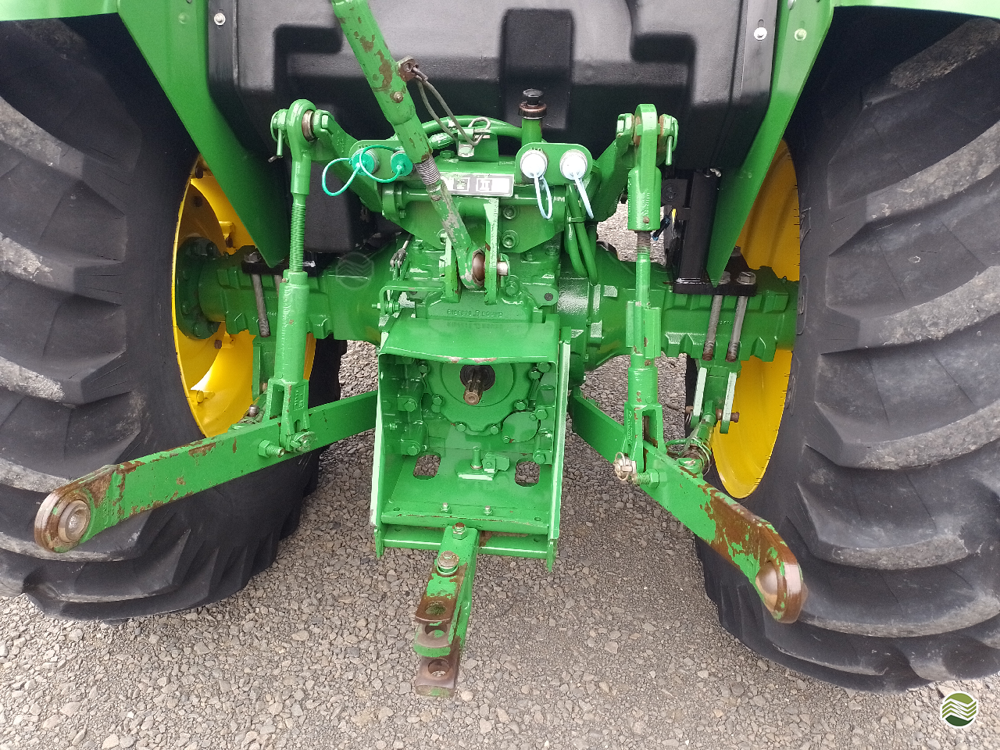{fig-align="center"}

:::

:::

:::

## Órgãos de engate e transferência de energia

[__Barra de tração:__]{.fg style="--col: #e64173"}

::: {.columns}

::: {.column width="40%"}

Uma de suas extremidades é presa ao chassi do trator, enquanto a outra possui orifício, onde são acoplados os equipamentos.

:::

::: {.column width="60%"}

{fig-align="center"}

:::

:::

## Órgãos de engate e transferência de energia

[__Barra de tração:__]{.fg style="--col: #e64173"}

::: {.columns}

::: {.column width="40%"}

::: {.incremental}

- Engate fácil;
- Transmissão de potência entre 50 a 75%;
- Há 3 tipos de barras;
  - Fixas;
  - Oscilantes;
  - Reguláveis.

:::
:::

::: {.column width="60%"}

{fig-align="center"}

:::

:::

## Órgãos de engate e transferência de energia

[__Barra de tração fixa:__]{.fg style="--col: #e64173"}

::: {.columns}

::: {.column width="40%"}

::: {.incremental}
- Não possui movimento vertical e horizontal.
- Composta por uma única barra;
- Adequada para implementos simples e leves;
- Trabalho em apenas uma posição (altura em relação ao solo).

:::

:::

::: {.column width="60%"}

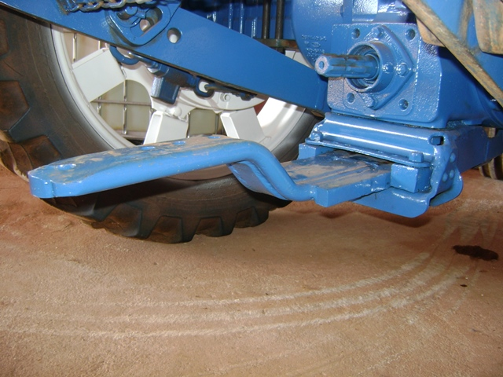{fig-align="center"}

:::

:::

## Órgãos de engate e transferência de energia

[__Barra de tração oscilante:__]{.fg style="--col: #e64173"}

::: {.columns}

::: {.column width="40%"}

::: {.incremental}

- Apenas movimento relativo no plano horizontal;
- Oscilação por remoção de pinos de fixação;
- Reduz o raio de giro do conjunto mecanizado.

:::

:::

::: {.column width="60%"}

{fig-align="center"}

:::

:::

## Órgãos de engate e transferência de energia

[__Barra de tração ajustável:__]{.fg style="--col: #e64173"}

::: {.columns}

::: {.column width="40%"}

::: {.incremental}

- Permite o ajuste em múltiplas posições de operação;
- Posições regulares, curtas e estendidas.

:::

:::

::: {.column width="60%"}

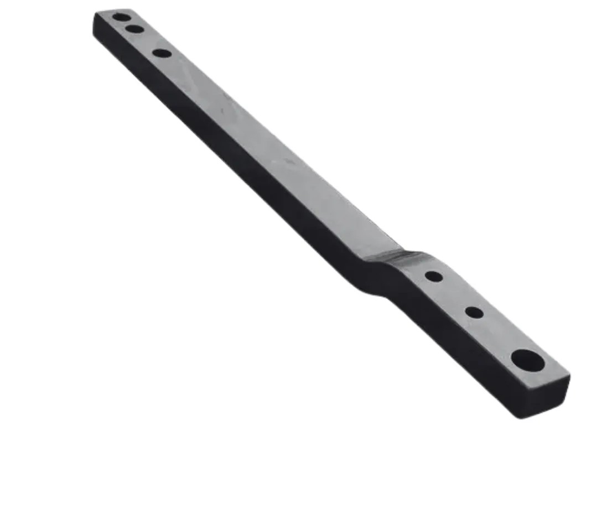{fig-align="center"}

:::

:::

## Órgãos de engate e transferência de energia

[__Barra de tração formatos:__]{.fg style="--col: #e64173"}

::: {layout-nrow=1}

::: {.fragment}

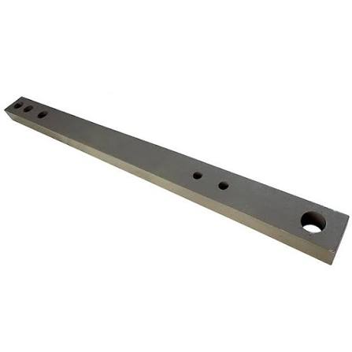{fig-align="center" width="350px"}

:::
::: {.fragment}

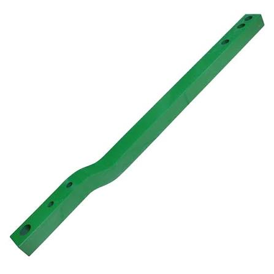{fig-align="center" width="300px"}

:::
::: {.fragment}

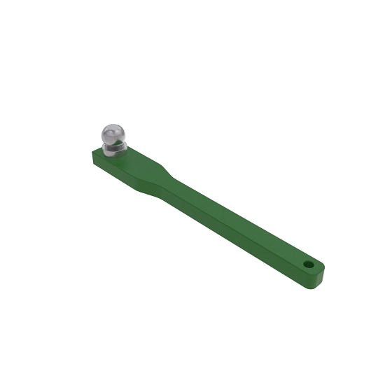{fig-align="center" width="350px"}

:::
:::

## Órgãos de engate e transferência de energia

[__Barra de tração:__]{.fg style="--col: #e64173"}

<table class="tabela-tracao">

<thead>
<tr>
  <th rowspan="2">Categoria</th>
  <th colspan="2">
    Potência da TDP à velocidade nominal do motor
  </th>
</tr>

<tr>
  <th>kW</th>
  <th>cv</th>
</tr>
</thead>

<tbody>
<tr>
  <td>0</td>
  <td>≤ 28</td>
  <td>≤ 38</td>
</tr>

<tr>
  <td>1</td>
  <td>≤ 48</td>
  <td>≤ 65</td>
</tr>

<tr>
  <td>2</td>
  <td>≤ 115</td>
  <td>≤ 156</td>
</tr>

<tr>
  <td>3</td>
  <td>≤ 185</td>
  <td>≤ 251</td>
</tr>

<tr>
  <td>4</td>
  <td>≤ 300</td>
  <td>≤ 408</td>
</tr>

<tr>
  <td>5</td>
  <td>≤ 500</td>
  <td>≤ 680</td>
</tr>
</tbody>

</table>

Determinado de acordo com a norma ISO 789-1 ou código 1 ou 2 da OCDE.
Em caso de TDP não disponível, utilizar 86% da potência do motor.

## Órgãos de engate e transferência de energia

[__Barra de tração:__]{.fg style="--col: #e64173"}

 <table class="tabela-tracao">

<thead>
<tr>
  <th rowspan="2">Posição da barra de tração</th>
  <th colspan="6">Categoria da barra de tração</th>
</tr>

<tr>
  <th>0</th>
  <th>1</th>
  <th>2</th>
  <th>3</th>
  <th>4</th>
  <th>5</th>
</tr>
</thead>

<tbody>
<tr>
  <td>Curta</td>
  <td>7,0</td>
  <td>12,0</td>
  <td>22,0</td>
  <td>27,0</td>
  <td>33,0</td>
  <td>45,0</td>
</tr>

<tr>
  <td>Regular</td>
  <td>5,0</td>
  <td>8,0</td>
  <td>15,0</td>
  <td>18,0</td>
  <td>22,0</td>
  <td>30,0</td>
</tr>

<tr>
  <td>Estendida</td>
  <td>3,5</td>
  <td>6,0</td>
  <td>11,0</td>
  <td>13,0</td>
  <td>16,0</td>
  <td>NA</td>
</tr>
</tbody>

</table>

Classificações de cargas verticais estáticas (kN) para diferentes
categorias de barras, de acordo com a norma ISO 6489-3:2004.

## Órgãos de engate e transferência de energia

[__Barra de tração:__]{.fg style="--col: #e64173"}

Tipos de engate

::: {layout-nrow=1}

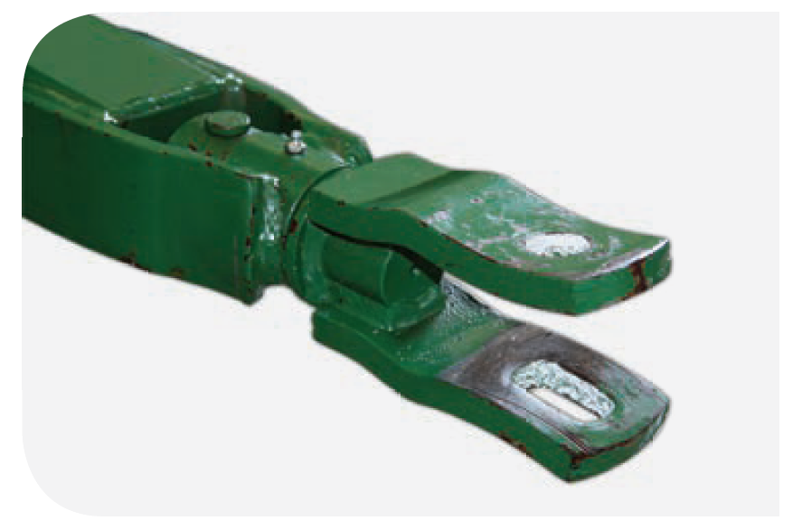{fig-align="center" width="350px"}

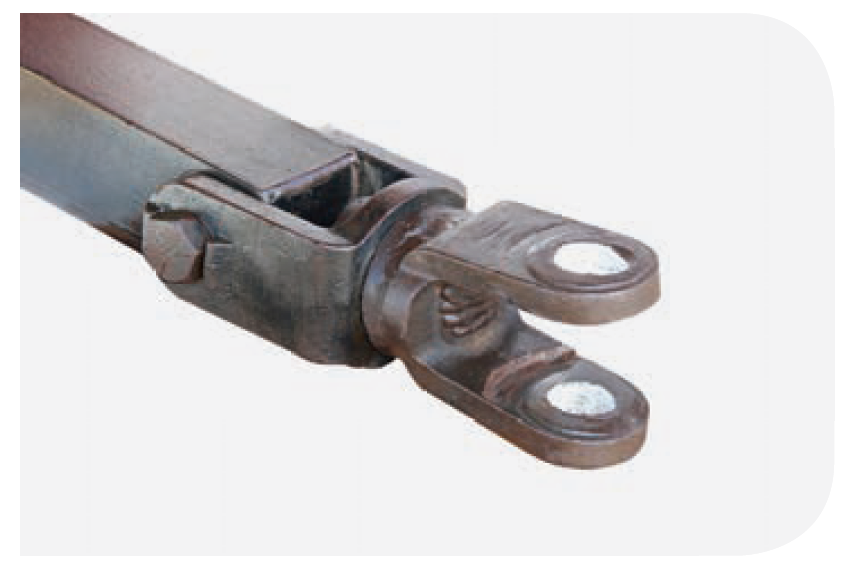{fig-align="center" width="350px"}

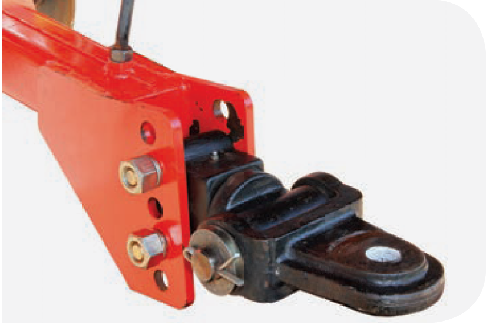{fig-align="center" width="350px"}

:::

## Órgãos de engate e transferência de energia

[__Barra de tração:__]{.fg style="--col: #e64173"}

Tipos de engate

::: {layout-nrow=1}

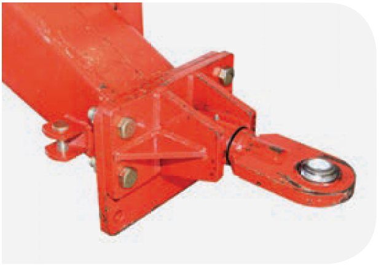{fig-align="center" width="350px"}

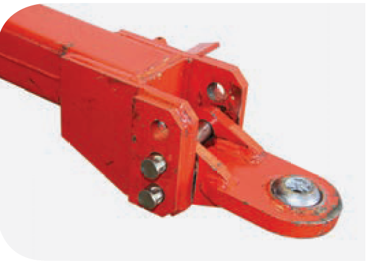{fig-align="center" width="350px"}

:::

## Órgãos de engate e transferência de energia

[__Sistema hidráulico de 3 pontos (SHPT):__]{.fg style="--col: #e64173"}

::: {.fragment}

Utiliza um fluido hidráulico sob pressão para realizar o controle de máquinas e implementos agrícolas de maneira simples, fácil e rápida. Permite que os equipamentos sejam levantados, abaixados e ajustados verticalmente.

:::

::: {.fragment} 

É um sistema composto por um conjunto de válvulas, cilindros hidráulicos e por 3 pontos de conexão (Engate de 3 pontos).

:::

## Órgãos de engate e transferência de energia

[__Sistema hidráulico de 3 pontos:__]{.fg style="--col: #e64173"}

{fig-align="center"}

## Órgãos de engate e transferência de energia

[__Sistema hidráulico de 3 pontos:__]{.fg style="--col: #e64173"}

O sistema é acionado por meio de uma alavanca localizada na cabine de operação ou por joysticks.

::: {.incremental}

- Os equipamentos podem ser levantados para a posição de transporte;
- Abaixados para operação no solo;
- Ajuste de profundidade para trabalho.

:::

## Órgãos de engate e transferência de energia

[__Sistema hidráulico de 3 pontos:__]{.fg style="--col: #e64173"}

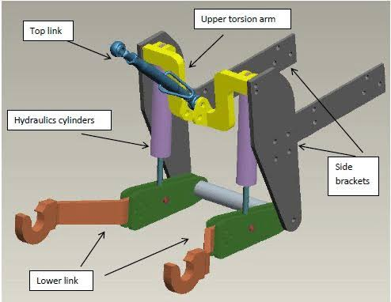{fig-align="center"}

## Órgãos de engate e transferência de energia

[__Sistema hidráulico de 3 pontos:__]{.fg style="--col: #e64173"}

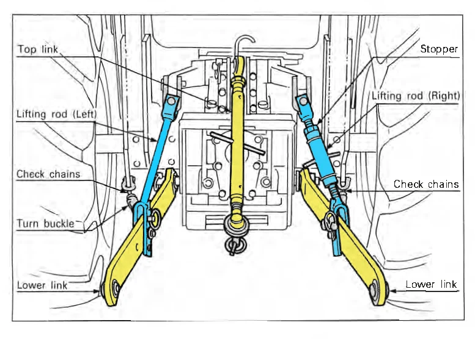{fig-align="center"}

## Órgãos de engate e transferência de energia

[__Sistema hidráulico de 3 pontos:__]{.fg style="--col: #e64173"}

::: {layout-nrow=1}

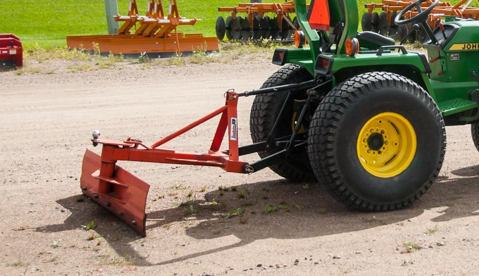{fig-align="center"}

{fig-align="center" width="350px"}

:::

## Órgãos de engate e transferência de energia

[__Sistema hidráulico de 3 pontos:__]{.fg style="--col: #e64173"}

<table class="tabela-tracao">

<thead>
<tr>
  <th rowspan="2">Categoria</th>
  <th colspan="2">
    Potência da TDP à rotação nominal do motor
  </th>
</tr>

<tr>
  <th>kW</th>
  <th>cv</th>
</tr>
</thead>

<tbody>

<tr>
  <td>1N</td>
  <td>Até 35</td>
  <td>Até 48</td>
</tr>

<tr>
  <td>1</td>
  <td>Até 48</td>
  <td>Até 65</td>
</tr>

<tr>
  <td>2N/2</td>
  <td>30 a 92</td>
  <td>41 a 125</td>
</tr>

<tr>
  <td>3N/3</td>
  <td>60 a 185</td>
  <td>82 a 252</td>
</tr>

<tr>
  <td>4N/4</td>
  <td>110 a 350</td>
  <td>150 a 476</td>
</tr>

</tbody>

</table>

*Adaptada da norma ISO 730:2009(E), <em>Agricultural wheeled tractors —
Rear-mounted three-point linkage — Categories 1N, 1, 2N, 2, 3N, 3, 4N and 4.</em>

## Órgãos de engate e transferência de energia

[__Sistema hidráulico de 3 pontos:__]{.fg style="--col: #e64173"}

<table class="tabela-tracao">

<thead>
<tr>
  <th rowspan="2">Categoria</th>
  <th colspan="2">
    Potência da TDP à rotação nominal do motor
  </th>
</tr>

<tr>
  <th>kW</th>
  <th>cv</th>
</tr>
</thead>

<tbody>

<tr>
  <td>I</td>
  <td>Até 36,9</td>
  <td>Até 50,2</td>
</tr>

<tr>
  <td>II</td>
  <td>37 a 73,9</td>
  <td>50,3 a 100,5</td>
</tr>

<tr>
  <td>III</td>
  <td>74 a 146,9</td>
  <td>100,6 a 199,7</td>
</tr>

<tr>
  <td>IV</td>
  <td>Acima de 147</td>
  <td>Acima de 199,7</td>
</tr>

</tbody>

</table>

*Associação Nacional dos Veículos Automotores.*

## Órgãos de engate e transferência de energia

[__Acoplamento hidráulico com mangueiras:__]{.fg style="--col: #e64173"}

{fig-align="center"}

## Órgãos de engate e transferência de energia

[__Acoplamento hidráulico com mangueiras:__]{.fg style="--col: #e64173"}

Sistema encontrado na traseira do trator, porém há modelos com configurações na parte frontal.

::: {.fragment}

Terminais de engate rápido ou tomadas hidráulicas são os responsáveis pela conexão.

:::

::: {.fragment}

O sistema hidráulico auxiliar (SHA) funciona com elevada pressão e vazão. Isso permite transmitir força e movimento para os equipamentos agrícolas.

::: {.incremental}

- Suspensão dos rodados;
- Controle de profundidade;
- Acionamento de motores hidráulicos.

:::

:::

## Órgãos de engate e transferência de energia

[__Acoplamento hidráulico com mangueiras:__]{.fg style="--col: #e64173"}

Acoplados por conectores tipo macho e fêmea. Os conectores no trator são denominados de "fêmeas" e nas mangueiras dos implementos são denominados "machos".

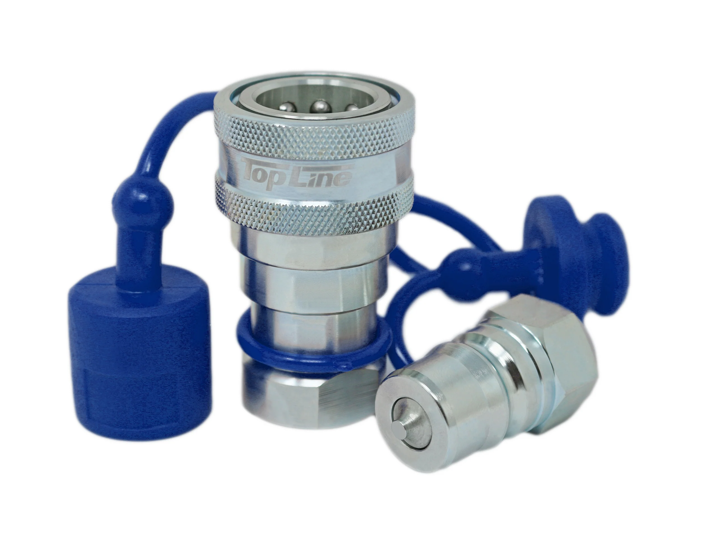{fig-align="center"}

## Órgãos de engate e transferência de energia

[__Acoplamento hidráulico com mangueiras:__]{.fg style="--col: #e64173"}

::: {layout-nrow=1}

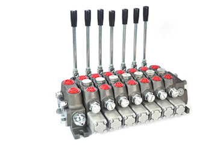

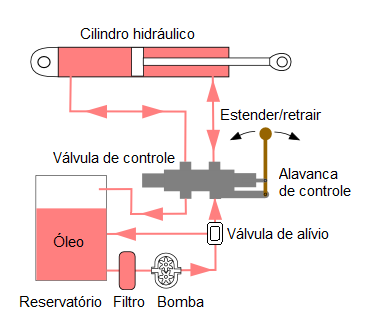

:::

## Órgãos de engate e transferência de energia

[__Acoplamento hidráulico com mangueiras:__]{.fg style="--col: #e64173"}

::: {layout-nrow=1}

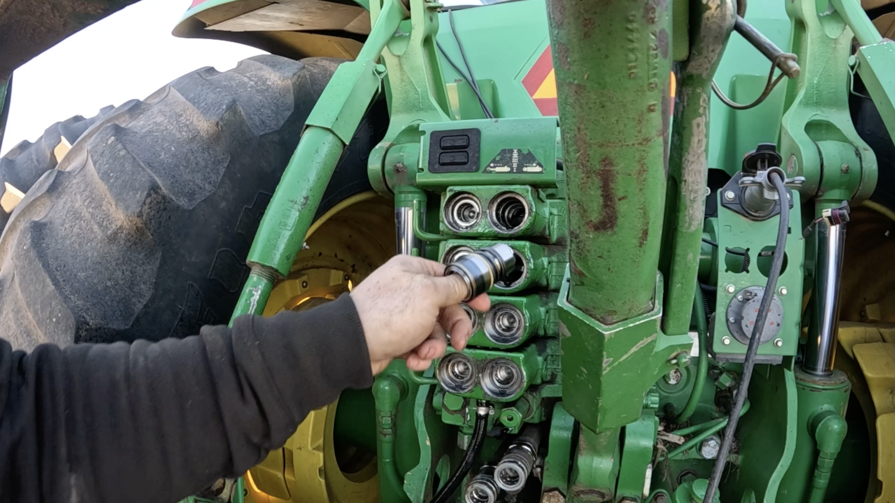{fig-align="center" width="550px"}

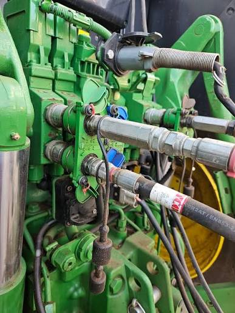{fig-align="center" width="300px"}

:::

## Órgãos de engate e transferência de energia

[__Acoplamento hidráulico com mangueiras:__]{.fg style="--col: #e64173"}

::: {layout-nrow=1}

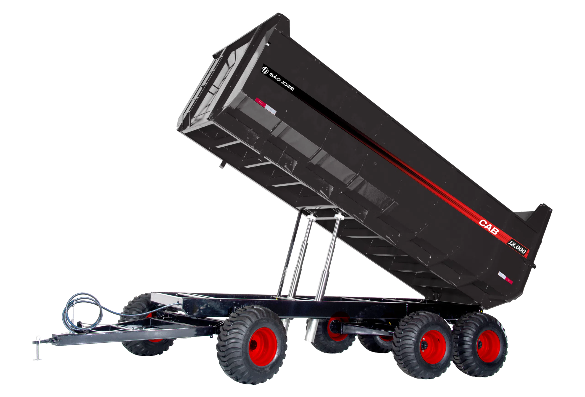{fig-align="center"}

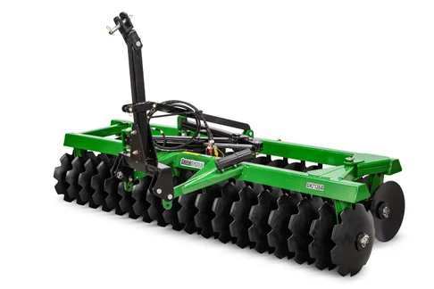{fig-align="center"}

:::

## Órgãos de engate e transferência de energia

[__Acoplamento hidráulico com mangueiras:__]{.fg style="--col: #e64173"}

::: {layout-nrow=1}

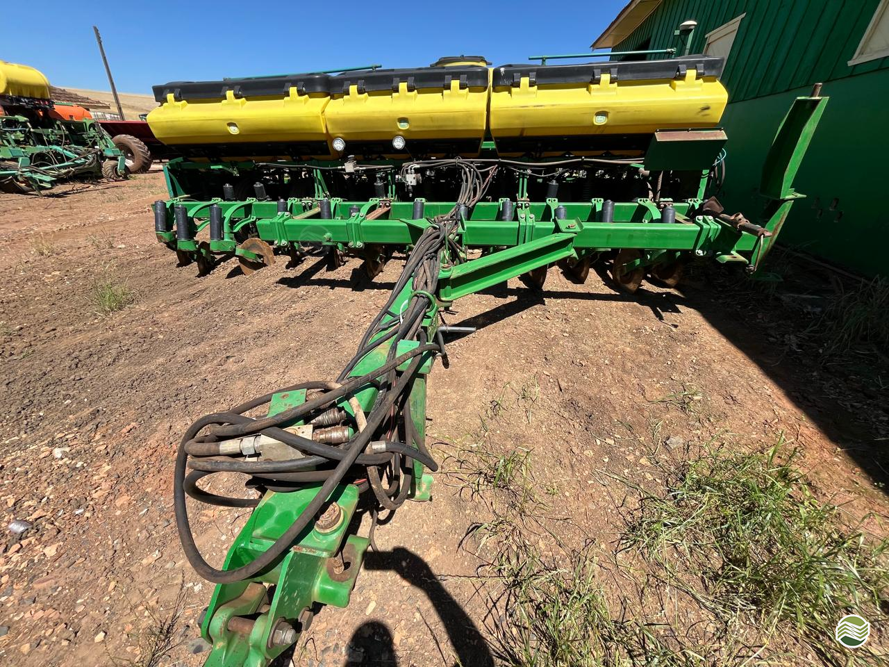{fig-align="center"}

{fig-align="center"}

:::

## Órgãos de engate e transferência de energia

[__Acoplamento hidráulico com mangueiras:__]{.fg style="--col: #e64173"}

::: {layout-nrow=1}

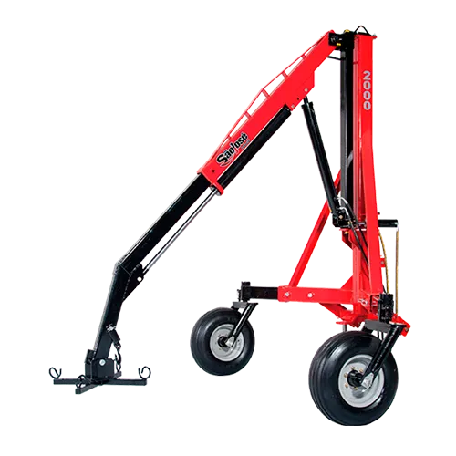{fig-align="center"}

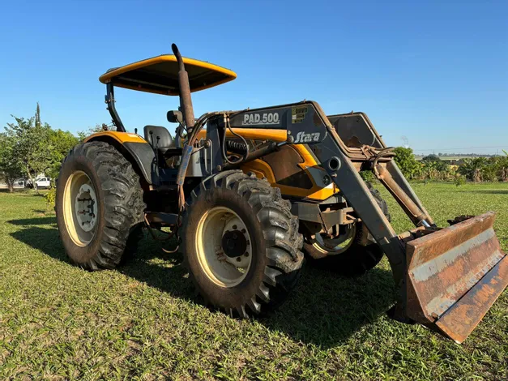{fig-align="center"}

:::

## Órgãos de engate e transferência de energia

[__Acoplamento hidráulico com mangueiras:__]{.fg style="--col: #e64173"}

Regulador de vazão:

- Fluxo constante: motores hidráulicos (semeadoras a vácuo);
- Desarme automático: final do curso (subir ou abaixar implementos);
- Flutuação: o implemento acompanha as flutuações do terreno.

## Órgãos de engate e transferência de energia

[__Acoplamento mecânico de torção (TDP):__]{.fg style="--col: #e64173"}

{fig-align="center"}

## Órgãos de engate e transferência de energia

[__Acoplamento mecânico de torção (TDP):__]{.fg style="--col: #e64173"}

Tomada de potência é o órgão capaz de realizar a transferência de potência do motor do trator para os implementos ou máquinas acopladas.

::: {.fragment}

É um eixo localizado na parte traseira ou frontal do trator, projetado para fornecer energia mecânica aos equipamentos.

::: {.fragment}

No Brasil é mais comum a traseira, sendo a frontal um acessório.

:::

:::

## Órgãos de engate e transferência de energia

[__Acoplamento mecânico de torção (TDP):__]{.fg style="--col: #e64173"}

::: {layout-nrow=1}

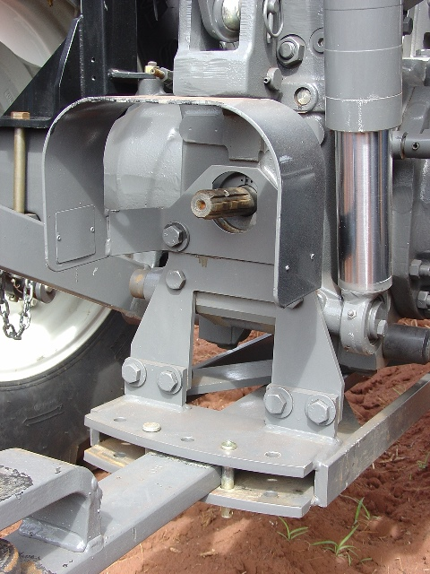{fig-align="center" width="350px"}

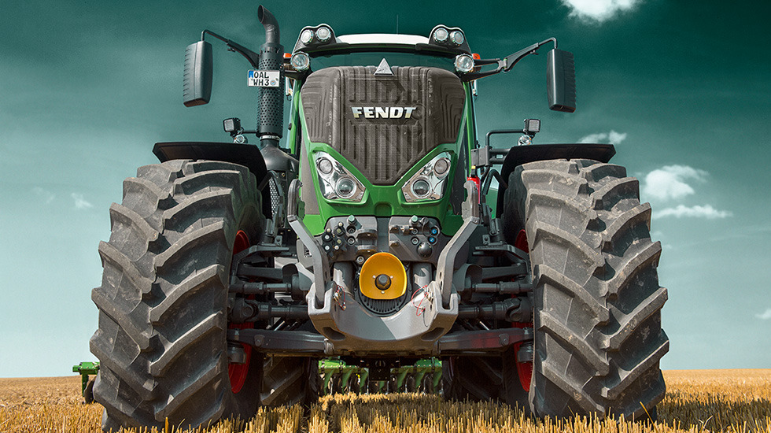{fig-align="center" width="550px"}

:::

## Órgãos de engate e transferência de energia

[__Acoplamento mecânico de torção (TDP):__]{.fg style="--col: #e64173"}

O eixo da TDP é um meio muito eficiente de transferência de potência mecânica.

::: {.incremental}

- A perda de potência do motor até a barra de tração é de 30 a 40%;
- Na TDP a perda é reduzida para 20%.

:::

## Órgãos de engate e transferência de energia

[__Acoplamento mecânico de torção (TDP):__]{.fg style="--col: #e64173"}

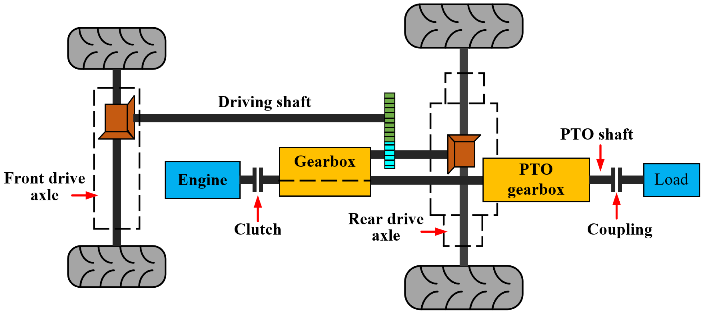{fig-align="center"}

## Órgãos de engate e transferência de energia

[__Acoplamento mecânico de torção (TDP):__]{.fg style="--col: #e64173"}

A conexão é realizada por meio de um cardan.

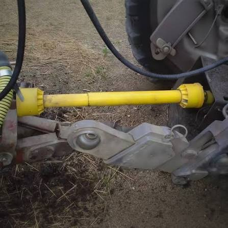{fig-align="center"}

## Órgãos de engate e transferência de energia

[__Acoplamento mecânico de torção (TDP):__]{.fg style="--col: #e64173"}

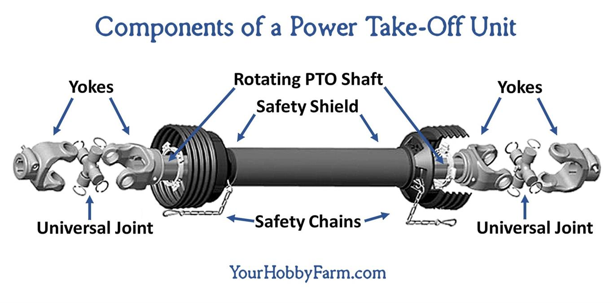{fig-align="center"}

## Órgãos de engate e transferência de energia

[__Acoplamento mecânico de torção (TDP):__]{.fg style="--col: #e64173"}

A TDP traseira é projetada para operar em rotação de 540 ou 1000 RPM, sempre no sentido horário.

::: {.fragment}

A TDP frontal atinge 1000 RPM e pode girar no sentido horário e anti-horário.

:::

::: {.fragment}

Pode ser de 3 tipos:

::: {.incremental}

- Dependente;
- Semi-independente;
- Independente.

:::

:::

## Órgãos de engate e transferência de energia

[__Acoplamento mecânico de torção (TDP):__]{.fg style="--col: #e64173"}

A TDP dependente é a convencional, com acionamento diretamente pelo eixo de transmissão do motor.

Quando a velocidade do trator é alterada, a velocidade da TDP também é afetada.

Encontrada em tratores mais antigos e menores.

## Órgãos de engate e transferência de energia

[__Acoplamento mecânico de torção (TDP):__]{.fg style="--col: #e64173"}

A semi-independente possui acionamento separado do eixo de transmissão do trator.

::: {.fragment}

Acionado por meio de uma embreagem independente, com o pedal de embreagem apresentando dois cursos.

::: {.incremental}

- Primeiro curso: desembreia a caixa de câmbio;
- O segundo curso: desembreia a TDP.
  - Permite que ela seja acionada ou desligada independentemente da velocidade da transmissão do trator.

:::

:::

## Órgãos de engate e transferência de energia

[__Acoplamento mecânico de torção (TDP):__]{.fg style="--col: #e64173"}

A TDP independente possui seu próprio motor dedicado.

::: {.fragment}

Pode ser ligada e desligada independentemente do motor ou da transmissão do motor. 

::: {.incremental}

:::

:::

## Órgãos de engate e transferência de energia

[__Acoplamento mecânico de torção (TDP):__]{.fg style="--col: #e64173"}

Para alterar a rotação é necessário trocar o eixo de saída.

::: {layout-nrow=1}

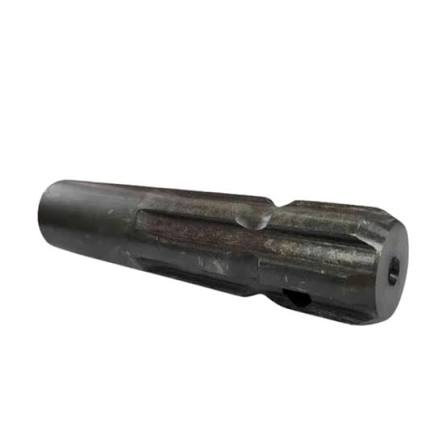{fig-align="center" }

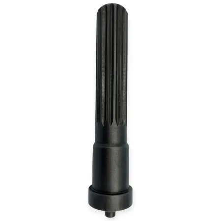{fig-align="center" }

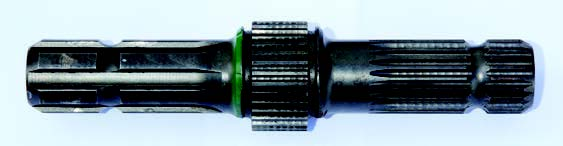{fig-align="center" width="350px"}

:::

## Órgãos de engate e transferência de energia

[__Acoplamento mecânico de torção (TDP):__]{.fg style="--col: #e64173"}

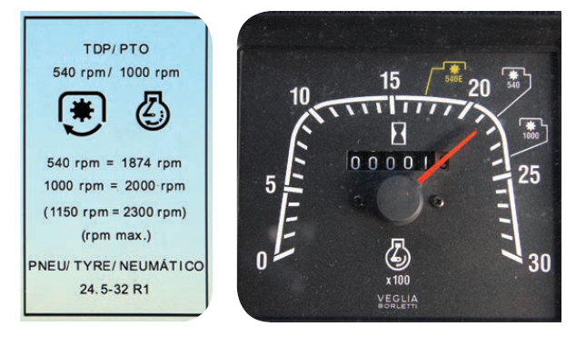{fig-align="center"}

## Órgãos de engate e transferência de energia

[__Acoplamento mecânico de torção (TDP):__]{.fg style="--col: #e64173"}

<table>
  <thead>
    <tr>
      <th rowspan="2">Especificações</th>
      <th colspan="3" style="text-align:center;">Tipos</th>
    </tr>
    <tr>
      <th style="text-align:center;">1</th>
      <th style="text-align:center;">2</th>
      <th style="text-align:center;">3</th>
    </tr>
  </thead>

  <tbody>
    <tr>
      <td>Diâmetro do eixo (mm)</td>
      <td>35</td>
      <td>35</td>
      <td>45</td>
    </tr>

    <tr>
      <td>Número de estrias</td>
      <td>6</td>
      <td>21</td>
      <td>20</td>
    </tr>

    <tr>
      <td>Rotação (rpm)</td>
      <td>540 ± 10</td>
      <td>1000 ± 25</td>
      <td>1000 ± 25</td>
    </tr>

    <tr>
      <td>Sentido de rotação</td>
      <td colspan="3" style="text-align:center;">Horário</td>
    </tr>

    <tr>
      <td rowspan="2">Potência máx.</td>
      <td>48 kW</td>
      <td>92 kW</td>
      <td>185 kW</td>
    </tr>

    <tr>
      <td>65 cv</td>
      <td>125 cv</td>
      <td>252 cv</td>
    </tr>
  </tbody>
</table>

## Órgãos de engate e transferência de energia

**Exemplo de acionamento**

::: {layout-nrow=1}

{fig-align="center" width="350px"}

::: {.fragment}

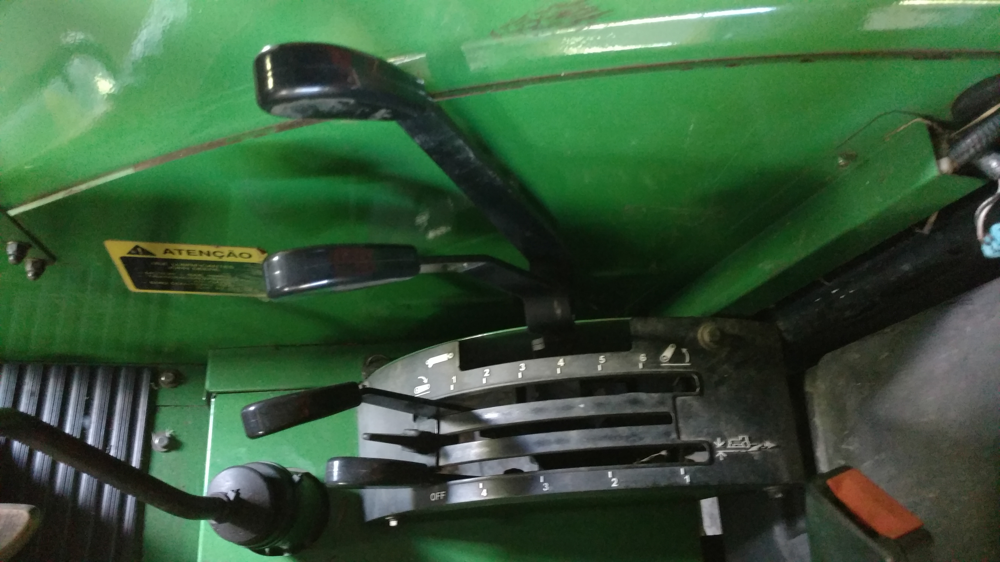{fig-align="center"}

:::

:::

## Órgãos de engate e transferência de energia

**Exemplo de acionamento**

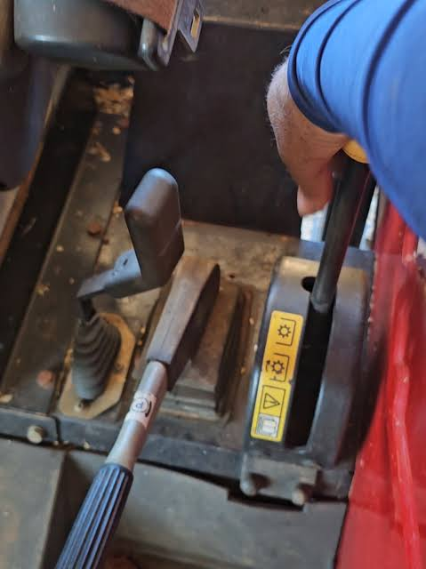{fig-align="center"}

# Fim!

