# Relembrando o motor...

## Relembrando o motor...

Responsável pela transformação da energia dos combustíveis em energia mecânica (torque e rotação).

# Sistema de transmissão

## Sistema de transmissão

::: {.fragment}

Função principal de realizar a transmissão de potência.

:::

::: {.fragment}

::: {.incremental}

- Permitir o funcionamento contínuo do motor;
- Redução de rotação e aumento de torque;
- Possibilitar operações de aproximação e paradas de emergência sem danificar os componentes;
- Permitir inúmeras intensidades operacionais;
  - Rotação, velocidade, torque e sentido.
- Diferenciar a rotação entre as duas rodas motrizes, traseira e dianteira (4x2 TDA);
- Acionar diferentes sistemas (TDP e hidráulico).

:::

:::

## Sistema de transmissão

O que se busca em um trator?

::: {.fragment}

Velocidade ou torque?

:::

::: {.fragment}

Um trator cujo acionamento estivesse de forma direta no eixo da roda motriz do motor ocasionaria velocidades de carros esportivos.

::: {.fragment}

Ex: Um trator a 2000 rpm e com pneus traseiros de 61 cm de diâmetro, sem redução da rotação, teria uma velocidade de deslocamento de 230 km h^-1^.

:::

:::

## Sistema de transmissão

A proporção de diminuição é chamada de **relação de transmissão** e é expressa como a razão entre a rotação do virabrequim e a do eixo das rodas motrizes.

::: {.fragment}

"O número de voltas do volante do motor para cada volta da roda motriz do trator"

:::

## Sistema de transmissão

A contrapartida é o aumento significativo do torque, que é altamente desejável em aplicações agrícolas.

::: {.fragment}

O sistema de transmissão opera modificando o torque e a rotação para que o trator possa desempenhar adequadamente os trabalhos agrícolas (muito torque).

:::

## Sistema de transmissão

Essa importância do sistema se traduz em seu preço.

::: {.fragment}

Todo o sistema (transmissão, diferencial, eixos, freios, TDP, eixo de tração) corresponde a 25 a 30% do custo total do trator.

:::

## Sistema de transmissão

[__Constituintes do sistema de transmissão:__]{.fg style="--col: #e64173"}

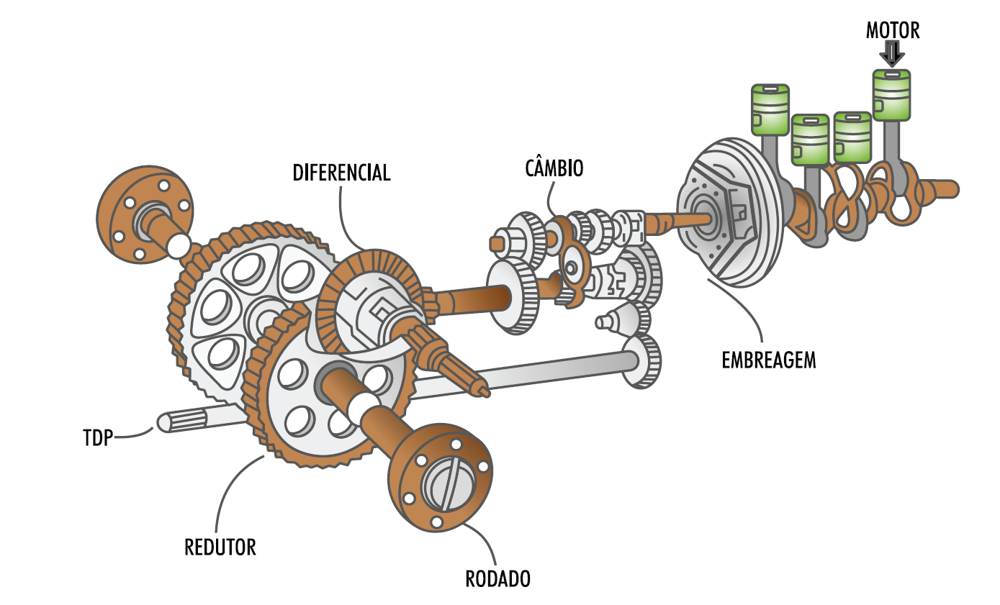{fig-align="center"}

# Embreagem

## Embreagem

::: {.fragment}

A função da embreagem é conectar e desconectar o movimento do motor com o da caixa de câmbio.

:::

::: {.incremental}

- Quando o pedal da embreagem está em sua posição normal (solto), a embreagem transmite o movimento do motor à caixa de câmbio.
- Quando ocorre o acionamento do pedal, a embreagem deixa de transmitir o movimento.

:::

## Embreagem

[__Embreagem de disco único (simples):__]{.fg style="--col: #e64173"}

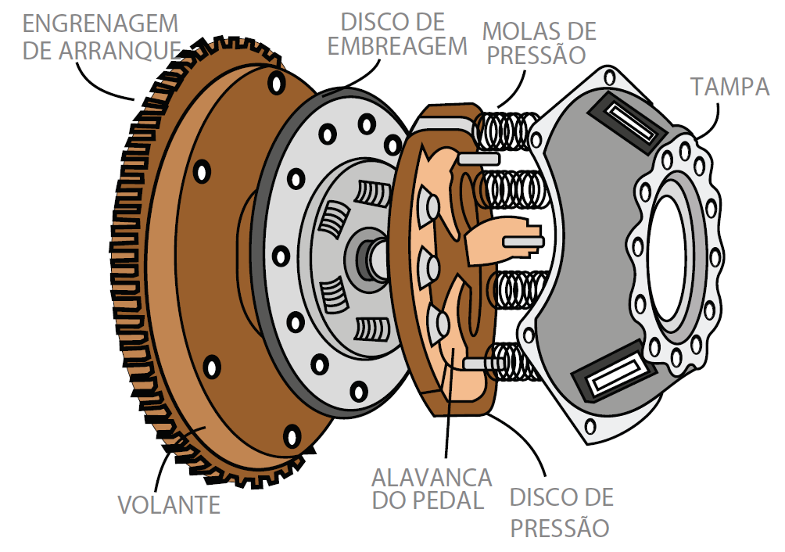{fig-align="center"}

## Embreagem

[__Embreagem de disco único (simples):__]{.fg style="--col: #e64173"}

**Funcionamento**

::: {.fragment}

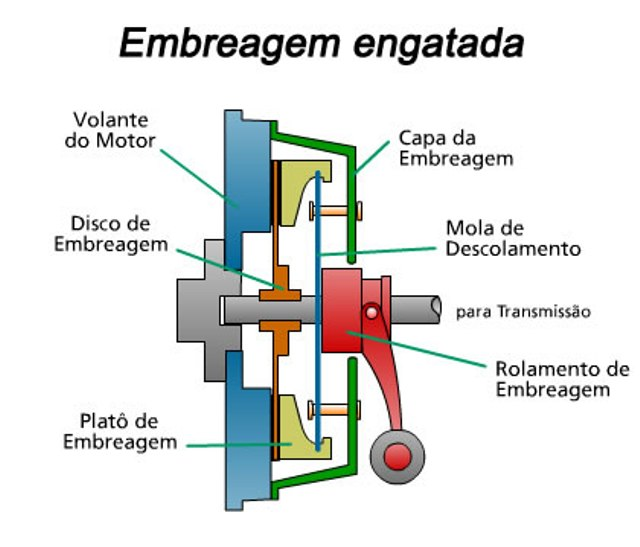{fig-align="center" width="550px"}

:::

## Embreagem

[__Embreagem de disco único (simples):__]{.fg style="--col: #e64173"}

**Funcionamento**

::: {.fragment}

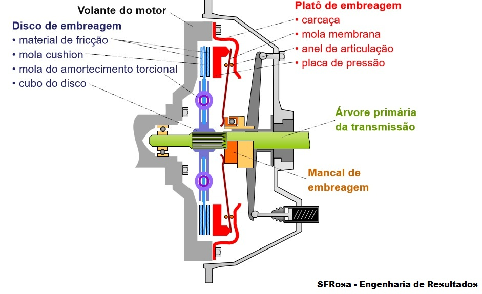{fig-align="center" width="750px"}

:::

## Embreagem

[__Embreagem de disco único (simples):__]{.fg style="--col: #e64173"}

**Funcionamento**

::: {.fragment}

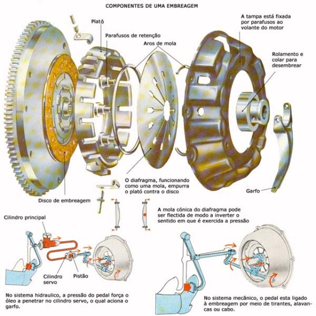{fig-align="center" width="450px"}

:::

## Embreagem

[__Embreagem de disco único (simples):__]{.fg style="--col: #e64173"}

::: {layout-ncol=2}

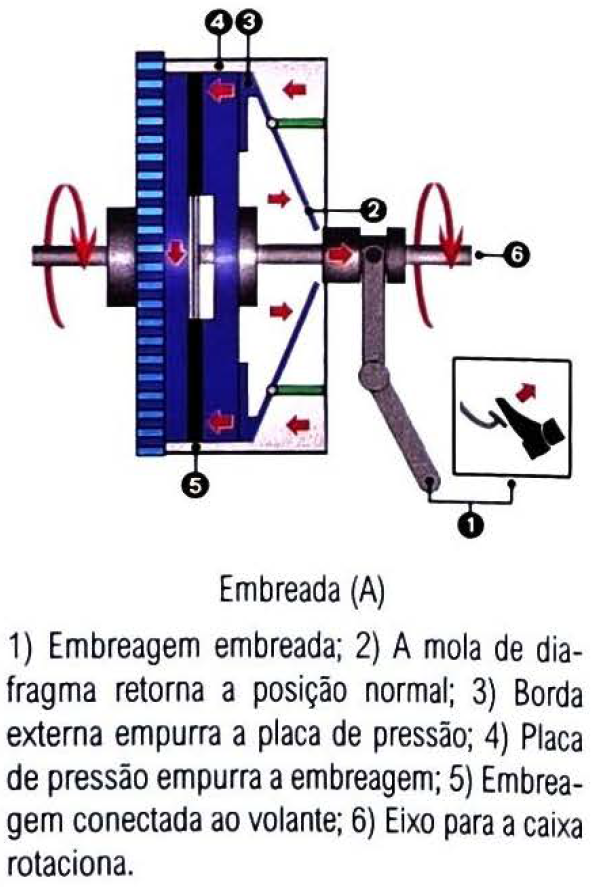{width="340px" fig-align="center"}

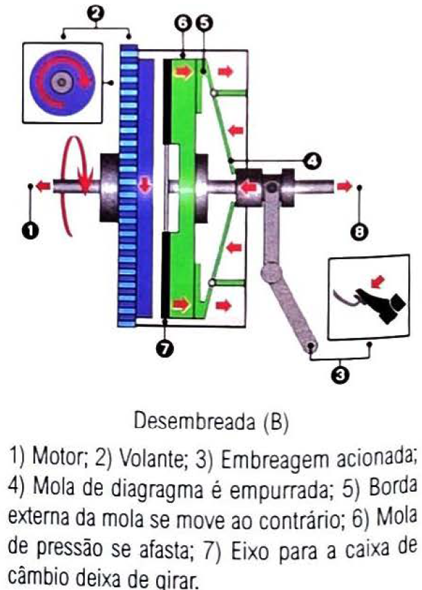{width="340px" fig-align="center"}

:::

## Embreagem

[__Embreagem de disco único (simples):__]{.fg style="--col: #e64173"}

**Funcionamento**

A placa de pressão exerce força sobre o disco que é preso ao volante do motor. Isso permite a transferência de energia e do movimento de rotação para o sistema de transmissão.

::: {.fragment}

Ao acionar o pedal, a placa de pressão libera a pressão sobre o disco, e este é desacoplado do volante.

:::

::: {.fragment}

Disco simples refere-se à quantidade de discos de embreagem no sistema (1 disco).

::: {.fragment style="font-size:22px"}

Controle limitado da TDP. Não é possível interromper o movimento do trator sem desligar a TDP quando ambos estão em movimento.

:::

:::

## Embreagem

[__Tipos de embreagem:__]{.fg style="--col: #e64173"}

::: {.incremental}

- Disco simples a seco: em tratores mais simples, o acionamento provoca a parada do avanço do trator quando há a parada da TDP;
- Embreagem dupla a seco: contém dois conjuntos de discos de embreagem independentes. Possui dois estágios: o primeiro desconecta o motor da caixa de câmbio e o segundo, da TDP;
  - Permite parar o movimento do trator sem parar a TDP, quando ambos estão em movimento.

:::

## Embreagem

[__Tipos de embreagem:__]{.fg style="--col: #e64173"}

::: {.incremental}

- Independente de disco duplo a seco: dois conjuntos de discos separados. Possui dispositivos independentes do pedal da embreagem para ligar ou desligar o movimento do motor à TDP;
  - Alavancas, teclas ou botões (apenas para a TDP);
  - Mais moderno;
- Discos múltiplos: vários discos metálicos, que aumentam a superfície de atrito.

:::

## Embreagem

[__Discos duplos:__]{.fg style="--col: #e64173"}

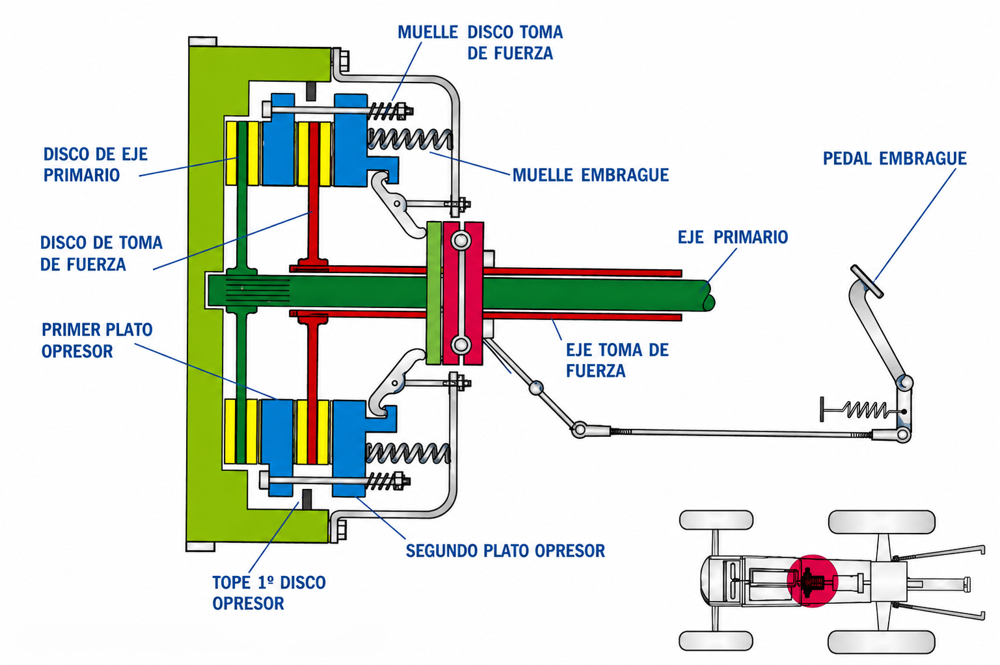{fig-align="center"}

# Caixa de câmbio

## Caixa de câmbio

Em motores agrícolas, a potência na rotação é praticamente constante. Portanto, mesmo que a rotação seja alterada, a velocidade não mudará muito.

::: {.fragment}

A alteração da velocidade e do torque é realizada por meio de mudanças de marchas (relações de engrenagens).

:::

::: {.fragment}

Para potência constante do motor, quando se aumenta o torque, tem-se a redução da velocidade, e vice-versa.

:::

## Caixa de câmbio

A principal função é facilitar a adequação da potência e do torque do trator à atividade realizada.

::: {.fragment}

Permitir a alteração do sentido do deslocamento do trator (frente e ré).

:::

## Caixa de câmbio

Tratores requerem muitas marchas.

::: {.fragment}

A entrega da potência máxima em velocidades de trabalho distintas requer marchas.

:::

# Caixa de câmbio - transmissão mecânica

## Caixa de câmbio - transmissão mecânica

::: {layout-ncol=2}

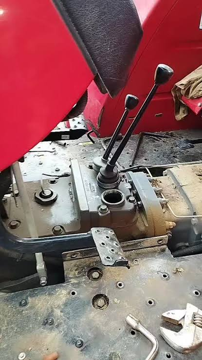{width="300px" fig-align="center"}

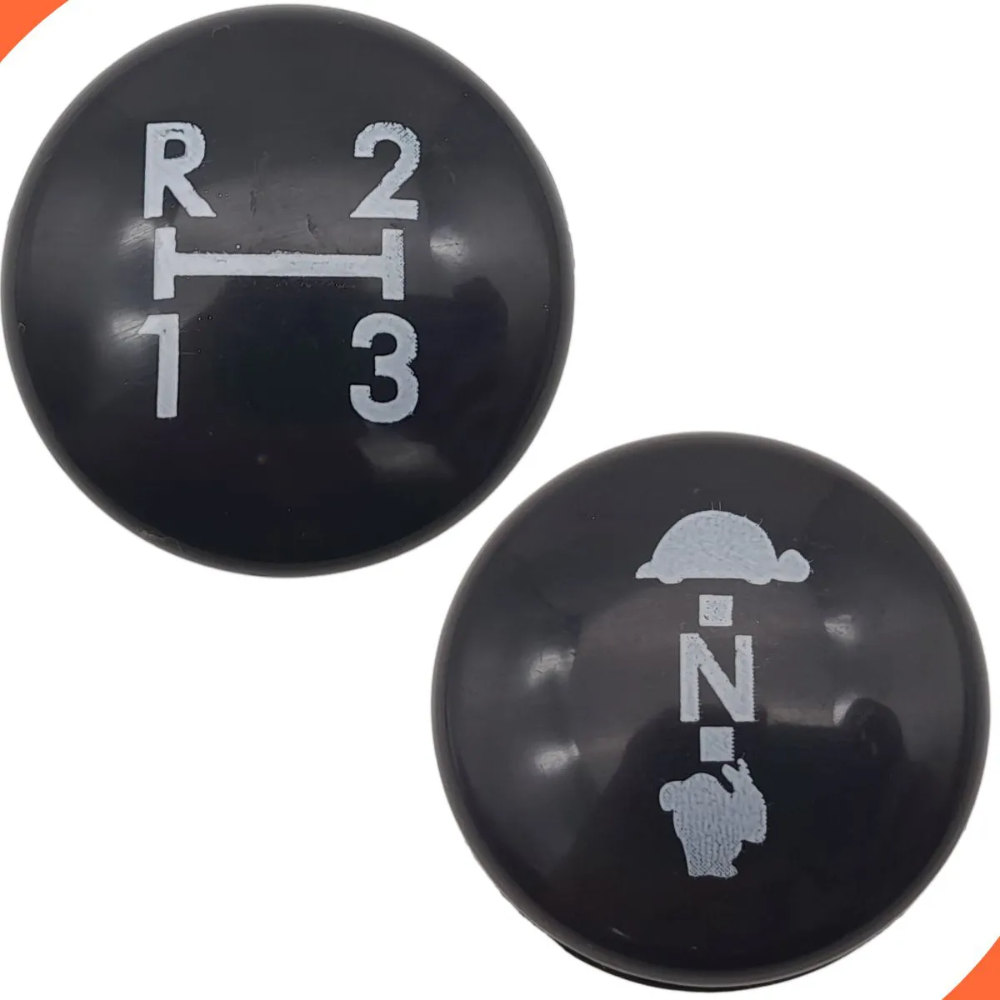{width="300px" fig-align="center"}

:::

## Caixa de câmbio - transmissão mecânica

[__Grupos de marchas:__]{.fg style="--col: #e64173"}

Caixas redutoras, posicionadas antes da caixa de marchas geral.

::: {.fragment}

Composta por um par de engrenagens de mesmo tamanho, que não altera o torque e a rotação.
Mais um par de engrenagens, com uma engrenagem motora menor e uma movida maior, propiciando menor velocidade e maior torque.

::: {.fragment}

Chamada de **marchas reduzidas**.

:::

:::

::: {.fragment}

Ex: um trator com opção reduzida multiplica por 2 o número de marchas. Se há 4 marchas normais, são 8 no total para frente, mais 2 para ré.

:::

## Caixa de câmbio - transmissão mecânica

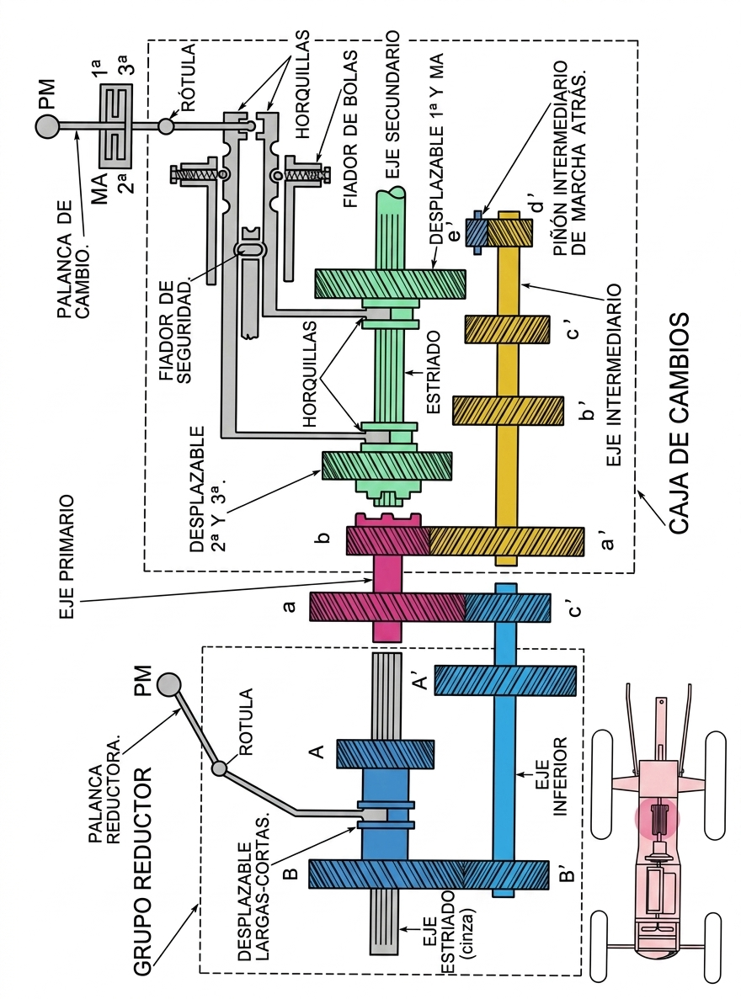{fig-align="center"}

## Caixa de câmbio - transmissão mecânica

[__Caixa reduzida:__]{.fg style="--col: #e64173"}

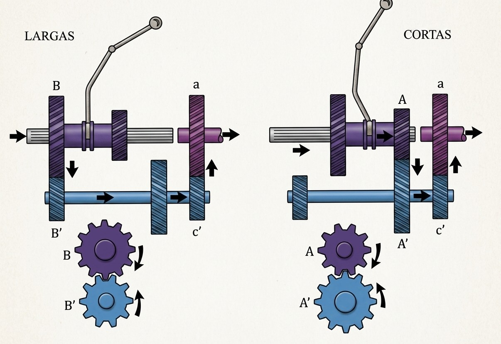{fig-align="center"}

## Caixa de câmbio - transmissão mecânica

[__Caixa principal (1ª):__]{.fg style="--col: #e64173"}

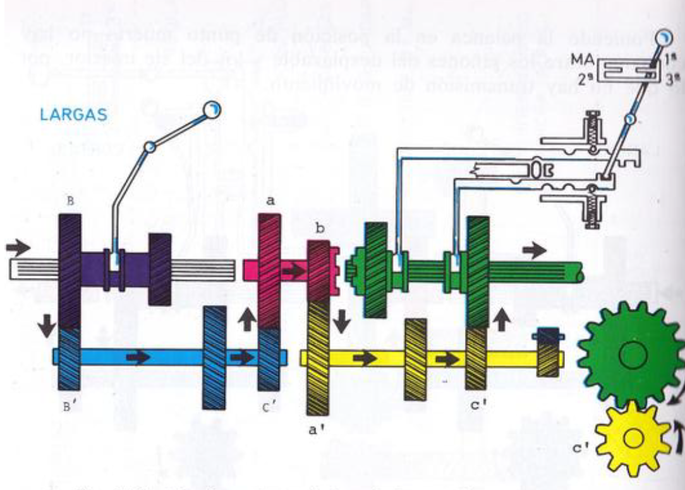{fig-align="center"}

## Caixa de câmbio - transmissão mecânica

[__Caixa principal (2ª):__]{.fg style="--col: #e64173"}

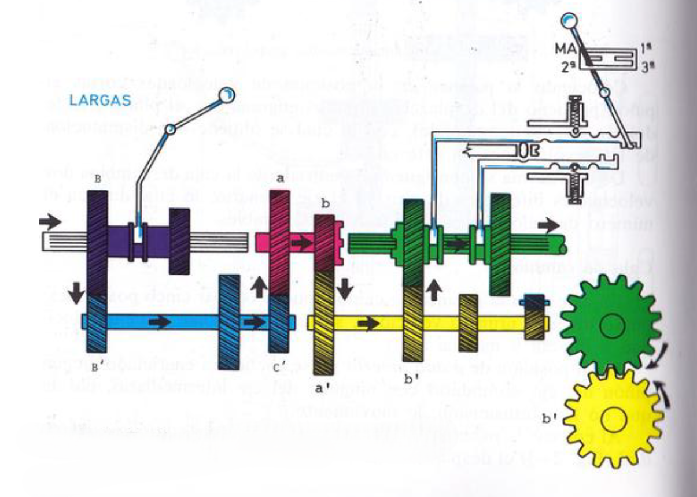{fig-align="center"}

## Caixa de câmbio - transmissão mecânica

[__Caixa principal (3ª):__]{.fg style="--col: #e64173"}

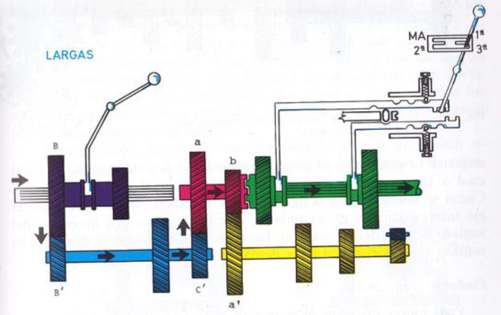{fig-align="center"}

## Caixa de câmbio - transmissão mecânica

[__Caixa principal (Ré):__]{.fg style="--col: #e64173"}

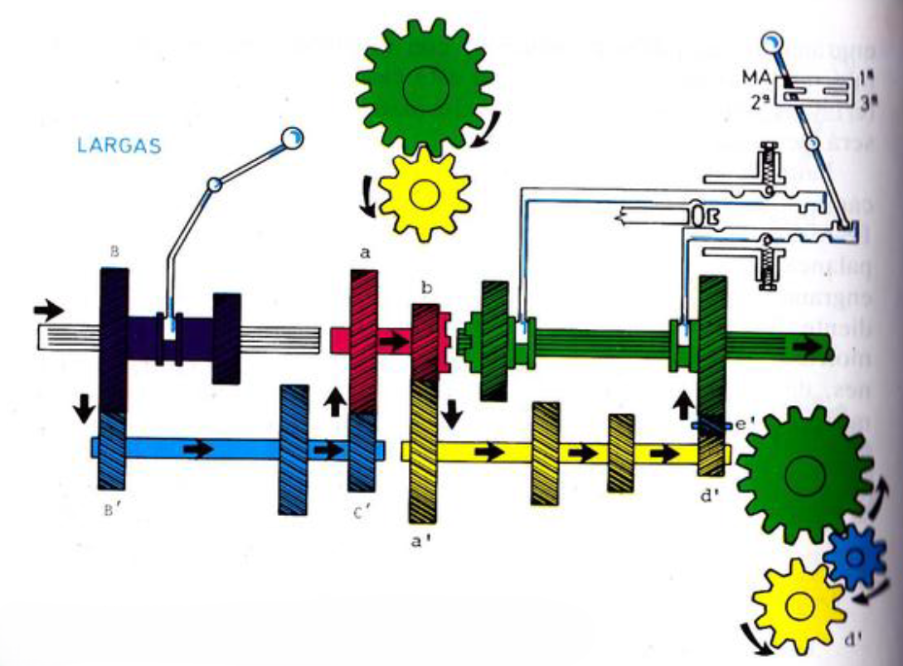{fig-align="center"}

## Caixa de câmbio - transmissão mecânica

[__Características:__]{.fg style="--col: #e64173"}

É conhecida como sistema de transmissão manual.

::: {.incremental}

- Troca de marchas discreta, que ocorre em intervalos específicos;
- Na caixa de câmbio "seca" (deslizante), as trocas de marcha devem ocorrer com o trator parado;
  - Ou por habilidade do operador;
- As engrenagens devem estar paradas ou sincronizadas;
- Sistema mais simples;
- Engrenagens sujeitas a maior desgaste;

:::

## Caixa de câmbio 

[__Escalonamento de marchas:__]{.fg style="--col: #e64173"}

::: {.fragment}

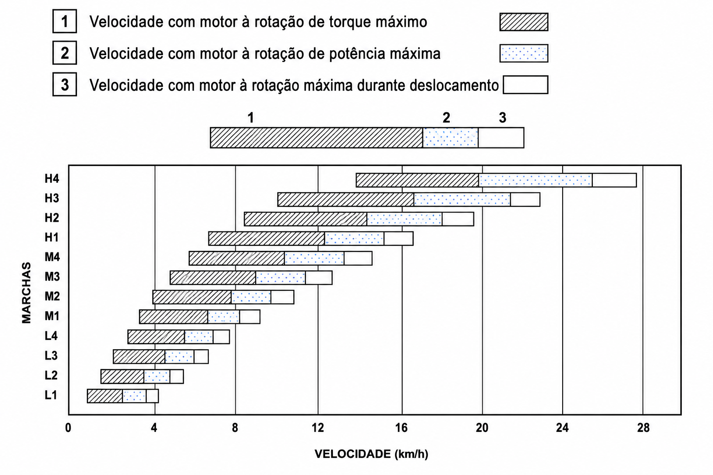{fig-align="center" width="750px"}

:::

## Caixa de câmbio 

[__Escalonamento de marchas:__]{.fg style="--col: #e64173"}

::: {.fragment}

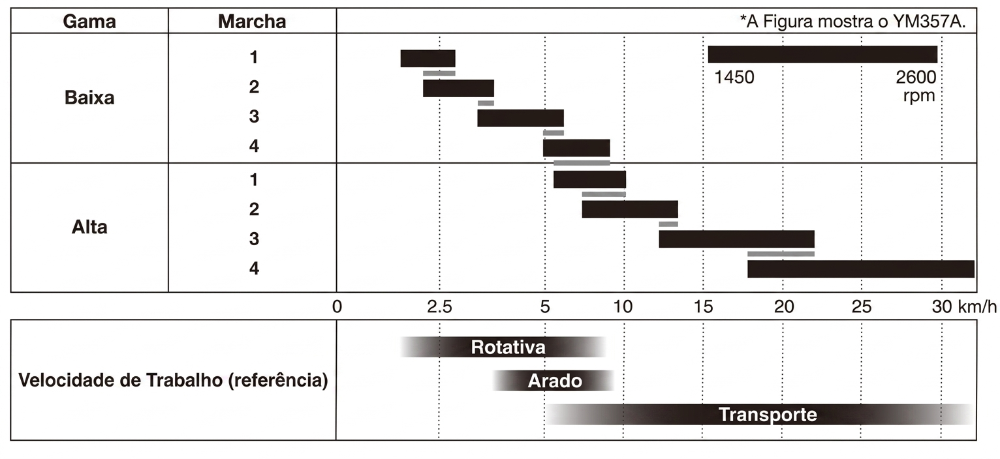{fig-align="center" width="850px"}

:::

## Caixa de câmbio 

[__Escalonamento de marchas:__]{.fg style="--col: #e64173"}

Se cada operação agrícola tem uma faixa de velocidade de trabalho, é o esforço exigido pelo equipamento acoplado que indica a marcha a ser utilizada.

::: {.fragment}

A escolha depende da rotação do motor e da marcha utilizada.

:::

::: {.incremental}

- Quanto maior o número de marchas, maior o escalonamento;
- Maiores são as possibilidades de se adequar a velocidade e o torque ao trabalho agrícola alvo;

:::

## Caixa de câmbio 

[__Escalonamento de marchas:__]{.fg style="--col: #e64173"}

Pode ser entendido como uma escada, em que cada degrau representa uma marcha em diversas rotações do motor.

::: {.fragment}

Cada degrau representa uma faixa de velocidade para determinada marcha.

:::

::: {.fragment}

Que tipo de escalonamento se busca em um trator?

:::

# Caixa de câmbio - engrenamento constante

## Caixa de câmbio - engrenamento constante

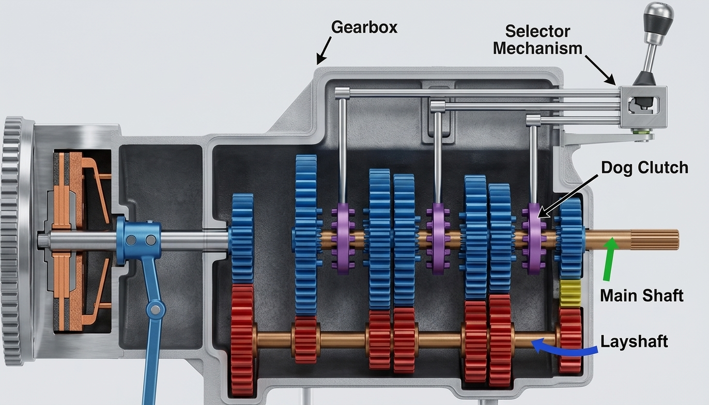{fig-align="center"}

## Caixa de câmbio - engrenamento constante

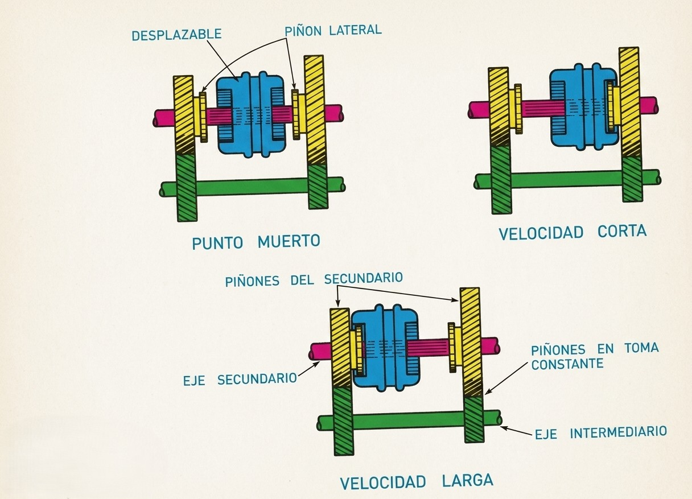{fig-align="center"}

## Caixa de câmbio - engrenamento constante

Todas as engrenagens estão em contato permanente umas com as outras.

::: {.incremental}

- Giram livremente nos eixos, mas precisam ser ativadas para transmitir potência;
- A mudança de marcha ocorre com o operador desembreando, selecionando a marcha e embreando novamente;
- Transmissão suave e silenciosa;
- Mudanças rápidas;

:::

## Caixa de câmbio - engrenamento constante

[__Com sincronizador:__]{.fg style="--col: #e64173"}

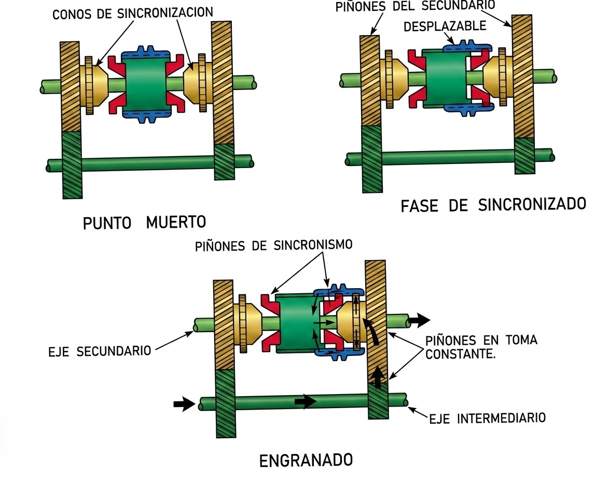{fig-align="center"}

## Caixa de câmbio - engrenamento constante

[__Com sincronizador:__]{.fg style="--col: #e64173"}

::: {.incremental}

- Operam sob engrenamento constante;
- Incorporam sincronizadores, projetados para igualar as velocidades das engrenagens;
  - Facilitar a troca e deixá-la mais suave;
- Permite a troca de marcha mesmo quando as velocidades de rotação das engrenagens e do eixo de transmissão não estão perfeitamente alinhadas;
- Apenas um par de engrenagens é ativado a cada troca (as demais giram livremente);
- Troca de marcha sem necessidade de parar o trator;
- Potência temporariamente interrompida.

:::

# Caixa de câmbio - powershift

## Caixa de câmbio -  powershift

[__Características:__]{.fg style="--col: #e64173"}

::: {.incremental}

- Transmissão mecânica do tipo "transmissões sob carga";
  - Capacidade de realizar trocas de marcha sem interromper a transmissão de potência do motor para as rodas motrizes;
- As marchas são trocadas por meio de embreagens multidiscos com controle hidráulico;
- Trocas rápidas e suaves, sem necessidade de usar a embreagem;
- Embreagens acoplam e desacoplam as marchas;
- Conjunto de engrenagens planetárias;
  - Engrenagens satélites que giram em torno de uma engrenagem central (solar);
- Engrenagens de múltiplos estágios.

:::

## Caixa de câmbio -  powershift

[__Características:__]{.fg style="--col: #e64173"}

::: {.fragment}

Durante a troca de marchas, uma embreagem desengata a marcha atual e outra engata a marcha desejada. Não há interrupção do fluxo de energia.

:::

## Caixa de câmbio -  powershift

[__Engrenagem planetária:__]{.fg style="--col: #e64173"}

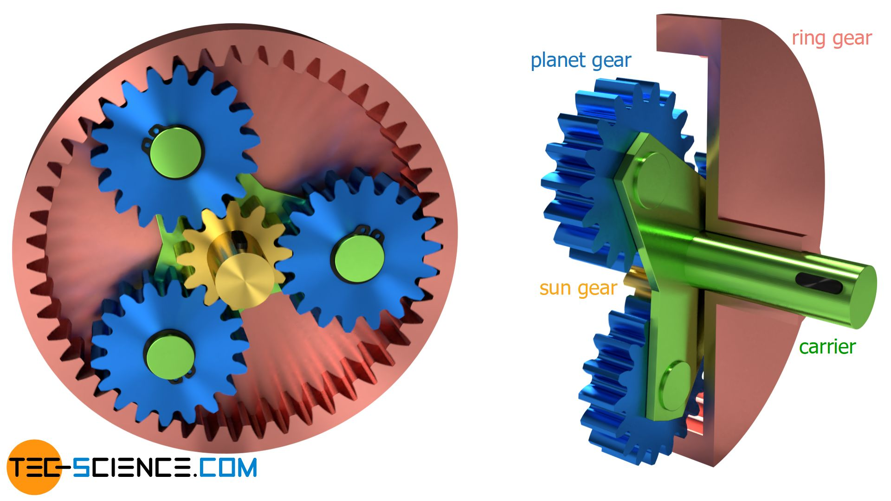{fig-align="center"}

## Caixa de câmbio -  powershift

[__Engrenagem planetária - ex:__]{.fg style="--col: #e64173"}

::: {.columns}

::: {.column}

- Engrenagem sol (sun gear): 18 dentes (teeth);
- Engrenagem anel (ring gear): 43 dentes;
- Sistema planetário (planetary carrier): 61 dentes (18 + 43).

:::

::: {.column}

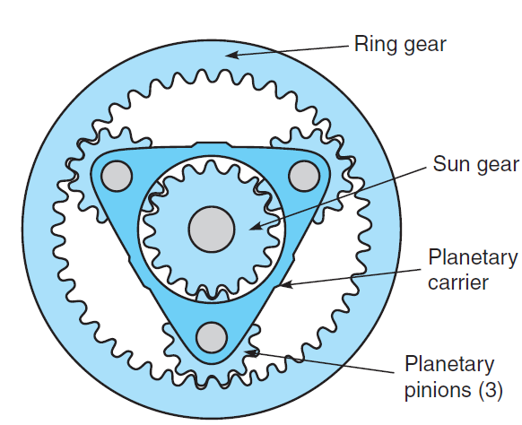{fig-align="center"}

:::

:::

## Caixa de câmbio -  powershift

[__Engrenagem planetária - redução máxima de velocidade:__]{.fg style="--col: #e64173"}

::: {.columns}

::: {.column}

Para obter a máxima redução de velocidade em um conjunto de engrenagens planetárias simples, a engrenagem solar deve ser o elemento de entrada, e a engrenagem anel deve ser o elemento fixo ou travado. Isso torna automaticamente o porta-satélites o elemento de saída. Isso produz o aumento máximo de torque e faz com que o porta-satélites gire no mesmo sentido que a engrenagem solar.

:::

::: {.column}

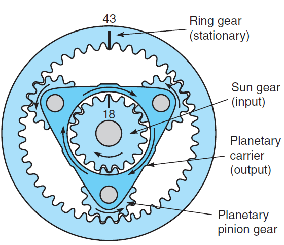{fig-align="center"}

:::

:::

## Caixa de câmbio -  powershift

[__Engrenagem planetária - redução máxima de velocidade:__]{.fg style="--col: #e64173"}

::: {.columns}

::: {.column}

- Engrenagem sol (sun gear): 18 dentes (teeth);
- Engrenagem anel (ring gear): 43 dentes;
- Sistema planetário (planetary carrier): 61 dentes (18 + 43).

::: {.fragment}

$$Relação= \frac{61}{18}= 3.388889:1$$

:::

:::

::: {.column}

{fig-align="center"}

:::

:::

## Caixa de câmbio -  powershift

[__Engrenagem planetária - redução mínima de velocidade:__]{.fg style="--col: #e64173"}

::: {.columns}

::: {.column}

O porta-satélites planetário continua sendo a saída. A engrenagem solar passa a ser o elemento estacionário, enquanto a coroa passa a ser a entrada. O sentido de rotação é o mesmo da entrada, com uma redução de transmissão mínima. Essa é a segunda menor relação de transmissão que pode ser obtida em um conjunto de engrenagens planetárias simples, proporcionando aumento de torque.

:::

::: {.column}

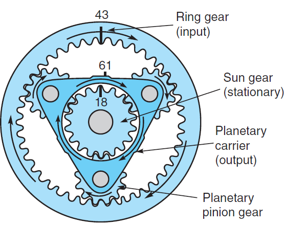{fig-align="center"}

:::

:::

## Caixa de câmbio -  powershift

[__Engrenagem planetária - redução mínima de velocidade:__]{.fg style="--col: #e64173"}

::: {.columns}

::: {.column}

- Engrenagem sol (sun gear): 18 dentes (teeth);
- Engrenagem anel (ring gear): 43 dentes;
- Sistema planetário (planetary carrier): 61 dentes (18 + 43).

::: {.fragment}

$$Relação= \frac{61}{43}= 1.418605:1$$

:::

:::

::: {.column}

{fig-align="center"}

:::

:::

## Caixa de câmbio -  powershift

[__Engrenagem planetária - velocidade máxima:__]{.fg style="--col: #e64173"}

::: {.columns}

::: {.column}

A engrenagem com o maior número de dentes deve ser utilizada como entrada. O porta-satélites é sempre o componente com o maior número de dentes. Portanto, deve ser utilizado como elemento de entrada (sobremarcha = overdrive). Dependendo de qual elemento permanece travado, a engrenagem solar ou a coroa proporcionará uma maior relação de sobremarcha.

:::

::: {.column}

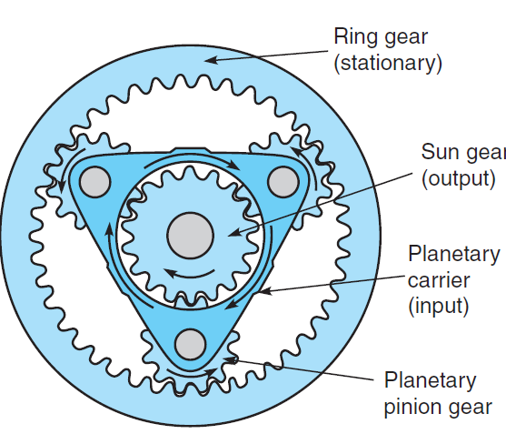{fig-align="center"}

:::

:::

## Caixa de câmbio -  powershift

[__Engrenagem planetária - velocidade máxima:__]{.fg style="--col: #e64173"}

::: {.columns}

::: {.column}

- Engrenagem sol (sun gear): 18 dentes (teeth);
- Engrenagem anel (ring gear): 43 dentes;
- Sistema planetário (planetary carrier): 61 dentes (18 + 43).

::: {.fragment}

$$Relação= \frac{18}{61}= 0.295082:1$$

:::

:::

::: {.column}

{fig-align="center"}

:::

:::

## Caixa de câmbio -  powershift

[__Operações do sistema de engrenagens planetárias:__]{.fg style="--col: #e64173"}

::: {style="font-size:26px"}

| Name | Nome| Característica |
|:--|:--|:--|
| **Maximum Speed Reduction** | **Redução máxima de velocidade** | Maior redução e maior aumento de torque |
| **Minimum Speed Reduction** | **Redução mínima de velocidade** | Menor redução e aumento de torque |
| **Maximum Speed Increase** | **Aumento máximo de velocidade** | Maior sobremarcha (*overdrive*) |
| **Minimum Speed Increase** | **Aumento mínimo de velocidade** | Menor sobremarcha |
| **Speed Reduction – Reverse Direction** | **Redução de velocidade – sentido inverso** | Redução com inversão do sentido |
| **Speed Increase – Reverse Direction** | **Aumento de velocidade – sentido inverso** | Aumento de velocidade com inversão do sentido |
| **Direct Drive** | **Transmissão direta (1:1)** | Entrada e saída na mesma velocidade |
| **Neutral Condition** | **Condição de neutro** | Não há transmissão de movimento |

:::

## Caixa de câmbio -  powershift

[__Leis de operação da engrenagem planetária simples:__]{.fg style="--col: #e64173"}

::: {style="font-size:22px"}

| Engrenagem solar | Porta-satélites | Coroa | Velocidade | Torque | Sentido de rotação |
|:----------------:|:----------------:|:-----:|:----------|:-------|:-------------------|
| 1. Entrada | Saída | Travada | **Redução máxima** | Aumento | Igual à entrada |
| 2. Travada | Saída | Entrada | **Redução mínima** | Aumento | Igual à entrada |
| 3. Saída | Entrada | Travada | **Aumento máximo** | Redução | Igual à entrada |
| 4. Travada | Entrada | Saída | **Aumento mínimo** | Redução | Igual à entrada |
| 5. Entrada | Travada | Saída | **Redução** | Aumento | Inverso ao da entrada |
| 6. Saída | Travada | Entrada | **Aumento** | Redução | Inverso ao da entrada |

Quando dois elementos são mantidos juntos, a velocidade e o sentido de rotação são iguais aos da entrada, resultando em uma **transmissão direta (1:1)**.

Quando nenhum elemento é mantido ou travado, não é possível transmitir movimento para a saída, resultando em uma condição de **neutro**.

:::

## Caixa de câmbio -  powershift

[__Sistema de engrenagens planetárias:__]{.fg style="--col: #e64173"}

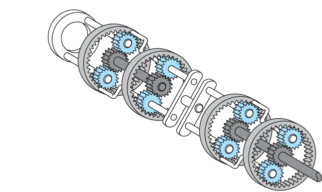{fig-align="center"}

## Caixa de câmbio -  powershift

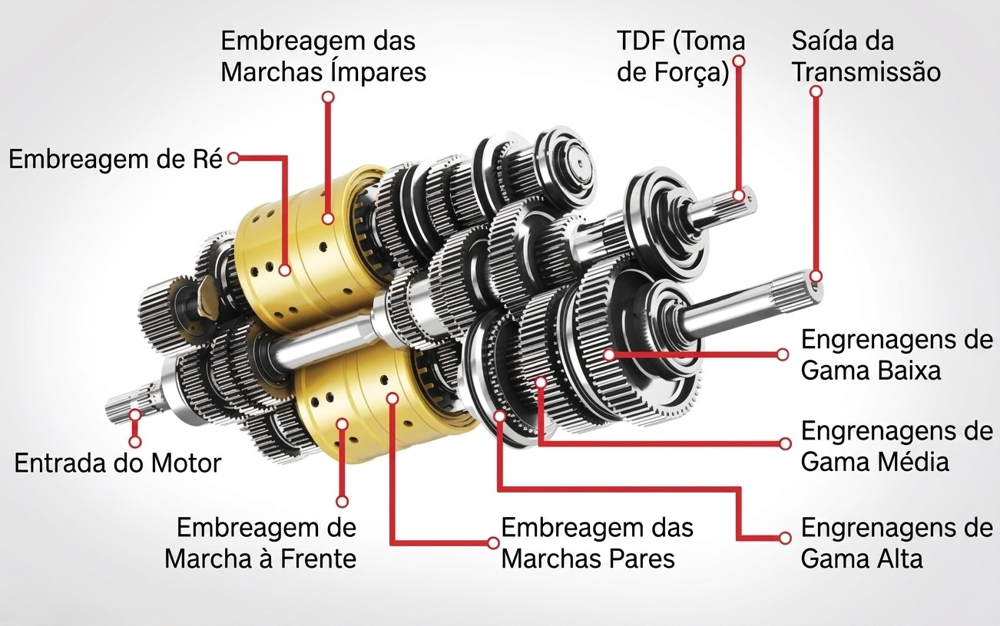{fig-align="center"}

## Caixa de câmbio -  powershift

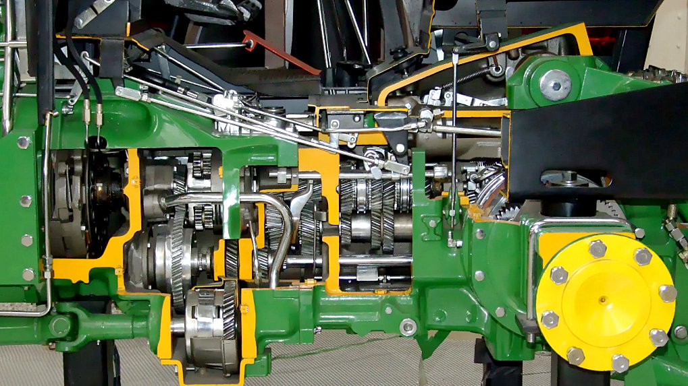{fig-align="center"}

## Caixa de câmbio 

[__Grupos de marchas:__]{.fg style="--col: #e64173"}

::: {.fragment}

Uma melhoria da marcha reduzida foi a caixa com diferentes relações (gamas).

:::

::: {.incremental}

- Permite 3 ou 4 relações de transmissão em vez de apenas duas;
- Indicadas como: L (low), M (medium), H (high), R (reverse);
- Também indicadas por: A, B, C, D e R;
- Atualmente, os tratores podem contar com 24, 36 e até 48 marchas.

:::

::: {.fragment}

Ex: para um trator possuir 20 marchas para frente, basta ter duas caixas, uma com 5 velocidades (1ª até 5ª) e outra com 4 grupos (A, B, C e D).

:::

## Caixa de câmbio 

::: {.fragment}

[__Inversor:__]{.fg style="--col: #e64173"}

Possibilita inverter o sentido do curso simplesmente atuando em uma alavanca (inverte o sentido de todas as marchas).

:::

::: {.fragment}

[__Super redutor:__]{.fg style="--col: #e64173"}

Localizado na frente da caixa de marchas, utiliza pares de engrenagens com grandes reduções, permitindo velocidades baixíssimas. Específico para algumas culturas (ex: café).

:::

## Caixa de câmbio 

[__Grupos de marchas:__]{.fg style="--col: #e64173"}

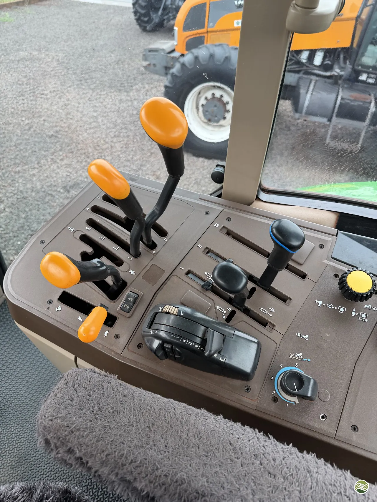{fig-align="center"}

# Caixa de câmbio - hidrostático

## Caixa de câmbio -  hidrostático

Utiliza uma bomba e um motor para controlar a velocidade e a direção do trator por meio do fluxo de óleo. Opções mais suaves de troca de velocidade.

::: {.fragment}

Converte energia mecânica em energia hidráulica (pressão de óleo) e novamente em energia mecânica.

:::

## Caixa de câmbio -  hidrostático

<iframe 
  width="850" 
  height="478" 
  src="https://www.youtube.com/embed/T5vpqI7SmIc"
  title="Vídeo do YouTube"
  frameborder="0"
  allow="accelerometer; autoplay; clipboard-write; encrypted-media; gyroscope; picture-in-picture"
  allowfullscreen>
</iframe>

## Caixa de câmbio -  hidrostático

Quando a alavanca distribuidora não é acionada, o óleo chega ao distribuidor e retorna ao tanque através do filtro magnético.

::: {.fragment}

Quando a alavanca é puxada, o óleo chega ao distribuidor e sai dele em alta pressão, indo em direção a uma das entradas do motor hidrostático reversível, fazendo com que ele gire em uma direção.

:::

::: {.fragment}

O óleo não pressurizado sai do motor, chega novamente ao distribuidor e, através do filtro magnético, chega ao tanque.

:::

# Caixa de câmbio - CVT

## Caixa de câmbio -  CVT

**Transmissão continuamente variável**

::: {.fragment}

Permite variabilidade "infinita" entre as relações de transmissão dentro de uma faixa específica.

:::

::: {.fragment}

A transmissão CVT varia continuamente a relação de transmissão (com sensores, polias e correias ou acionamento hidrostático).

:::

## Caixa de câmbio -  CVT

É construída por duas polias, uma conectada ao virabrequim e outra ao restante do sistema. Também usa um conjunto de engrenagens planetário.

::: {.fragment}

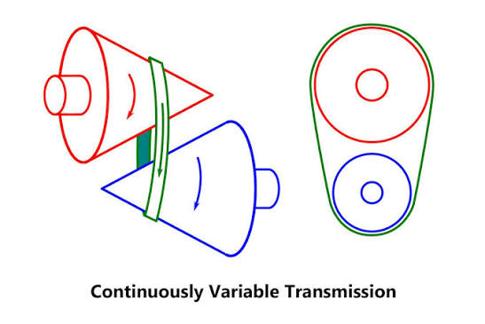{fig-align="center"}

:::

## Caixa de câmbio -  CVT

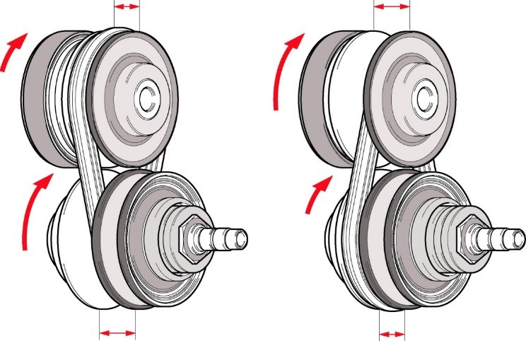{fig-align="center"}

## Caixa de câmbio -  CVT

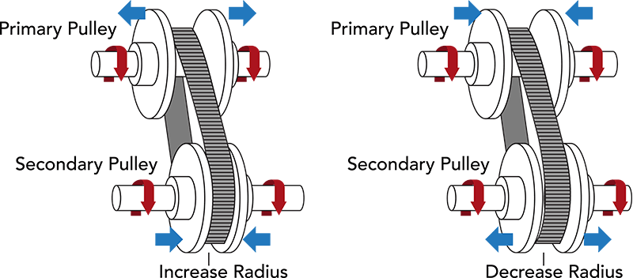{fig-align="center"}

## Caixa de câmbio

Consumo de combustível powershift vs. CVT

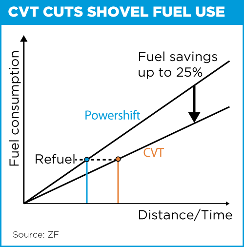{fig-align="center"}

# Eixo traseiro

## Eixo traseiro

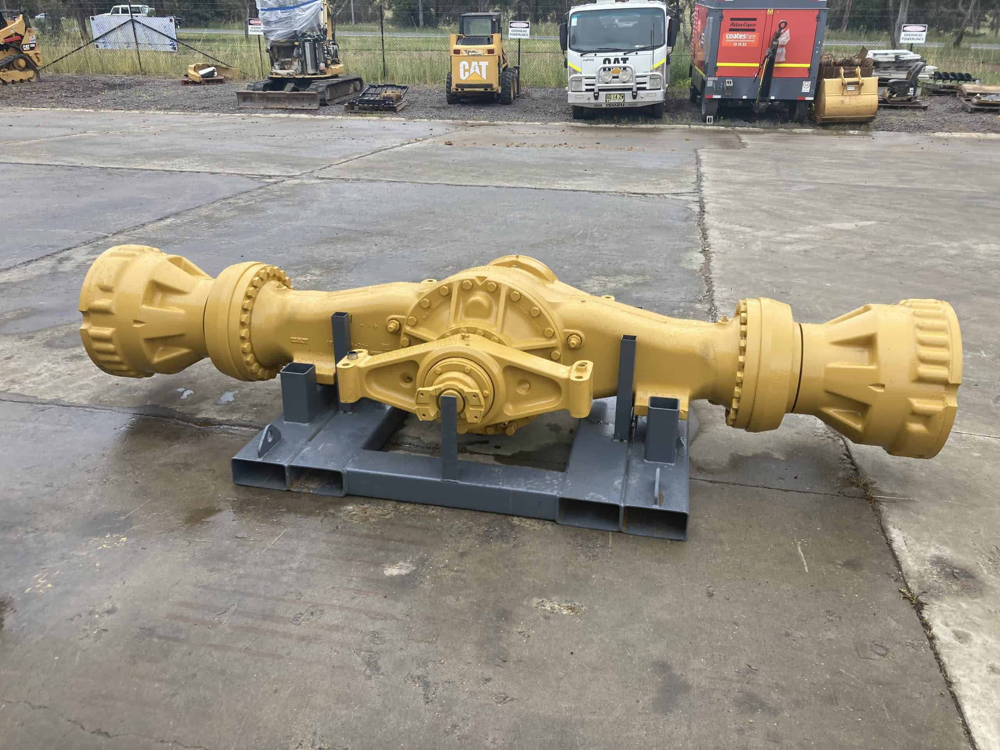{fig-align="center"}

## Eixo traseiro

É responsável por conectar as rodas traseiras, transmitindo a potência do motor para as rodas.

::: {.fragment}

Elementos:

::: {.incremental}

- Carcaça: estrutura que abriga os componentes internos do eixo traseiro e fornece suporte e proteção.
- Diferencial: permite movimento independente entre as rodas traseiras;
- Semieixos: transmitem a potência do motor para as rodas traseiras, estando conectados ao diferencial;
- Redução final: ajusta a velocidade de rotação das rodas, reduzindo-a e ampliando o torque;
- Freios: às vezes integrados ao eixo traseiro, permitem a parada ou desaceleração.

:::

:::

# Diferencial

## Diferencial

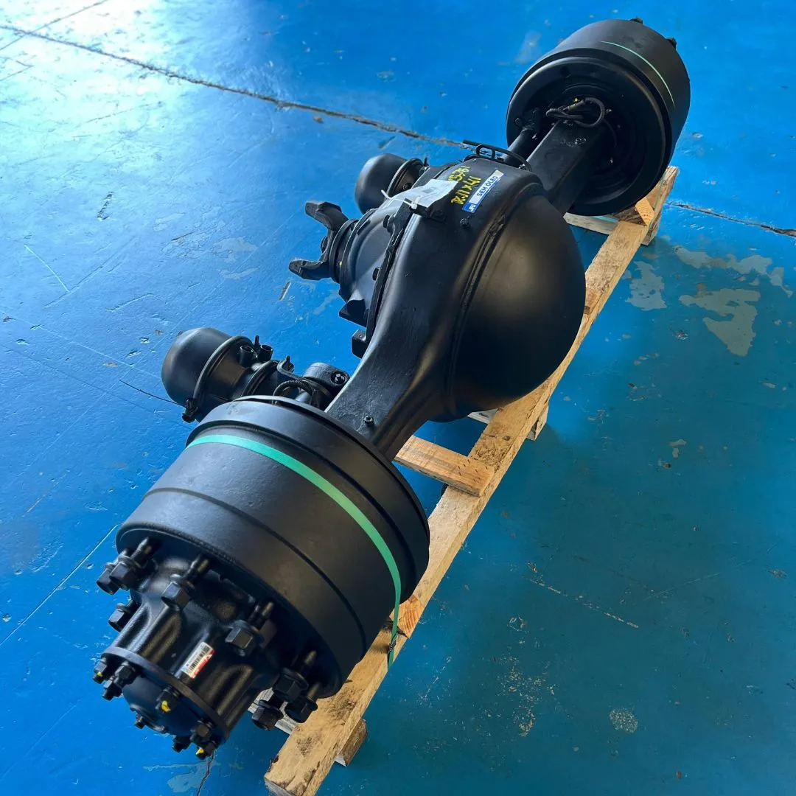{fig-align="center"}

## Diferencial

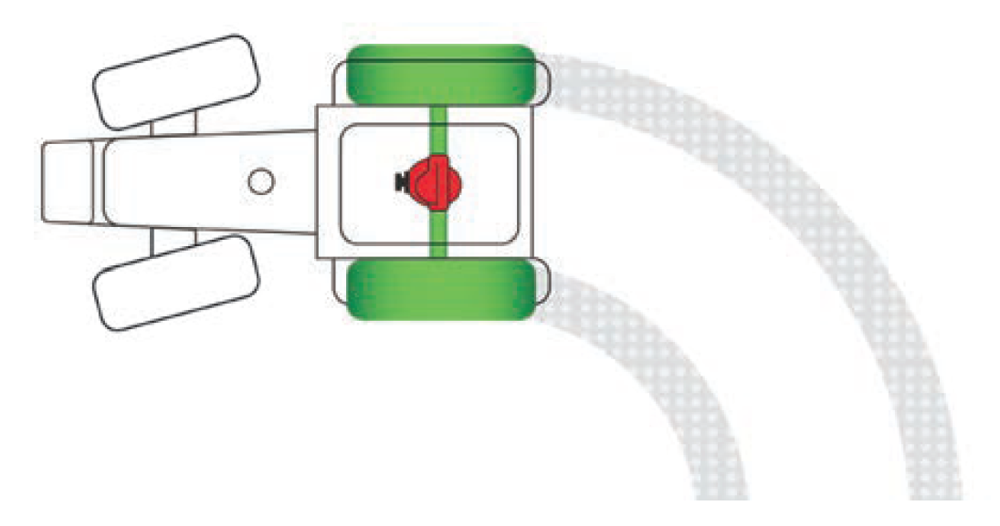{fig-align="center"}

::: {.fragment}

Qual a diferença de giro entre os pneus?

:::

## Diferencial

[__Função:__]{.fg style="--col: #e64173"}

::: {.incremental}

- Permitir diferentes velocidades de rotação para cada uma das rodas;
  - Facilitando as manobras;
- Alterar o ângulo de rotação em 90º do motor para as rodas;
- Aumentar o torque nas rodas motrizes do trator;
  - Relação de 4 ou 5 para 1.

:::

## Diferencial

[__Elementos:__]{.fg style="--col: #e64173"}

::: {.incremental}

- Pinhão: engrenagem ligada ao eixo secundário da caixa de câmbio e engrenada à coroa.
  - Recebe o movimento vindo da caixa de câmbio e o transfere para a coroa, alterando o sentido do movimento em 90°;
- Coroa: engrenagem de maior tamanho no diferencial. Ligada à caixa de satélites.
  - Recebe o movimento do pinhão, altera o movimento e proporciona aumento do torque para as rodas motrizes;

:::

## Diferencial

[__Elementos:__]{.fg style="--col: #e64173"}

::: {.incremental}

- Satélites: de 2 a 4, localizados dentro de uma caixa e com seus eixos presos a ela;
- Planetárias: 2, responsáveis por transmitir o movimento às rodas motrizes direita e esquerda. São conectadas aos satélites.
  - Eixos de rotação perpendiculares aos dos satélites.

:::

## Diferencial

[__Funcionamento:__]{.fg style="--col: #e64173"}

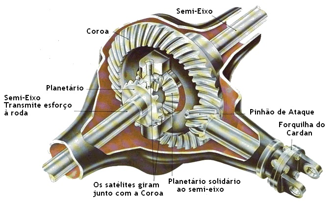{fig-align="center"}

## Diferencial

[__Funcionamento:__]{.fg style="--col: #e64173"}

{fig-align="center" width="850px"}

## Diferencial

[__aoqueio:__]{.fg style="--col: #e64173"}

Em algumas situações, é desejável que o diferencial não permita que as rodas tenham compensação de movimento.

::: {.fragment}

Ex: aração, quando o trator trafega com as rodas de um lado sobre o solo arado e as do outro lado sobre o solo firme.

::: {.incremental}

- Maior patinação no lado arado;
- Prejudica a eficiência de tração;

:::

:::

::: {.fragment}

O bloqueio do diferencial tem a função de travar o giro independente entre os rodados.

:::

## Diferencial

[__Bloqueio:__]{.fg style="--col: #e64173"}

::: {.fragment}

O bloqueio deve ser utilizado apenas em deslocamento em linha reta.

:::

::: {.fragment}

Tipos de bloqueio:

::: {.incremental}

- Bloqueio mecânico: mais simples, utiliza mecanismos físicos para conectar as duas rodas;
  - Engrenagens ou discos de fricção;
  - Robusto e confiável;
  - Menos suave.

:::

:::

## Diferencial

[__Bloqueio:__]{.fg style="--col: #e64173"}

Tipos de bloqueio:

::: {.incremental}

- Bloqueio hidráulico: utiliza fluido hidráulico para transferir potência entre as rodas;
  - Embreagens hidráulicas que conectam as duas rodas;
  - Mais suave;
- Bloqueio eletrônico: controle via interruptor com acionadores elétricos;
- Bloqueio automático: diferencial autoblocante. Distribui de forma automática a potência entre as rodas a depender da aderência;
  - Envia mais potência para a roda com maior aderência (dispensa bloqueio manual).

:::

## Diferencial

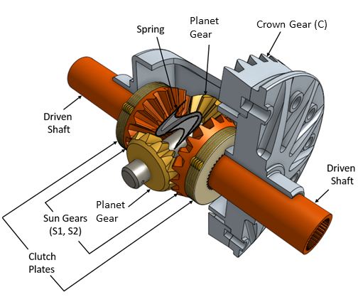{fig-align="center"}

## Diferencial

 <iframe title="Differential Gears Animation" frameborder="0" allowfullscreen mozallowfullscreen="true" webkitallowfullscreen="true" allow="autoplay; fullscreen; xr-spatial-tracking" xr-spatial-tracking execution-while-out-of-viewport execution-while-not-rendered web-share width="900" height="600" src="https://sketchfab.com/models/0f3ee18a0c5441688846f20f2eb0f2e0/embed"> </iframe> 
 <a href="https://sketchfab.com/3d-models/differential-gears-animation-0f3ee18a0c5441688846f20f2eb0f2e0" target="_blank" rel="nofollow" style="font-weight: bold; color: #1CAAD9;"> Differential Gears Animation </a> by <a href="https://sketchfab.com/Padpilot" target="_blank" rel="nofollow" style="font-weight: bold; color: #1CAAD9;"> Padpilot </a> on <a href="https://sketchfab.com" target="_blank" rel="nofollow" style="font-weight: bold; color: #1CAAD9;">Sketchfab</a>

# Redução final

## Redução final

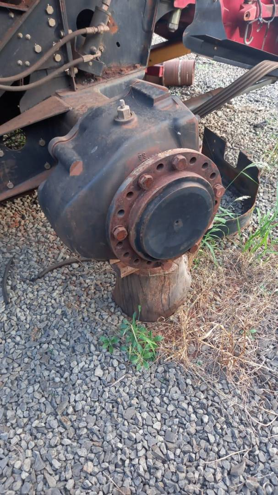{fig-align="center"}

## Redução final

[__Função:__]{.fg style="--col: #e64173"}

::: {.fragment}

Sistema de engrenagens na saída dos semieixos, próximo às rodas.

:::

::: {.incremental}

- Finalidade de reduzir (ainda mais) o movimento que vem do diferencial;
- Ampliação do torque;
- Redução da velocidade.

:::

## Redução final

[__Função:__]{.fg style="--col: #e64173"}

Redução de 5:1, ou seja, aumento do torque em 5 vezes.

::: {.fragment}

Redução final somada ao diferencial leva a uma "redução" de 20 a 30:1.

:::

::: {.fragment}

A redução final pode ser composta por um sistema de engrenagens do tipo planetário.

:::

## Redução final

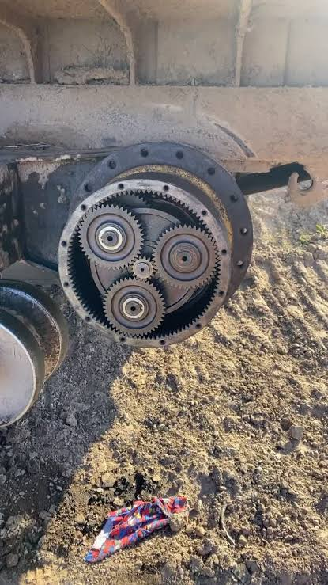{fig-align="center"}

# Relações fundamentais

## Relações fundamentais

$$\tau_m * n_m * E_t= \tau_r*n_r \approx constante $$

O $\tau_m$ é o torque do motor;
O $n_m$ é a rotação do motor;
$E_t$ é a eficiência de transmissão;
$\tau_t$ é torque do rodado;
$n_r$ é a rotação do rodado;

::: {.fragment}

torque por rotação é a potência do motor.

:::

::: {.fragment}

**Eficiência de transmissão**

$$E_t = \frac{P_r}{P_m}$$

$P_r$ potência final (rodado);
$P_m$ potência de entrada (motor);

:::

## Relações fundamentais

$$P_b=F*V=E_r*P_r$$

$P_b$ é a potência na barra de tração;
$F$ é a força;
$V$ é a velocidade;
$E_r$ é a eficiência do rodado;
$P_r$ é a poténcia do rodado;

::: {.fragment}

$$E_r=\frac{P_b}{P_r}$$

$E_r$ é a eficiência de tração;
$P_b$ é a potência na barra;
$P_r$ é a potência no radado;

:::

::: {.fragment}

$$P_b = P_m * E_t * E_r$$

:::

## Relações fundamentais

**Rendimento tratório**

$$\eta= \frac{P_b}{P_m}$$

::: {.fragment}

Quanto da potência do motor foi para a barra, após "negociação" com o solo.

:::

# Exemplos

## Exemplos

::: {.columns}

::: {.column}

Dados:

::: {style="font-size:22px"}

- Rotação do motor: 1950 rpm;
- torque do motor: 200 Nm;
- Relação de transmissão da 4ª marcha: 2,1:1;
- Relação de transmissão do diferencial: 6:1;
- Relação na redução final: 3,95:1;
- Diâmetro dos pneus traseiros: 1100 mm;
- Eficiência de transmissão: 97%;
  - Cada conjunto: caixa, diferencial, redução final.
- Rendimento tratório: 70%.

:::
:::

::: {.column}

::: {.fragment}

Pergunta:

- Qual a velocidade?
- Qual o torque do rodado?
- Qual a potência no rodado?
- Qual a potência na barra de tração?

:::

:::

:::

## Exemplos

Velocidade:

$$i= 2,1*6*3.95= 49,77$$

::: {.fragment}

$$velocidade = \frac{1950}{49,77}=39,18~rpm~(0,653rps)$$ 

:::

::: {.fragment}

$$Perímetro_{roda}= 1,1~m*\pi= 3,456~m$$

:::

::: {.fragment}

$$V=0,653~rps*3,456~m= 2,26m/s$$

:::

## Exemplos

Torque do rodado:

::: {.fragment}

Eficiência de transmissão para cada conjunsto (E~t~^3^)

$$E_t= 0,97^3=0,913$$

:::

::: {.fragment}

Eficiência de transmissão para cada conjunsto (E~t~^3^)

$$\tau_r= \frac{200~Nm*39,18~rpm*0,97^3}{39,18}=9087,7~Nm$$

:::

## Exemplos

Potência do rodado:

::: {.fragment}

$$P_r= \frac{2*\pi * 39,18~rpm * 9084,7~Nm}{60}= 37273,8~W~ou~37,27kW$$

:::

## Exemplos

Potência na barra de tração:

::: {.fragment}

$$n_m= \frac{1950}{60}=32,5~rps$$

:::

::: {.fragment}

$$P_m= 2*\pi*32,5~rps*200~Nm= 40,48~kW$$

:::

::: {.fragment}

$$P_b= 0,70*40,48~kW=28,59~kW$$

:::

# Próxima aula...

## Próxima aula...

Rodados, pneus, bitola e lastro!

# Fim!