# Relembrando o sistema de transmissão...

## Relembrando o sistema de transmissão...

[__Constituintes do sistema de transmissão:__]{.fg style="--col: #e64173"}

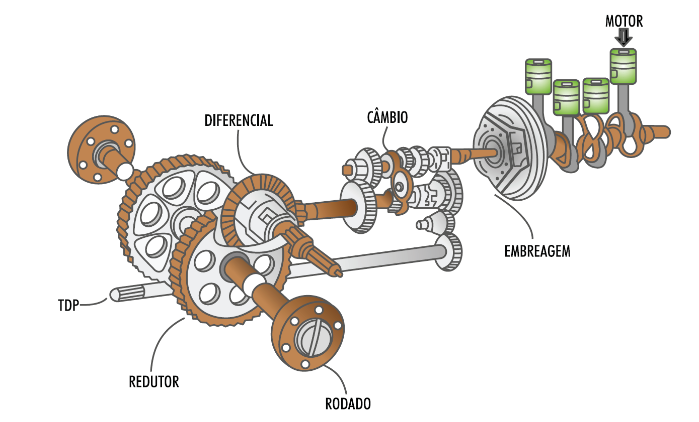{fig-align="center"}

# Sistema de freios

## Sistema de freios

Sistema que promove controle e segurança durante a operação do veículo.

::: {.fragment}

Serve para retardar e parar o trator. Garantindo que o operador mantenha o controle sobre a velocidade e a direção, essenciais para uma operação segura e eficiente.

:::

::: {.fragment}

Em tratores 4x2 e 4x2 TDA os freios são localizados exclusivamente nas rodas traseiras e são acionados por pedais (um par).

:::

::: {.fragment}

Pedais individuais que permitem o acionamento do freio de forma isolada para cada lado do trator.

:::

::: {.fragment}

Em tratores 4x4 o sistema de freio é nas 4 rodas ou um sistema central acionado por meio da transmissão. Nesses tratores há apenas um pedal de acionamento.

:::

## Sistema de freios

::: {layout-ncol=2}

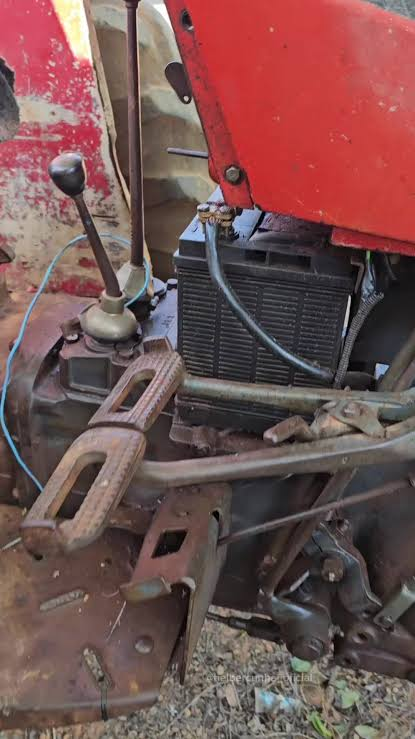{fig-align="center" width="350px"}

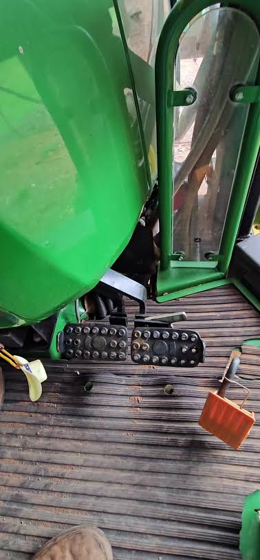{fig-align="center" width="290px"}

:::

## Sistema de freios

Freios individuais permitem a realização de manobras, operações em locais declivosos e auxílio no controle da patinagem das rodas.

::: {.fragment}

**Tipos de freios:**

- Disco;
- Tambor;
- Hidráulico;
- Pneumático.

:::

## Sistema de freios

[__Freio a disco:__]{.fg style="--col: #e64173"}

::: {.fragment}

São muito utilizados em tratores e são constituídos por discos de freio montados nas rodas do trator e pastilhas de freio.

:::

::: {.fragment}

**Funcionamento:** Quando o freio é acionado, as pastilhas são pressionadas contra os discos e criam atrito.

:::

::: {.fragment}

Freios a disco são rápidos e possuem desempenho superior em condições de alta demanda.

:::

## Sistema de freios

[__Freio a tambor:__]{.fg style="--col: #e64173"}

::: {.fragment}

Possuem tambores de freio montados nas rodas e pastilhas.

:::

::: {.fragment}

**Funcionamento:** Quando o freio é acionado, as pastilhas de freio são acionadas e pressionam as superfícies internas do tambor, criando atrito.

:::

::: {.fragment}

Freios com necessidade de manutenção regular.

:::

## Sistema de freios

[__Freio a tambor:__]{.fg style="--col: #e64173"}

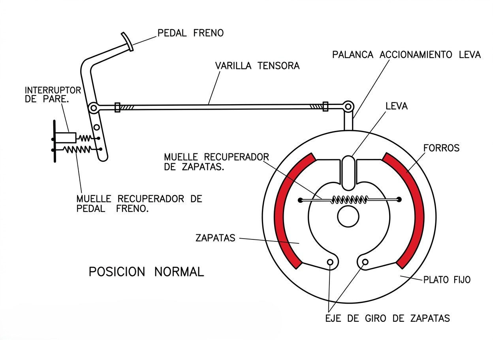{fig-align="center"}

## Sistema de freios

[__Freio a tambor:__]{.fg style="--col: #e64173"}

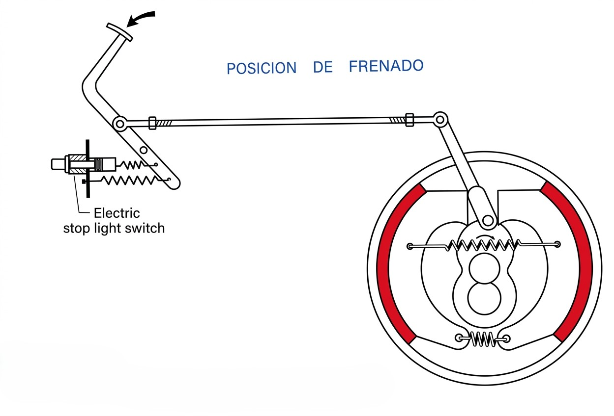{fig-align="center"}

## Sistema de freios

[__Freio hidráulico (acionamento):__]{.fg style="--col: #e64173"}

::: {.fragment}

Empregado em tratores de maior porte. Possuem um sistema hidráulico com pressão para acionar as pastilhas ou sapatas.

:::

::: {.fragment}

**Funcionamento:** Quando o freio é acionado, um cilindro mestre pressuriza o fluido hidráulico, que empurra os pistões dos cilindros de roda para dentro das pastilhas ou sapatas, freando o trator.

:::

## Sistema de freios

[__Freio hidráulico (acionamento):__]{.fg style="--col: #e64173"}

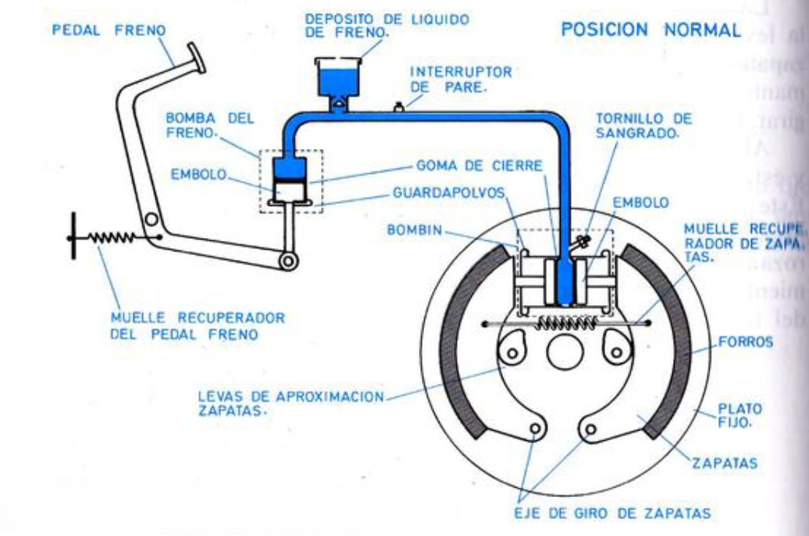{fig-align="center"}

## Sistema de freios

[__Freio hidráulico (acionamento):__]{.fg style="--col: #e64173"}

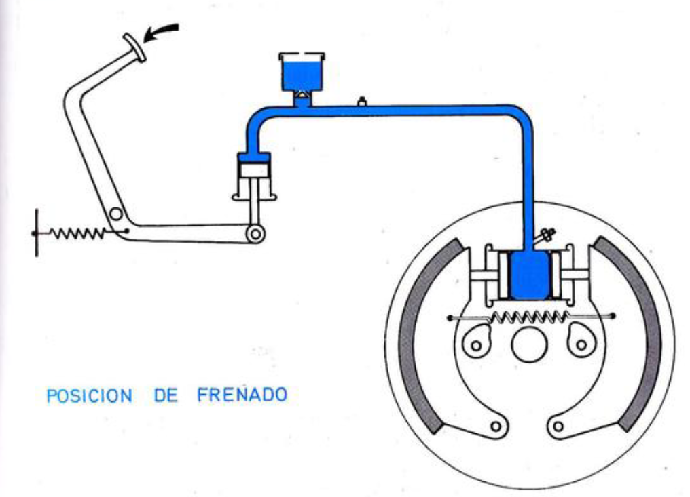{fig-align="center"}

## Sistema de freios

[__Freio pneumático (acionamento):__]{.fg style="--col: #e64173"}

::: {.fragment}

Nesse sistema, se utiliza ar comprimido para gerar a força de frenagem.

:::

::: {.fragment}

**Funcionamento:** Quando o freio é acionado, o ar comprimido é direcionado aos cilindros de freio nas rodas. A pressão do ar nos cilindros aciona as pastilhas ou sapatas de freio, que pressionam o disco ou tambor de freio, gerando atrito.

:::

## Sistema de freios

::: {layout-ncol=2}

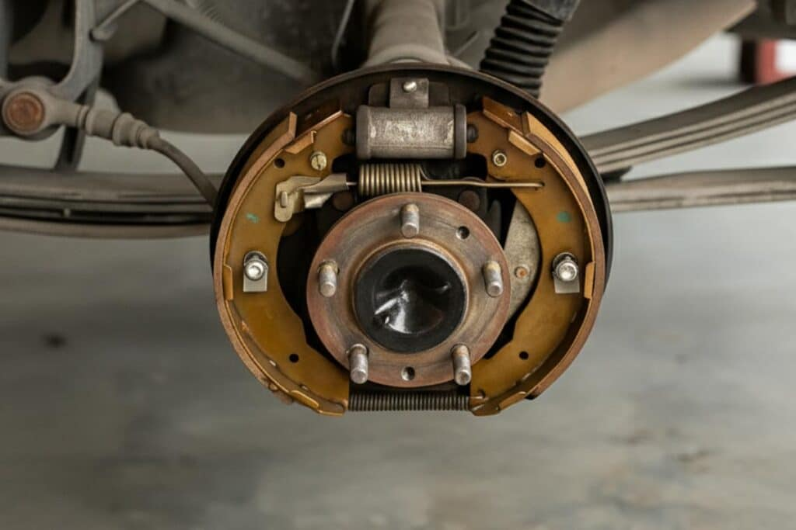{fig-align="center" width="450px"}

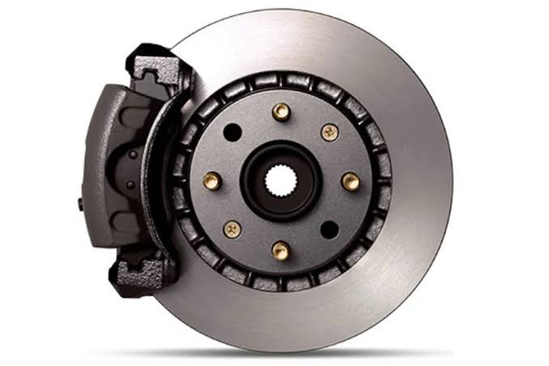{fig-align="center" width="450px"}

:::

# Pneus 

## Pneus 

É o elemento de ligação entre o veículo (trator) e o solo ou qualquer superfície.

::: {.fragment}

**Desenvolvimento no começo do século XIX**

:::

::: {.incremental}

- Em 1830 experimentos de Charles Goodyear mostraram que a borracha tinha elasticidade, com a variação da temperatura;
- Processo de vulcanização (adição de enxofre e cozimento em alta temperatura) foi desenvolvido em 1843;
  - Maior segurança e redução de trepidação;
- A câmara de ar de borracha fixada em roda de madeira foi patenteada em 1845 por Robert Thompson;
- O pneu de automóvel foi patenteado em 1895 pelos irmãos Michelin;
  - Emprego em larga escala; 

:::

## Pneus 

[__Tipos de pneus:__]{.fg style="--col: #e64173"}

::: {.incremental}

- Pneus para automóveis;
- Pneus para camionetas e comerciais leves;
- Pneus para ônibus e caminhões;
- Pneus para veículos industriais;
- Pneus fora de estrada (todo terreno);
- Pneus para tratores e implementos agrícolas;
- Pneus para motocicletas, motonetas, scooters, ciclomotores e bicicletas.

:::

## Pneus 

[__Pneus industriais:__]{.fg style="--col: #e64173"}

::: {.columns}

::: {.column}

Utilizados em maquinários de indústrias, geralmente para funções de locomoção de cargas (empilhadeiras).

Podem ser maciços ou inflados.

:::

::: {.column}

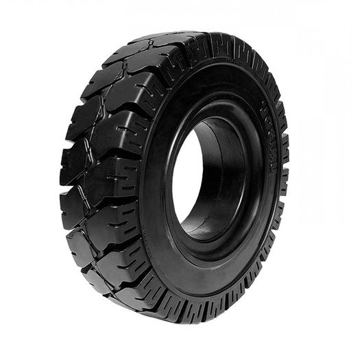{fig-align="center"}

:::

:::

## Pneus 

[__Pneus fora de estrada (OTR):__]{.fg style="--col: #e64173"}

::: {.columns}

::: {.column}

São produzidos para utilização em terrenos desnivelados, irregulares e de difícil trafegabilidade.

Empregado na mineração, construção civil e demais obras.

- Alta resistência (carga e terreno).

:::

::: {.column}

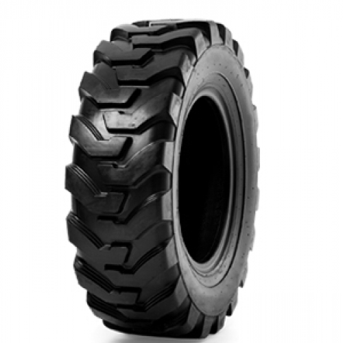{fig-align="center"}

:::

:::

## Pneus 

[__Pneus fora de estrada (OTR):__]{.fg style="--col: #e64173"}

::: {.columns}

::: {.column}

A resistência e capacidade de carga é informada pelo número de camadas construtivas ou PR (Ply Rating) ou capacidade de lonas

::: {.fragment}

ex: Um pneu OTR pode ser encontrado com 68 PR com capacidade para 92500 kg e diâmetro de 3,7 m

:::

:::

::: {.column}

::: {.fragment}

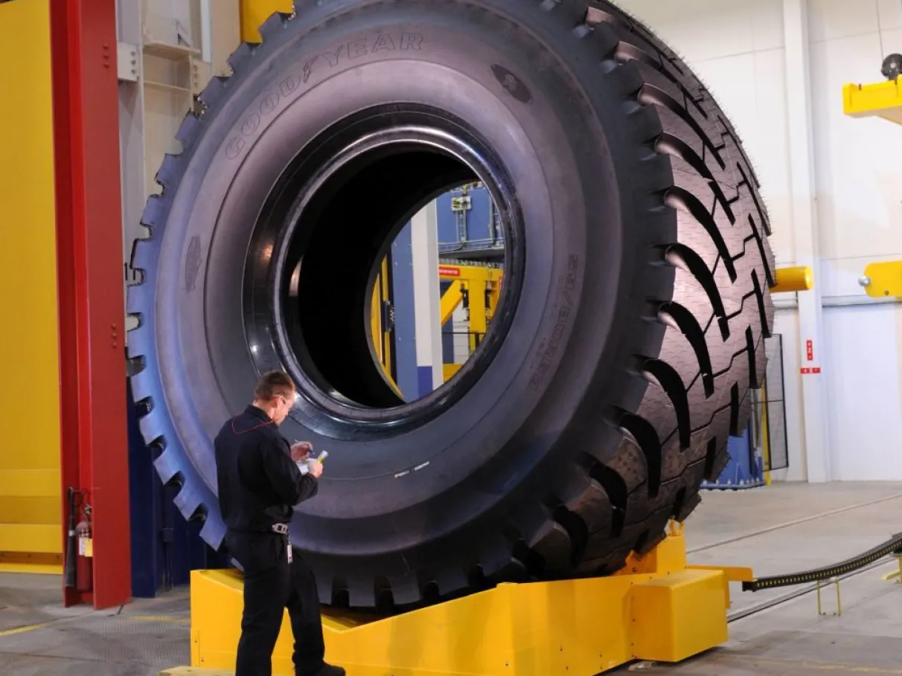{fig-align="center"}

:::

:::

:::

## Pneus 

[__Pneus para tratores e implementos agrícolas:__]{.fg style="--col: #e64173"}

::: {.fragment}

São aqueles empregados em máquinas e implementos, e que são comumente utilizados em solos com baixa ou média capacidade de suporte (macios ou médios, preparados ou mobilizados, com ou sem palhada), e que com menor frequência são utilizados também em estradas para locomoção.

:::

## Pneus 

[__Pneus para tratores e implementos agrícolas:__]{.fg style="--col: #e64173"}

Qual a importância do solo para as características e variações dos pneus agrícolas?

::: {.fragment}

... aderência e suporte

:::

::: {.fragment}

Quem sabe de química, física, gênese e classificação e manejo do solo pode relacionar melhor.

:::

## Pneus 

[__Pneus para tratores e implementos agrícolas:__]{.fg style="--col: #e64173"}

| **Capacidade de suporte do solo e aderência: Menor** | **Capacidade de suporte do solo e aderência: Maior** |
|---|---|
| Solos úmidos ou alagados | Solos secos |
| Solos preparados | Estradas, solos firmes e alguns no SPD |
| Solos em declives e aclives | Solos planos |
| Solos arenosos | Solos argilosos |
| Solos com alto volume de palha e matéria orgânica | Solo com baixo volume de palha e matéria orgânica |

Considerar condição normal de trafegabilidade. Pode haver exceções. **SPD** – Sistema Plantio Direto.

## Pneus 

[__Funções dos pneus:__]{.fg style="--col: #e64173"}

::: {.incremental}

- Sustentação;
- Carga;
- Tração;
- Direção;
- Segurança;
- Rendimento e conforto operacional.

:::

## Pneus 

[__Constituição:__]{.fg style="--col: #e64173"}

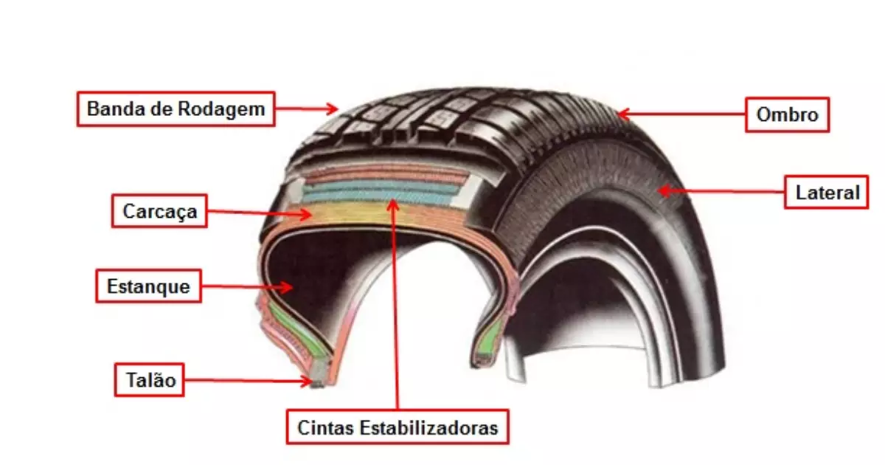{fig-align="center"}

## Pneus 

[__Constituição:__]{.fg style="--col: #e64173"}

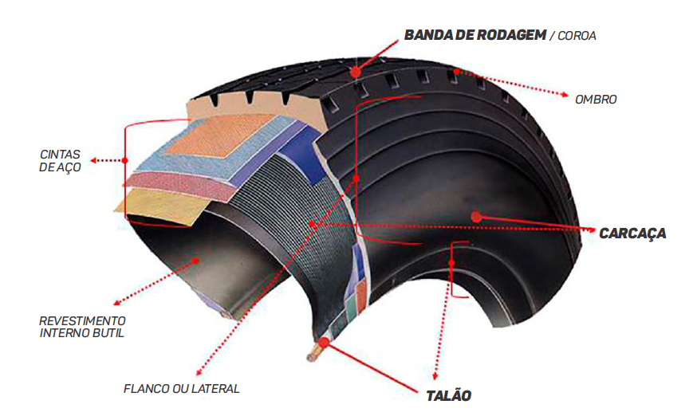{fig-align="center"}

## Pneus 

[__Dimensões de roda e pneu novo montado:__]{.fg style="--col: #e64173"}

Padronização: Associação Latino-Americana de Pneus e Aro (Alapa)

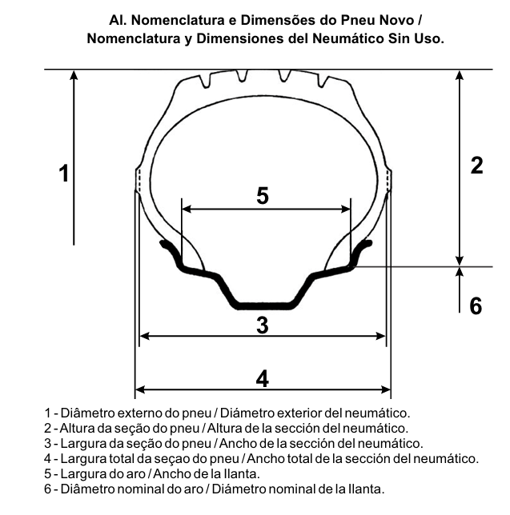{fig-align="center"}

## Pneus 

[__Designação de tamanho:__]{.fg style="--col: #e64173"}

O tamanho é formado pelas medidas nominais de largura da seção e do diâmetro interno do pneu, podendo incluir a relação nominal de aspecto entre as duas medidas.

## Pneus 

[__Marcações do pneu:__]{.fg style="--col: #e64173"}

::: {.columns}

::: {.column}

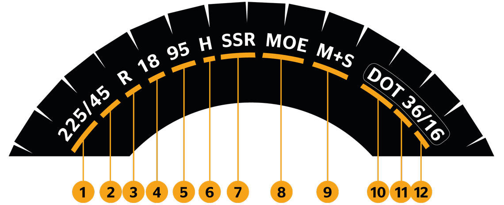

:::

::: {.column style="font-size:22px" .incremental}

1. Largura do pneu (225 mm) de uma parede a outra.
2. Relação altura/largura (sua altura é 45% da largura).
3. Construção da carcaça (R = Radial, B ou D = Diagonal).
4. Diâmetro do aro em polegadas (18 in).
5. Índice de carga, é a carga máxima que um pneu pode suportar quando totalmente cheio (95 = 690 kg).
6. Índice de velocidade (de A a Z). H é equivalente a uma velocidade máxima de 210 km h^-1^.
7. Marcações adicionais.

:::

:::

## Pneus 

[__Marcações do pneu:__]{.fg style="--col: #e64173"}

::: {.columns}

::: {.column}

:::

::: {.column style="font-size:22px"}

Marcações adicionais:

7. Pneu autônomo com tecnologia "Run flat".
8. Equipamento original Mercedes.
9. Adequado para condições com lama e neve.
10. Atende às normas de segurança de veículos a motor.
11. Semana da fabricação.
12. Ano de fabricação.

mais informações: [Continental](https://www.conti.com.br/tire-knowledge/tire-markings/)

:::

:::

## Pneus 

[__Índice de carga (Alapa):__]{.fg style="--col: #e64173"}

::: {style="font-size:20px"}

| **IC** | **kg** | **IC** | **kg** | **IC** | **kg** | **IC** | **kg** | **IC** | **kg** | **IC** | **kg** | **IC** | **kg** | **IC** | **kg** |
|---:|---:|---:|---:|---:|---:|---:|---:|---:|---:|---:|---:|---:|---:|---:|---:|
| 0 | 40 | 35 | 121 | 70 | 335 | 105 | 925 | 140 | 2.500 | 175 | 6.900 | 210 | 19.000 | 245 | 51.500 |
| 1 | 46,2 | 36 | 125 | 71 | 345 | 106 | 950 | 141 | 2.575 | 176 | 7.100 | 211 | 19.500 | 246 | 53.000 |
| 2 | 47 | 37 | 128 | 72 | 355 | 107 | 975 | 142 | 2.650 | 177 | 7.300 | 212 | 20.000 | 247 | 54.500 |
| -- | -- | -- | -- | -- | -- | -- | -- | -- | -- | -- | -- | -- | -- | -- | -- |
| 7 | 54,5 | 42 | 150 | 77 | 412 | 112 | 1.120 | 147 | 3.075 | 182 | 8.500 | 217 | 23.000 | 252 | 63.000 |
| 8 | 56 | 43 | 155 | 78 | 425 | 113 | 1.150 | 148 | 3.150 | 183 | 8.750 | 218 | 23.600 | 253 | 65.000 |
| 9 | 58 | 44 | 160 | 79 | 437 | 114 | 1.180 | 149 | 3.250 | 184 | 9.000 | 219 | 24.300 | 254 | 67.000 |
| 10 | 60 | 45 | 165 | 80 | 450 | 115 | 1.215 | 150 | 3.350 | 185 | 9.250 | 220 | 25.000 | 255 | 69.000 |
| 11 | 61,5 | 46 | 170 | 81 | 462 | 116 | 1.250 | 151 | 3.450 | 186 | 9.500 | 221 | 25.750 | 256 | 71.000 |
| 12 | 63 | 47 | 175 | 82 | 475 | 117 | 1.285 | 152 | 3.550 | 187 | 9.750 | 222 | 26.500 | 257 | 73.000 |
| 13 | 65 | 48 | 180 | 83 | 487 | 118 | 1.320 | 153 | 3.650 | 188 | 10.000 | 223 | 27.250 | 258 | 75.000 |
| -- | -- | -- | -- | -- | -- | -- | -- | -- | -- | -- | -- | -- | -- | -- | -- |
| 29 | 103 | 64 | 280 | 99 | 775 | 134 | 2.120 | 169 | 5.800 | 204 | 16.000 | 239 | 43.750 | 274 | 118.000 |
| 30 | 106 | 65 | 290 | 100 | 800 | 135 | 2.180 | 170 | 6.000 | 205 | 16.500 | 240 | 45.000 | 275 | 121.500 |
| 31 | 109 | 66 | 300 | 101 | 825 | 136 | 2.240 | 171 | 6.150 | 206 | 17.000 | 241 | 46.250 | 276 | 125.000 |
| 32 | 112 | 67 | 307 | 102 | 850 | 137 | 2.300 | 172 | 6.300 | 207 | 17.500 | 242 | 47.500 | 277 | 128.000 |
| 33 | 115 | 68 | 315 | 103 | 875 | 138 | 2.360 | 173 | 6.500 | 208 | 18.000 | 243 | 48.750 | 278 | 132.000 |
| 34 | 118 | 69 | 325 | 104 | 900 | 139 | 2.430 | 174 | 6.700 | 209 | 18.500 | 244 | 50.000 | 279 | 136.000 |

:::

## Pneus 

[__Velocidade (Alapa):__]{.fg style="--col: #e64173"}

::: {style="font-size:20px"}

| **Símbolo de velocidade** | **Velocidade (km/h)** | **Símbolo de velocidade** | **Velocidade (km/h)** |
|:---:|---:|:---:|---:|
| A1 | 5 | A2 | 10 |
| A3 | 15 | A4 | 20 |
| A5 | 25 | A6 | 30 |
| A7 | 35 | A8 | 40 |
| B | 50 | C | 60 |
| D | 65 | E | 70 |
| F | 80 | G | 90 |
| J | 100 | K | 110 |
| L | 120 | M | 130 |
| N | 140 | P | 150 |
| Q | 160 | R | 170 |
| S | 180 | T | 190 |
| U | 200 | H | 210 |
| V | 240 | W | 270 |
| Y | 300 |  |  |

:::

## Pneus 

[__Tipos:__]{.fg style="--col: #e64173"}

- Pneus diagonais;
- Pneus radiais;
- Pneus mistos.

## Pneus 

[__Diagonais:__]{.fg style="--col: #e64173"}

São mais rígidos com formato da banda de rodagem arredondados.

::: {.fragment}

São muito utilizados devido ao menor custo e à maior resistência de parte da carcaça e do costado.

:::

::: {.fragment}

Apropriado para tratores em solos irregulares, rochosos, condições florestais e em construções de estradas e pavimentos.

:::

## Pneus 

[__Diagonais:__]{.fg style="--col: #e64173"}

São construídos com um conjunto de lonas que se estendem de talão a talão, formando ângulos alternados em diagonal à linha de centro da banda de rodagem.

::: {.fragment}

Geralmente formam ângulos de 90° entre si.

:::

## Pneus 

[__Radiais:__]{.fg style="--col: #e64173"}

Melhor aproveitamento da banda de rodagem. Melhor área de contato com o solo.

É um pneu de melhor desempenho.

::: {.fragment}

Curiosidade: Foi lançado em 1946 pela Michelin. Em 1947 a Goodyear lançou os primeiros pneus de nylon e em 1974, a Pirelli lançou o pneu radial largo.

:::

## Pneus 

[__Radiais:__]{.fg style="--col: #e64173"}

A principal característica é a construção com camadas têxteis que se estendem de talão a talão, com ângulos aproximados de 90° em relação à linha central da banda de rodagem.

## Pneus 

{fig-align="center"}

## Pneus 

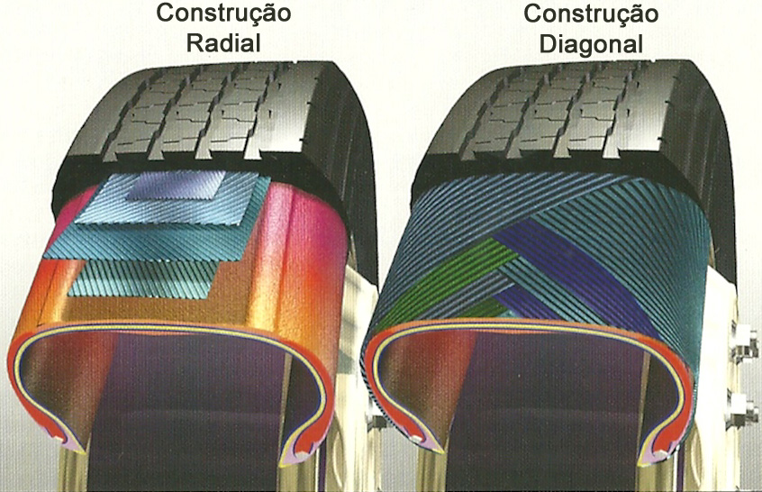{fig-align="center"}

## Pneus 

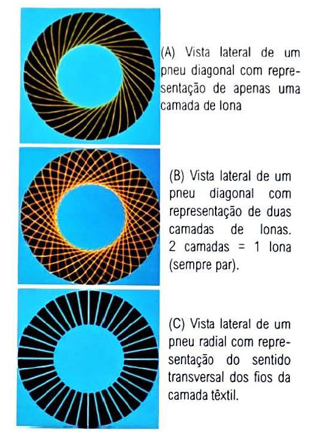{fig-align="center"}

## Pneus 

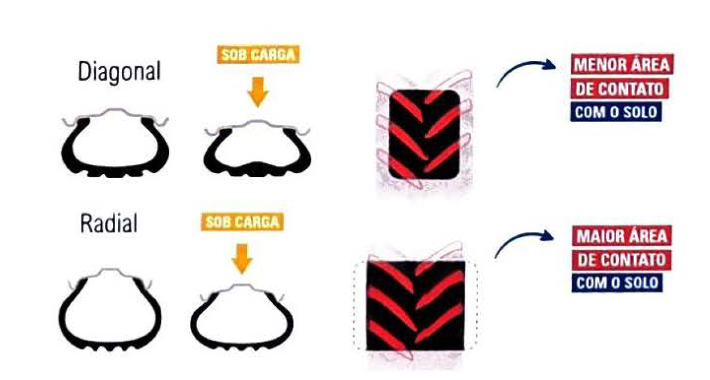{fig-align="center"}

# Lastro

## Lastro

- Aumenta o peso do trator;
- Melhora a estabilidade e eficiência de tração (atrito entre rodado e solo);

::: {.fragment}

Falta de lastro (peso) leva a uma alta patinagem do trator, que perde velocidade e desgasta mais rapidamente os pneus além de consumir mais combustível.

:::

::: {.fragment}

Excesso de lastro causa compactação do solo e o trator terá maior resistência ao deslocamento. Nesse caso, o consumo de combustível é maior e os componentes do trator serão submetidos a uma força muito alta e pode danificar partes do veículo.

:::

## Lastro

Na verdade... o lastreamento faz parte das "Condições de equilíbrio estático".

::: {.fragment}

Relações entre as forças mais importantes que atuam sobre o trator agrícola, em condições usuais de trabalho.

:::

::: {.incremental}

- Tração nas rodas traseiras;
- Movimento uniforme para frente, sobre superfície plana e nivelada;
- A força de tração na barra (f~b~) age segundo uma linha horizontal, a meia distância entre as rodas motoras e paralelas à direção do movimento do trator;

:::

## Lastro

Na verdade... o lastreamento faz parte das "Condições de equilíbrio estático".

::: {.incremental}

- Reação vertical do solo contra as rodas motoras (r~2~), passando pelo centro do eixo traseiro (O~2~) e pelo ponto "n";
- Reação vertical do solo contra as rodas dianteiras (r~1~), passando pelo centro do eixo dianteiro (O~1~) e pelo ponto "m";
- Força de tração (F~t~), exercida pelo rodado motriz contra o solo, tangente às rodas tratoras em "n";
- As demais forças secundárias atuando sobre o trator;
- A resistência ao rolamento é considerada nula.

:::

## Lastro

[__Distribuição de carga nos eixos:__]{.fg style="--col: #e64173"}

| **Tipo de trator** | **Eixo dianteiro (%)** | **Eixo traseiro (%)** |
|:------------------:|:----------------------:|:---------------------:|
| 4 × 2              | 40                     | 60                    |
| 4 × 2 TDA          | 45                     | 55                    |
| 4 × 4              | 55                     | 45                    |

::: {.fragment}

Determinada quando o trator está sem implemento ou máquina acoplada.

:::

## Lastro

[__Distribuição de carga nos eixos:__]{.fg style="--col: #e64173"}

Idealmente, o trator deveria possuir a capacidade de ajustar dinamicamente a distribuição de pesos nos eixos conforme as variações nas condições de operação (implemento)

::: {.fragment}

É fundamental buscar distribuir a carga nos eixos de forma a otimizar o desempenho do trator em diferentes contextos operacionais.

:::

## Lastro

A lastragem é variável e depende do implemento utilizado, condições de solo e da velocidade de uso.

::: {.fragment}

Uma dica é utilizar a menor quantidade de peso possível, desde que a patinagem fique dentro dos limites aceitáveis para a operação. A patinagem é o indicativo de lastragem correta.

:::

## Lastro

[__Patinagem:__]{.fg style="--col: #e64173"}

| **Condição** | **Patinagem (%)** | 
|:------------------:|:----------------------:|
| Asfalto, concreto              | 5 - 7                     | 
| Solo duro, compactado          | 7 - 12                     |
| Solo seco e macio              | 10 - 15                     |
| Solo arado, arenosos ou lamacentos              | 13 - 18                     |

## Lastro

[__Cálculo da patinagem:__]{.fg style="--col: #e64173"}

Anote o tempo para percorrer 50 m, em estrada, em operação.

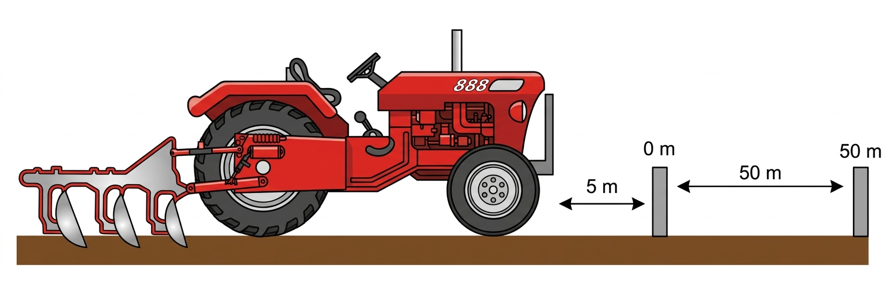{fig-align="center"}

## Lastro

[__Cálculo da patinagem:__]{.fg style="--col: #e64173"}

Anote o tempo para percorrer 50 m, em estrada, na mesma marcha e rotação.

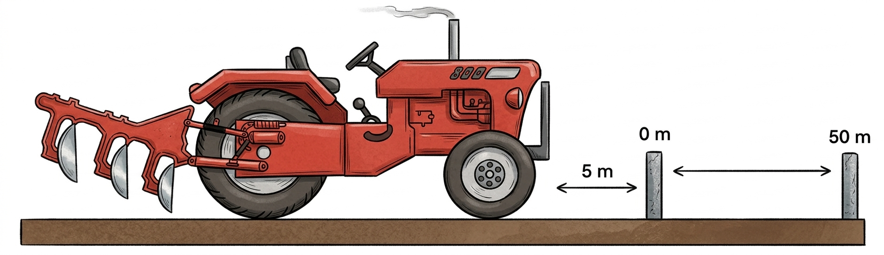{fig-align="center"}

## Lastro

[__Cálculo da patinagem:__]{.fg style="--col: #e64173"}

::: {.fragment}

$$P(\%)=\frac{T_c-T_s}{T_s}*100$$

::: {.incremental}

- $P(\%)$ é a patinagem;
- $T_c$ é o tempo com carga;
- $T_s$ é o tempo sem carga;

:::

:::

## Lastro

[__Formato do rastro:__]{.fg style="--col: #e64173"}

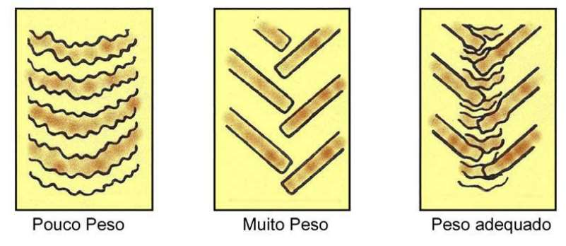{fig-align="center"}

## Lastro

[__Formato do rastro:__]{.fg style="--col: #e64173"}

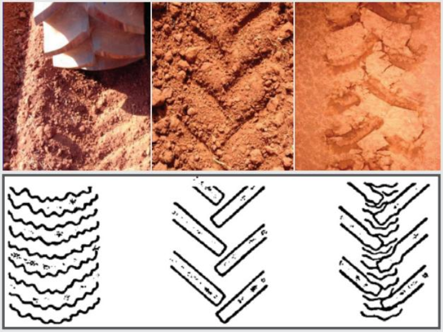{fig-align="center"}

## Lastro

[__Tipos de lastro:__]{.fg style="--col: #e64173"}

::: {.fragment}

- Lastragem líquida;
  - Água nos pneus;
- Lastragem sólida;
  - Peso nas rodas;
  - Peso na estrutura do trator.

:::

## Lastro

[__Tipos de lastro:__]{.fg style="--col: #e64173"}

::: {layout-ncol=3 .fragment}

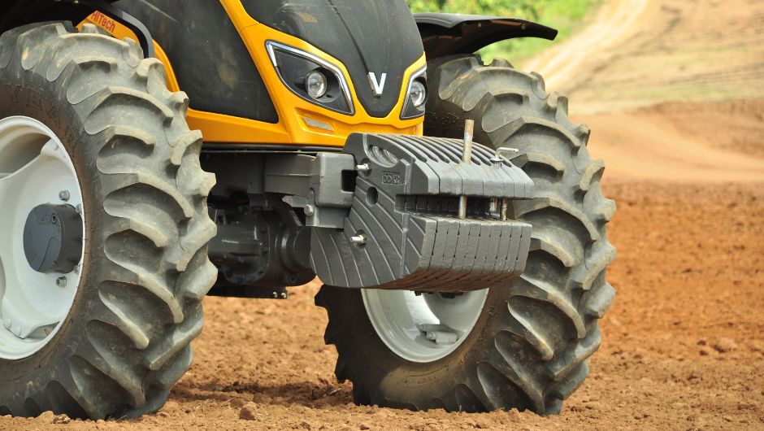{fig-align="center" }

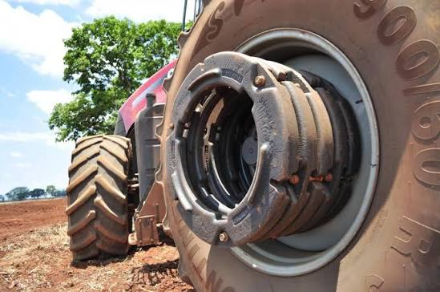{fig-align="center" }

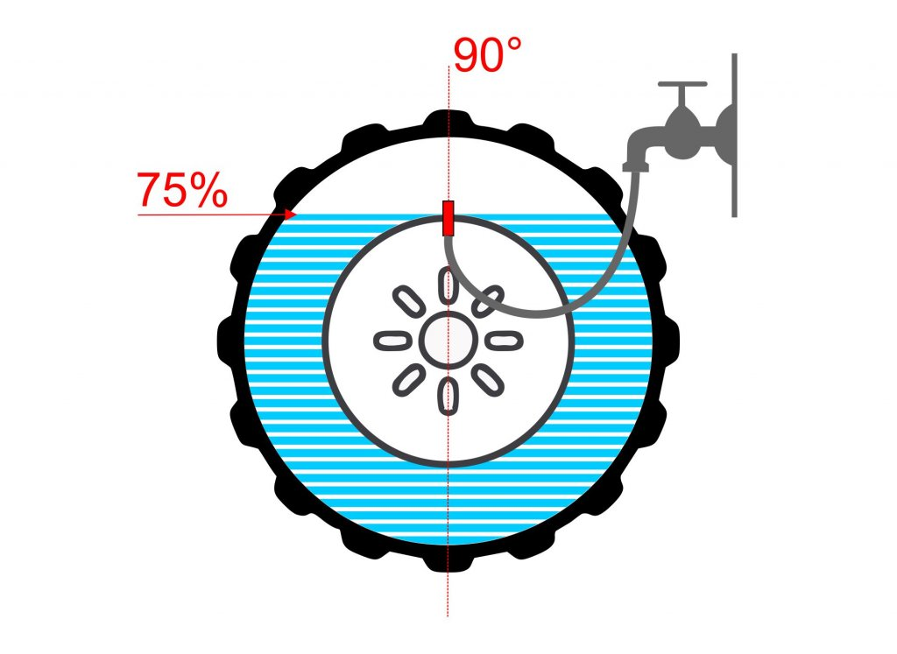{fig-align="center" }

:::

## Lastro

[__Lastro líquido máximo de pneus__]{.fg style="--col: #e64173"}

::: {style="font-size:22px"}

| **Dimensão** | **Água (kgf)** | **Solução de cloreto de cálcio (kgf)** | **Dimensão** | **Água (kgf)** | **Solução de cloreto de cálcio (kgf)** |
|:---:|---:|---:|:---:|---:|---:|
| 10.0-16 | 68 | 108 | 360/70R-20 | 90 | 144 |
| 7.50-18 | 42 | 67 | 425/70R-20 | 130 | 208 |
| 9.5-24 | 65 | 104 | 440/65R-24 | 150 | 240 |
| 11.2-24 | 90 | 144 | 320/70R-24 | 85 | 136 |
| 12.4-24 | 115 | 184 | 360/70R-24 | 100 | 160 |
| 13.6-24 | 120 | 192 | 380/70R-24 | 130 | 208 |
| 14.9-24 | 150 | 240 | 420/70R-24 | 166 | 265 |
| 11.2-28 | 100 | 160 | 480/65R-28 | 175 | 280 |
| 13.6-28 | 119 | 190 | 540/65R-28 | 253 | 404 |

:::

## Lastro

[__Lastro líquido máximo de pneus__]{.fg style="--col: #e64173"}

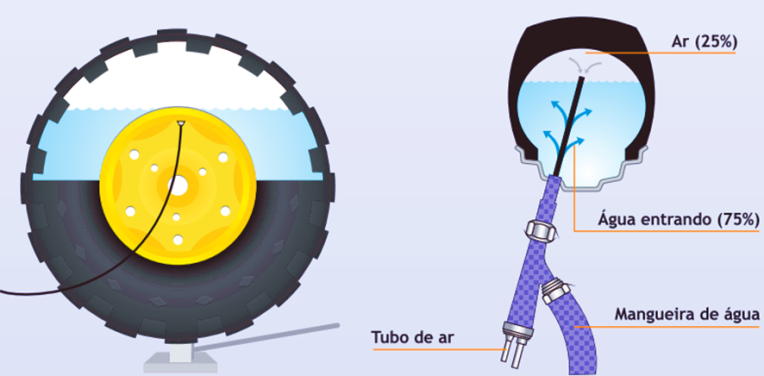

## Lastro

[__Vantagens do lastro líquido__]{.fg style="--col: #e64173"}

::: {.incremental}

- A água é adicionada diretamente no pneu em contato com o solo, isso reduz risco de danos mecânicos em eixos e rodas;
- Fácil detecção de furos;
- Fácil socorro do trator quando furar o pneu, leva mais tempo para murchar;
- Baixo custo.

:::

## Lastro

[__Importante sobre o lastro líquido__]{.fg style="--col: #e64173"}

Não é recomendado completar totalmente com água, isso reduz a flexibilidade dos pneus em amortecer os choques. Após a adição da água, os pneus devem ser calibrados com ar.

## Lastro

[__Lastro líquido máximo de pneus__]{.fg style="--col: #e64173"}

Posição da válvula (12 horas e 4 horas)

::: {layout-ncol=2}

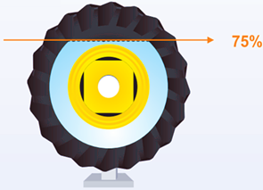{fig-align="center" width="350px"}

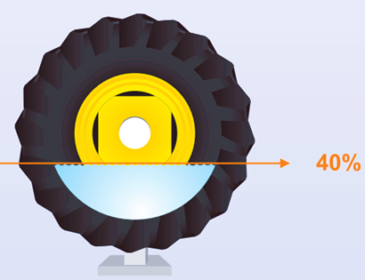{fig-align="center" width="350px"}

:::

## Lastro

[__Calibragem de pneus__]{.fg style="--col: #e64173"}

- A calibragem reduz em até 20% o consumo de combustível;
- Economiza o tempo gasto nas operações;
- Reduz a compactação do solo.

## Lastro

[__Calibragem de pneus__]{.fg style="--col: #e64173"}

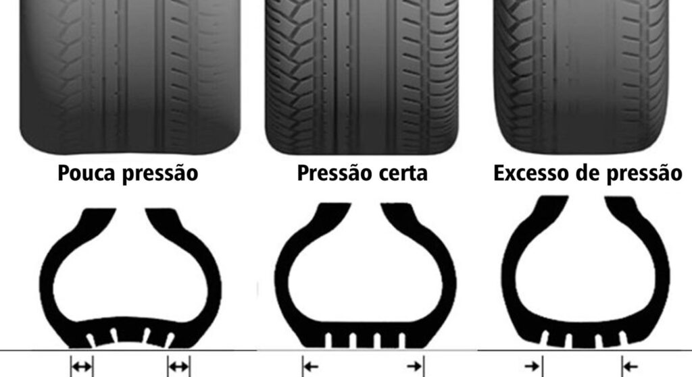{fig-align="center"}

## Lastro

[__Cálculo de lastro:__]{.fg style="--col: #e64173"}

Leva em consideração a operação, a velocidade e a potência do motor.

::: {.fragment}

Ex: Qual o peso recomendado em lastro para um trator com 104 kW com pneu dianteiro 480/70R-28 e traseiro 580/70R-38. Será realizada uma operação de preparo do solo em velocidade de 5 e 6 km h^-1^ com parâmetro de 80 kgf kW^-1^.

:::

## Lastro

[__Cálculo de lastro:__]{.fg style="--col: #e64173"}

::: {style="font-size:22px"}

Ex: Qual o peso recomendado em lastro para um trator 4x2 TDA com 104 kW com pneu dianteiro 480/70R-28 e traseiro 580/70R-38.

:::

1. Calcular o peso recomendado para o trator

$W_l = P * (relação~peso~potência)$

::: {.fragment}

$W_l = 104 * 80= 8320~kgf~(kg)$

:::

## Lastro

[__Cálculo de lastro:__]{.fg style="--col: #e64173"}

::: {style="font-size:22px"}

Ex: Qual o peso recomendado em lastro para um trator 4x2 TDA com 104 kW com pneu dianteiro 480/70R-28 e traseiro 580/70R-38.

:::

$W_l = 104 * 80= 8320~kgf~(kg)$

Eixo dianteiro:

::: {.fragment}

$W_{1l}= 0,45 (45\%) * 8320 = 3744~kgf$

:::

::: {.fragment}

Eixo traseiro:

$W_{2l}= 0,55 (55\%) * 8320 = 4576~kgf$

:::

## Lastro

[__Cálculo de lastro:__]{.fg style="--col: #e64173"}

::: {style="font-size:22px"}

Ex: Qual o peso recomendado em lastro para um trator 4x2 TDA com 104 kW com pneu dianteiro 480/70R-28 e traseiro 580/70R-38.

:::

Verificar a carga máxima dos eixos (manual de instruções). Para o exemplo temos carga máxima de 4500 kgf no eixo dianteiro e 7500 kgf no eixo traseiro.

::: {.fragment}

2. Determinar os pesos (prévio) nos eixos (sem operador, lastro e tanque vazio)

::: {.fragment}

$W_1= 2200~kgf$, logo faltam 1544 kgf no eixo dianteiro.

$W_2= 3050~kgf$ e, 1526 kgf no eixo traseiro.

:::
:::

## Lastro

[__Cálculo de lastro:__]{.fg style="--col: #e64173"}

::: {style="font-size:22px"}

Ex: Qual o peso recomendado em lastro para um trator 4x2 TDA com 104 kW com pneu dianteiro 480/70R-28 e traseiro 580/70R-38.

:::

::: {.fragment}

3. Determinar o peso dos eixos lastrados

$W_{LPD} = 149~kgf (50\%~água)$

$W_{LPT} = 182~kgf (50\%~água)$

:::

## Lastro

[__Cálculo de lastro:__]{.fg style="--col: #e64173"}

::: {style="font-size:22px"}

Ex: Qual o peso recomendado em lastro para um trator 4x2 TDA com 104 kW com pneu dianteiro 480/70R-28 e traseiro 580/70R-38.

:::

::: {.fragment}

3. Determinar o peso dos eixos lastrados

$W_{1l}= W_1=(2*W_{LPD})= 2200+ (2*149) = 2498~kgf$

$W_{2l}= W_2=(2*W_{LPT})= 3050+ (2*182) = 3414~kgf$

:::

## Lastro

[__Cálculo de lastro:__]{.fg style="--col: #e64173"}

::: {style="font-size:22px"}

Ex: Qual o peso recomendado em lastro para um trator 4x2 TDA com 104 kW com pneu dianteiro 480/70R-28 e traseiro 580/70R-38.

:::

Ainda faltam 1246 kgf no eixo dianteiro e 944 kgf no eixo traseiro.

$W_{1l}= W_1=(2*W_{LPD})= 2200+ (2*149) = 2498~kgf$

$W_{2l}= W_2=(2*W_{LPT})= 3050+ (2*291) = 3632~kgf$

No eixo dianteiro será suprido via adição de seções de 50 kgf, em um total de 24 seções.

## Lastro

[__Cálculo de lastro:__]{.fg style="--col: #e64173"}

::: {style="font-size:22px"}

Ex: Qual o peso recomendado em lastro para um trator 4x2 TDA com 104 kW com pneu dianteiro 480/70R-28 e traseiro 580/70R-38.

:::

Ainda faltam 1246 kgf no eixo dianteiro e 944 kgf no eixo traseiro.

::: {.fragment}

No eixo traseiro são disponibilizados discos de 65 kgf que podem ser adicionados em um máximo de 3 peças cada lado.

::: {.fragment}

Assim, mais 390 kgf serão supridos via lastro sólido, o que resulta em uma falta de 554 kgf. Esses podem ser supridos adicionando solução de cloreto de cálcio ao invés de água.

:::

:::

## Lastro

[__Cálculo de lastro:__]{.fg style="--col: #e64173"}

::: {style="font-size:22px"}

Ex: Qual o peso recomendado em lastro para um trator 4x2 TDA com 104 kW com pneu dianteiro 480/70R-28 e traseiro 580/70R-38.

:::

::: {.fragment}

Com cloreto o lastro líquido pode fornecer até 699 kgf por pneu, o que representa 4448 kgf, sobrando apenas 128 kgf que agora podem ser supridos com 2 discos sólidos de 65 kgf.

:::

## Lastro

[__Cálculo de lastro:__]{.fg style="--col: #e64173"}

A regra mais importante é: verifique o manual do operador de cada trator, pois, cada fabricante já possui especificações para lastro.

## Lastro

[__Cálculo de lastro exemplo NH:__]{.fg style="--col: #e64173"}

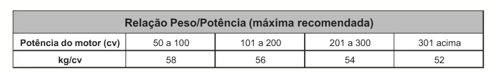{fig-align="center"}

## Lastro

[__Cálculo de lastro exemplo NH:__]{.fg style="--col: #e64173"}

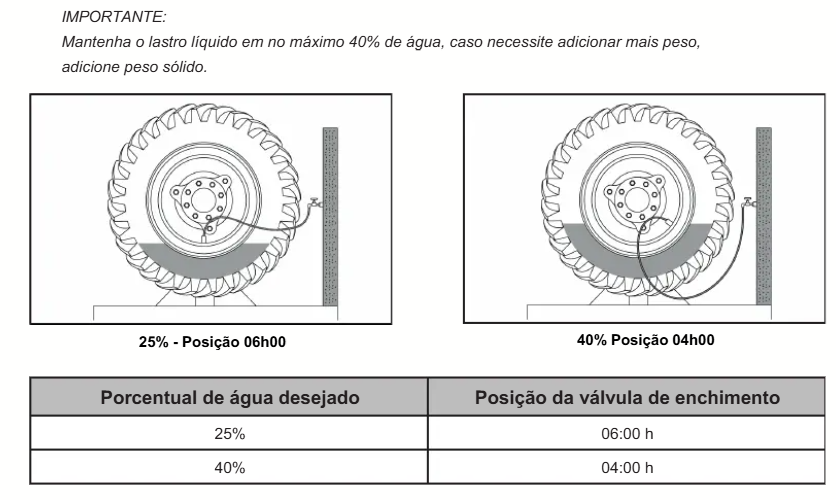{fig-align="center"}

## Lastro

[__Cálculo de lastro exemplo NH:__]{.fg style="--col: #e64173"}

::: {style="font-size:22px"}
Um cliente comprou um **T7.240** e deseja trabalhar com grade na barra de tração. Potência nominal do motor: 212 cv. Pneu Dianteiro: 600/65R28 A8 R1W e traseiro: 710/70R38 A8 R1W

**Distribuição de peso sem lastro**

- **Peso total sem lastro:** 7.300 kg (Manual do Operador)
- **Peso do eixo dianteiro sem lastro:** 3.184 kg (43,6%)
- **Peso do eixo traseiro sem lastro:** 4.116 kg (56,4%)

**Lastro sólido**

- **Dianteiro:** 818 kg
- **Traseiro:** 1.544 kg  
  - 6 × 227 kg + 2 × 91 kg

**Qual é a configuração ideal de lastro para trabalho severo na barra de tração?**

:::

## Lastro

[__Cálculo de lastro exemplo NH:__]{.fg style="--col: #e64173"}

::: {style="font-size:22px"}

**Segundo a Tabela em 1.4.:**

 **Lastro ideal:**  
$212\ \text{cv} \times 54\ \text{kg cv}^{-1}
 = 11.448\ \text{kg}$

**Segundo a distribuição de peso para esta operação:**

**Eixo dianteiro:** 11.448 kg × 40% = **4.580 kg**  
**Eixo traseiro:** 11.448 kg × 60% = **6.868 kg**

Esses valores são os pesos que o trator deve obter nos eixos dianteiro e traseiro.

:::

## Lastro

[__Cálculo de lastro exemplo NH:__]{.fg style="--col: #e64173"}

::: {style="font-size:22px"}

Trator com lastro sólido

Soma-se o peso dos eixos sem lastro aos lastros sólidos embarcados de fábrica:

- **Eixo dianteiro:** 3.184 kg + 818 kg = **4.002 kg**
- **Eixo traseiro:** 4.116 kg + 1.544 kg = **5.660 kg**

Para chegar ao lastro ideal dos eixos, adiciona-se lastro líquido respeitando os valores de 40%. O resultado abaixo representa a quantidade de água necessária:

- **Eixo dianteiro:** 4.580 kg − 4.002 kg = **578 kg**
- **Eixo traseiro:** 6.868 kg − 5.660 kg = **1.208 kg**

:::

## Lastro

[__Cálculo de lastro exemplo NH:__]{.fg style="--col: #e64173"}

::: {style="font-size:22px"}

- **Eixo dianteiro:** adicione 40% de lastro líquido nos pneus  
  $200 \times 2 = \mathbf{400\ kg}$

- **Eixo traseiro:** adicione 40% de lastro líquido nos pneus  
  $407 \times 2 = \mathbf{814\ kg}$

Como o lastro líquido não foi suficiente para chegar ao lastro ideal, deve-se adicionar **lastro sólido**.

**Jamais ultrapassar 40% de água nos pneus.**

### Lastro sólido adicional

- **Eixo dianteiro:** adicionar **178 kg** de lastro sólido  
  $4 \times 45 = 180\ kg$

- **Eixo traseiro:** adicionar **454 kg** de lastro sólido  
  $2 \times 227 = 454\ kg$

:::

## Lastro

[__Cálculo de lastro exemplo NH:__]{.fg style="--col: #e64173"}

::: {style="font-size:22px"}

Distribuição final de peso

**Assim, o trator apresenta a seguinte distribuição de peso:**

- **Eixo dianteiro:**  
  4.002 kg (eixo + lastro de fábrica) + 400 kg (água) + 178 kg (lastro sólido adicional)  
  = **4.580 kg (39,8%)**

- **Eixo traseiro:**  
  5.660 kg (eixo + lastro de fábrica) + 814 kg (água) + 454 kg (lastro sólido adicional)  
  = **6.928 kg (60,2%)**

**Peso total com lastro: 11.508 kg**

:::

## Lastro

[__Cálculo de lastro exemplo 2:__]{.fg style="--col: #e64173"}

::: {layout-ncol=1}

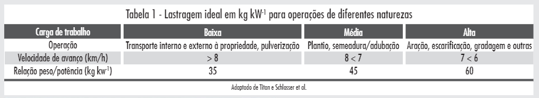{fig-align="center"}

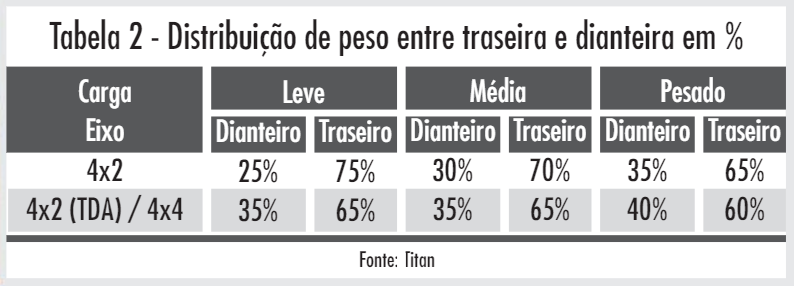{fig-align="center"}

:::

## Lastro

| Tipo de lastro | Leve | Média | Pesada |
|:---------------:|:----:|:-----:|:------:|
| **kg/cv**       | **50** | **55** | **60** |

# Bitola

## Bitola

É a distância de centro a centro dos pneus traseiros ou dianteiros e é ajustável na maioria dos sistemas de rodados

::: {.incremental}

Funções:

- Adequar o trator nas entrelinhas de cultivo;
- Adequar o trator ao implemento;
- Estabilizar o trator em terrenos acidentados.

:::

## Bitola

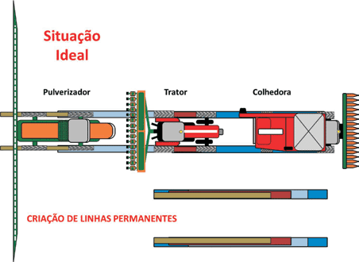{fig-align="center"}

## Bitola

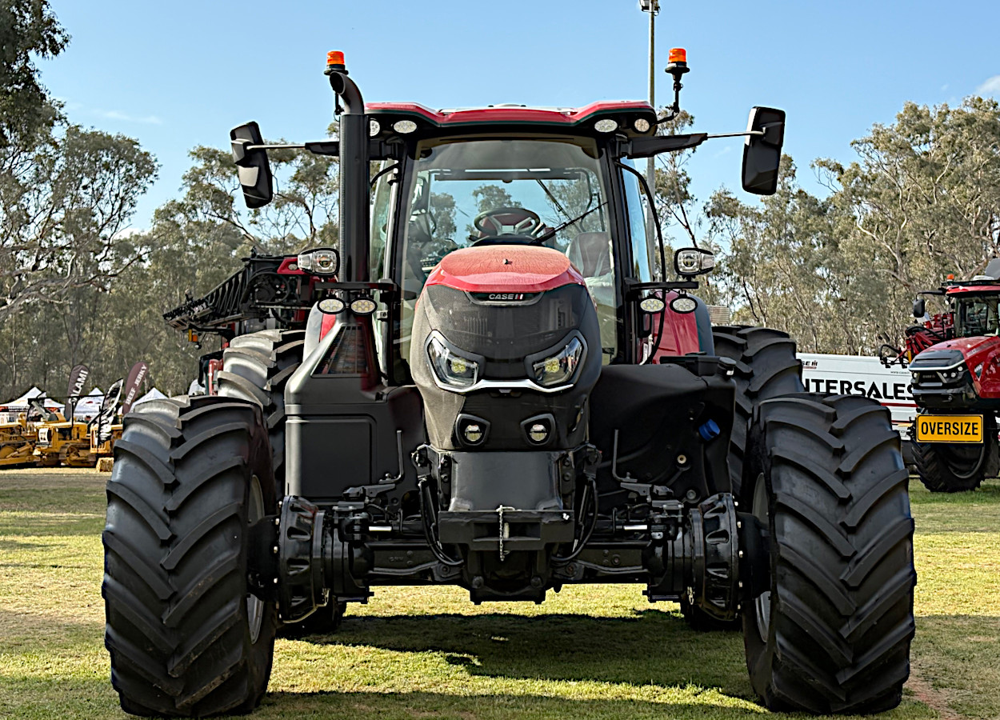{fig-align="center"}

## Bitola

Como alterar:

::: {layout-ncol=2}

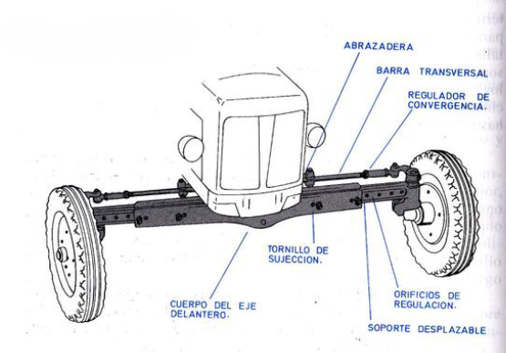{fig-align="center"}

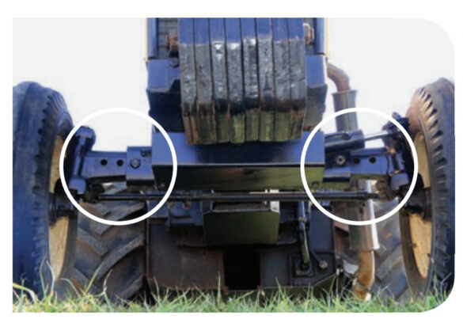{fig-align="center"}

:::

## Bitola

Como alterar:

::: {layout-ncol=3}

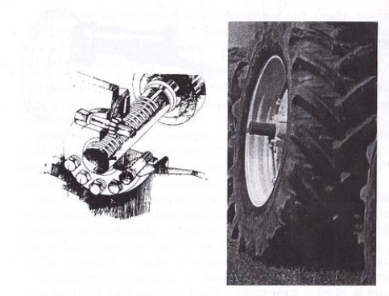{fig-align="center"}

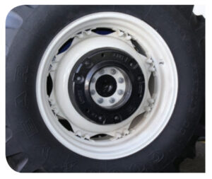{fig-align="center"}

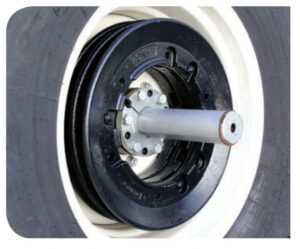{fig-align="center"}

:::

# Fim!

